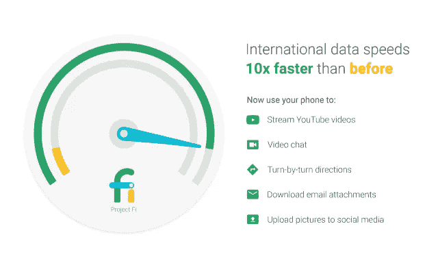
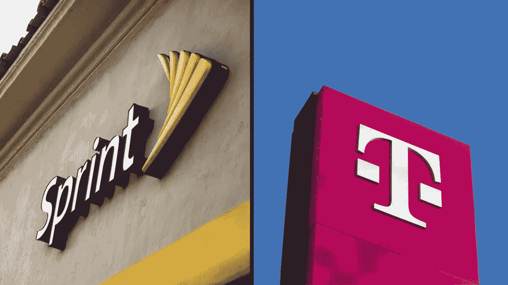
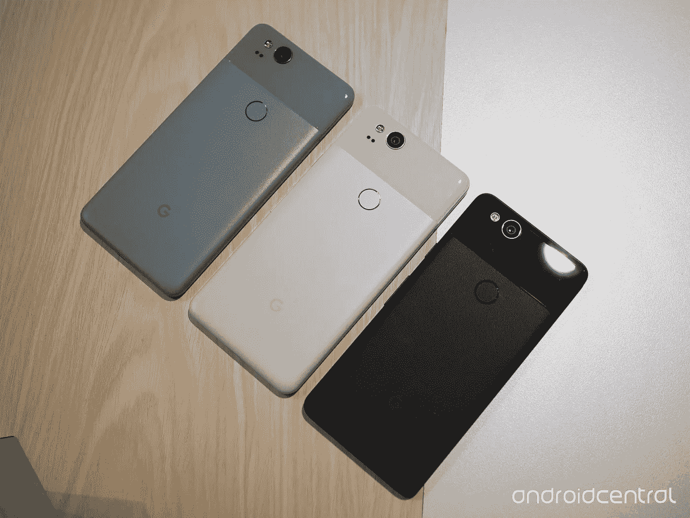
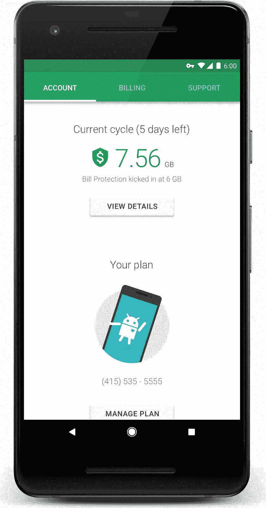
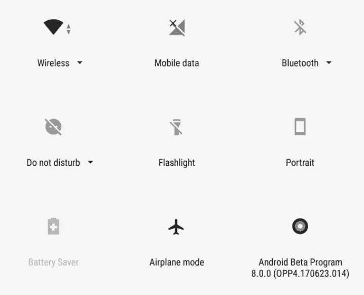
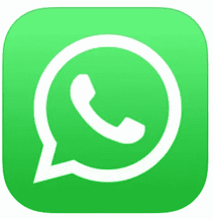
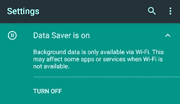

# 作为一名数字流浪者，我从一年来使用谷歌的 Project Fi 移动服务中学到了什么

> 原文：<https://medium.datadriveninvestor.com/what-i-learned-from-a-year-using-googles-project-fi-mobile-service-as-a-digital-nomad-8b5dd97bbebe?source=collection_archive---------1----------------------->

我使用谷歌手机服务 Google Fi 已经三年多了，包括一年的全职国际旅行。在这篇评论中，我将分享我使用这项服务的经验。

Project Fi has excellent coverage for data internationally

简而言之，对于旅行者来说，这是一个近乎完美的解决方案，但如果没有达到目标，就会特别令人沮丧。然而，我发现了一些解决方法，我在下面分享。根据我所了解的情况，我发现这家航空公司是全职国际旅客的绝佳解决方案，并将继续使用这项服务。

# 这个载体和其他载体有什么不同？

## 多载波

Fi 的工作方式是依靠现有的运营商，即 Sprint、T-Mobile 和 US Cellular。这是一个巨大的胜利，只有一个条件:你的手机需要能够连接到这些运营商，并在通话中切换运营商。

**Google Fi 目前支持以下手机:**

LG V35 ThinQ
LG G7 ThinQ
摩托罗拉 Moto G6
摩托罗拉 Moto X4(Android One)
Pixel
Pixel XL
Pixel 2
Pixel 2 XL
Nexus 5X
Nexus 6P
Nexus 6
Pixel 3
Pixel 3 XL

我有一部 Pixel 2，这是我的第二部手机，也是我有过的最好的手机。

这种设置给用户带来的巨大优势是更好的信号，尤其是在农村地区和国际上。如果你所在的地方没有 Sprint 的服务，你就不必购买 Sprint 计划，然后就倒霉了，你需要为这三个网络的接入付费。如果你在车里打电话，正驶出 Sprint 覆盖区域，但进入 T-Mobile 区域，你的电话将优雅地从一个网络切换到另一个网络！

不可否认，这很酷。

## 只为您使用的数据付费

另一个不同点是计费的方式，我也认为这很酷。

你总是要为 Fi 基础服务付费，该服务提供无限制的(本地)通话和短信，包括国际短信，每月 20 美元。

对于数据，你要为每 GB 支付 10 美元。句号。

为了使我们的电话账单保持一致，他们让用户估计他们每月可能使用/想要支付的费用，并将其作为一项计划。例如，如果你想每月支付大约 40 美元，并使用 2GB，你选择 20 美元的基本+ 2GB 的计划。

这个计划只是一个指南，但是，它是完全灵活的。只用 1.2GB？你只需支付 12 美元。用 6GB？嗯，那将花费你 60 美元+基本的 20 美元。你手机上的应用程序会告诉你，你正在查看数据，所以没什么好惊讶的。

但是你在 Wifi 上使用的任何数据都是免费的，无论你在哪里。 **这包括免费 wifi 通话，这是 fi 的一项惊人功能，但只适用于美国。**这是事情变得有点复杂的地方，也是我遇到一些麻烦的地方。希望我学到的东西可以帮你省去那个麻烦！

# 我超过 200 美元的电话账单以及如何让这种事情永远不要发生在你身上

好了，现在是令人沮丧的部分。在美国，wifi 通话总是免费的，网络通话也是如此。这款手机会自动从 wifi 切换到 satelite，并使用任何更强的信号，当你开车或走路时，通话质量非常好，很少掉线。

**在国际上，情况有点不同。**

在 135 个国家，通过手机连接打电话每分钟要花 20 美分。国际汇率还不错，但还是很贵。解决方案似乎是通过 Wifi 打这些电话。这是可行的，但是有两个主要的陷阱。

**在国际上，Wi-Fi 通话的费率各不相同。这是我能找到的关于这个主题的所有信息。所以你永远不知道在一个新的地方你要为一个 wifi 电话支付多少钱。**

什么更糟？**确保您的通话仅通过 wifi 进行并不容易！当我收到一份给母亲打电话的巨额账单时，我遇到了一个真正的问题，当时我的 wifi 信号很强。我被告知，我需要做的只是“打开飞行模式，然后重新打开 wifi，这样手机信号就关闭了，但 wifi 却打开了。”**

对于用户来说，这是一种奇怪而笨拙的避免巨额账单的方式，我一点也不喜欢。飞机模式是给飞机用的。不是为了逃避 200 美元的电话！

**应该发生的是，如果卫星信号比 wifi 连接强，它将切换到 wifi 连接，并向您收取每分钟 0.20 美元的费用。然而，它并不那么可靠。我花了 200 美元打了一个 20mbps 的 Wifi 电话，比网络快了近 10 倍。因为这个原因，也因为我能够证明这一点，他们实际上退还了我的钱！但我不指望这个。**

如果你想避免这种潜在的大量费用，你可以打开飞行模式，打开 wifi，然后打电话，你的手机将无法连接到卫星，你不会被收费。这种“黑客”是有帮助的，但只有当 wifi 通话费率根据您所在的国家而“变化”时，这种帮助才会有所帮助。

这当然省钱，因为费率可能远低于每分钟 0.20 美元。但这仍可能成为一场代价高昂的对话。

# 解决方案，或者如何让你的账单保持在 40 美元以下

## 使用 Wifi，打开数据保护程序，使用 WhatsApp、Skype 或谷歌的 Hangouts 等互联网通话应用程序。

最好的解决办法就是干脆不用你手机的电话(哈哈)打电话。如果你在 wifi 上使用 Hangouts、WhatsApp 或 Skype，你不会多花一毛钱。

**数据保护程序**(在你的手机设置中找到)将在你不在 Wifi 时阻止你的手机同步和更新，这将为你保存更多数据。

我经常更进一步，**让我的手机保持飞行模式，大部分时间都开着 Wifi。**这样，如果我拿出手机，开始在 Instagram 上滚动，它就不会重新加载并用完我宝贵的数据。让我自己经历额外的关闭飞行模式的步骤可以让我在不知不觉中用完数据。

# 非常适合旅行

一旦我想通了以上这些，我就真的成了这个旅行载体上的卖点了。*我在墨西哥和瓜地马拉的农村地区使用过，在其他地方没有信号的地方，我收到了很好的信号。*在这些国家，您支付的数据费用与在美国相同，只要您使用 Wifi，并使用 WhatsApp 等服务进行通话，您的账单将保持在可承受的范围内！

对于旅行者来说，另一个很棒的功能是方便共享或使用你的手机作为电脑的 wifi 集线器，这样你就可以在没有 wifi 的情况下完成工作。像往常一样，这将花费您正常的每 GB 10 美元。

# 概括起来

只要你使用 WiFi，并通过网络打电话，fi 对旅行者来说是一个很好的服务提供商。

它得到了很好的覆盖，甚至在我没有预料到的地方，而且收费总是很公平——只要你避免通过国际网络打电话。

如果你今年要去旅行，我强烈建议你买个 Google Fi，用 WhatsApp 或 Hangouts 打电话。

使用此链接注册项目 Fi，我们都可以获得 20 美元！[https://g.co/fi/r/X753X3](https://g.co/fi/r/X753X3)

点击这里查看 WhatsApp:[https://www.whatsapp.com/](https://www.whatsapp.com/)

这里还有常去的地方:[https://hangouts.google.com/webchat/start](https://hangouts.google.com/webchat/start)

其他建议:

如果你需要大量的数据存储，并享受一起使用谷歌产品的交叉兼容性，你可能想看看 G 套件:[https://refergsuite.app.goo.gl/Er81](https://refergsuite.app.goo.gl/Er81)

使用这些推荐代码可享受 20%的优惠:

G 套件基本计划

R3 vmmkludegpxp4

G 套件商业计划

G4L93N3KXQHTRPY

免责声明:如果你使用这些链接并注册，我会受益匪浅。但除此之外，我与这些品牌没有任何关系。我个人从不推广任何我不使用和受益的东西。

## 最后注意:

想了解更多省钱的方法，请查看我之前关于使用投资应用 Stash、Robinhood 和 Acorns 的文章，看看我是如何使用这些应用程序从一笔小额投资中获得近 2000 美元的回报的。

要直接使用这些应用程序，请随时使用下面的链接！

加入 Robinhood，我们都将免费获得一只像苹果、福特或 Sprint 这样的股票。一定要用我的链接。[http://share.robinhood.com/alexw94](http://share.robinhood.com/alexw94)

今天就开始用橡子投资吧！使用我的邀请链接获得 5 美元:【https://acorns.com/invite/QMMYSU 

藏起来:
这是 5 美元。试试这个:
[https://get.stashinvest.com/alex6wf9t](https://get.stashinvest.com/alex6wf9t)