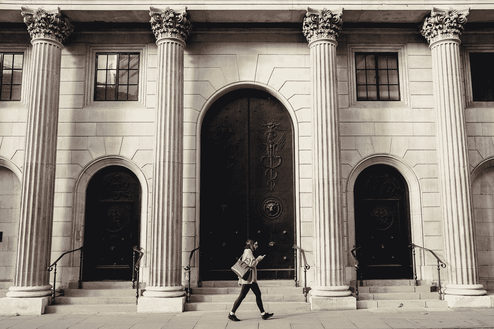

# 我在银行业的四年里学到了什么

> 原文：<https://medium.datadriveninvestor.com/what-i-learned-from-four-years-in-banking-35f3307e89df?source=collection_archive---------2----------------------->

上周，我在火车上遇到了一个以前工作时认识的人。当时是早上 7 点。他要去上班，我也是。这不会比坐火车更常见，但我偶尔会碰到保罗。我和他简短地交谈了几句。他告诉我，他仍然在为我们当地的交通系统教授健身课程，我告诉他我的新工作。当他告诉我他需要给自己买杯咖啡时，我们就分道扬镳了。

感觉是很久以前的事了，但是从 2010 年末到 2014 年末，我在银行业工作。可以说，这是我“陷入”的一个行业，因为我并没有特意去寻找它。大学毕业后，我不知道我想做什么。再加上[正在经历经济衰退](https://lilyplusjames.com/2018/09/22/the-recession-is-over-its-time-to-move-on/)，这并不是一个特别容易的决定。

我在当地银行找到了一份工作，因为我有客户服务和销售经验。在那里，我学会了数钱和展示钱的正确方法(这是我以前从未真正考虑过的)，以及如何对可能的安全风险保持警惕(例如，检查支票是否有欺诈迹象，或者观察人们在出纳员窗口与你互动时的行为)。8 个月后，我继续在当地一家信用合作社工作，因为销售环境对我来说有点吃不消。这几乎是一个竞争激烈的销售区，每周都有一场比赛，管理层会提醒我们，如果没有达到销售目标，我们可能会被解雇。

幸运的是，当我到了信用社时，情况并非如此，但我仍然有销售目标要实现。这是一个更加灵活、开放的环境，我可以打电话给公司内的任何人，他们会立即回复并给我提供有用的信息，这使得客户的体验更好。直到今天，我仍然在信用社存钱，不会推荐其他任何东西。

“closeup photo of 100 US dollar banknotes” by [Pepi Stojanovski](https://unsplash.com/@timbatec?utm_source=medium&utm_medium=referral) on [Unsplash](https://unsplash.com?utm_source=medium&utm_medium=referral)

不过，在那里的几年里，我经历了一些动荡的时刻，但也学到了很多关于人们行为的东西。我不知道我在大学里学到的所有东西，以及我在网上通过个人金融文章/博客/网站读到的东西，与访问人们的个人金融账户相比，都不算什么。

我通过他们的直接存款和实际工资知道了人们赚了多少钱(我帮助过的大多数成员都比我赚得多得多)。我通过简单地浏览他们的交易历史，了解了人们在周末做了什么——他们去哪里吃饭，他们通常在什么类型的事情上花钱，以及他们在杂货店花了多少钱(与我自己相比，这总是一个惊人的数字，我在有孩子之前，试图保持每月 200-300 美元左右)。

我们中的许多人没有意识到出纳员，也许就在我们的牧师旁边，知道这么多关于我们的个人信息。当然，我们并不都是由银行账户来定义的，但从中可以推导出很多东西。举个例子，有人经常去星巴克。说明他们有咖啡瘾，对吧？或者有人带来了很多支票，把它们分开，然后让你做多笔交易，最后花了至少 15 分钟，这意味着他们很特别，对吗？(我确实有一个成员一直这么做)。

我在银行业的日子里学到的另一件事是，你永远不能通过封面来判断一本书。我了解到，尽管很多人赚的钱(税后)比我多，但他们的支出仍然过高，所以在他们发工资的前一天，他们的账户上只有 10 美元，或者他们已经透支了。那些是不存钱的人。还有一些人很少花钱。相反，他们只有储蓄账户，每周提取一定数量的现金用于消费。还有一些人有很多存款，但也有很多债务，因为他们目前的信贷余额大约等于他们的存款。

最后，还有真正处于贫困线上的人——他们几乎没有钱，当他们有钱时，通常来自国家或政府机构，如国税局。我了解到那些人是最脚踏实地的人。他们的信用评级也很糟糕，通常是 D 级或 C 级(550-690)。

当然，通过信用评级来判断一个人是很容易的，因为信用评级等于信用价值，而信用价值又转化为人的价值。我们如何偿还债务，与我们对自己的道德义务和道德信仰有关，对吗？其他人如何看待我们也有助于这种价值。

那就大错特错了。但不幸的是，在金融界，数字意味着一切。我听人们告诉我发生在他们身上的事情，这些事情使他们的信用评级下降了 200 点。通常，只需要一个重大的灾难性事件就能让它发生，比如离婚、法律纠纷或健康状况。这些事情发生了，即使我们真的不能责怪人们(毕竟，这不是他们选择生病)，现实是——我们确实如此。银行和信用合作社从以前的衰退中得出一个观点，他们把一个人作为一个整体来看待——当然是从财务角度来看——收入和信用评分是一个人能否获得贷款的主要决定因素。别管他们现在是守法公民的事实；如果他们在过去犯了一个错误，比如因为离婚而宣布破产，他们将付出代价，实际上是很高的利息，或者在未来许多年里被拒绝。

这让我想到了特权的概念。对于那些有足够的特权，有良好的收入，允许他们被批准贷款的人来说，这为那些希望变得足够好以获得贷款的人提供了一个弯道，让他们重新站起来。在那里的几年里，我学到了很多关于特权的知识。但也许我学到的最重要的一课是关于个人理财。从看到别人在做什么，我学会了如何管理自己的钱。我知道了拥有一个退休账户有多重要。我也明白了信用可以让你受益，同时也会伤害你。

“woman walking in-front of white building with ionic pillars” by [Rob Bye](https://unsplash.com/@robertbye?utm_source=medium&utm_medium=referral) on [Unsplash](https://unsplash.com?utm_source=medium&utm_medium=referral)

现实是，银行柜员收入不高。他们的收入比最低工资高几美元，但是除了福利之外，这份特殊工作的薪水非常低，每年可能增加 25-50 美分。大多数人不知道的是，出纳员做的不仅仅是数钱和收钱。他们是货币兑换和客户问题的代理人，*此外还有*销售额外的产品，每天结算他们的钱柜，对于像我这样的一些人来说，管理整个分行的金库，这需要额外的职责。

毫不奇怪，与我关系最密切的人属于我上面描述的最后一类——几乎没有钱的人，似乎永远在挣扎的人。像保罗一样，他的账户上平均只有几百美元，我觉得我也在挣扎。但不知何故他过得还不错。他很高兴让其他人健康。如果你看看他和他的银行账户，你绝对想不到。

另一位顾客也是如此，他的名字我早就忘了，但我记得很清楚，因为他是一个举止温和的人，穿着像个穷人。事实上，他很富有。他的账户里有大约 50，000 美元，他从来没有动过，在一次谈话后，我试图让他和我们的财务顾问谈谈，他拒绝了，告诉我他在 90 年代对他的钱做了一些错误的选择，所以他只想保持他的钱的流动性，我想知道他是不是安然的受害者。

下次你去银行的时候，问问自己——这个出纳员对我了解多少？很有可能是很多。

*最初于 2018 年 9 月 29 日发表于 lilyplusjames.com。*