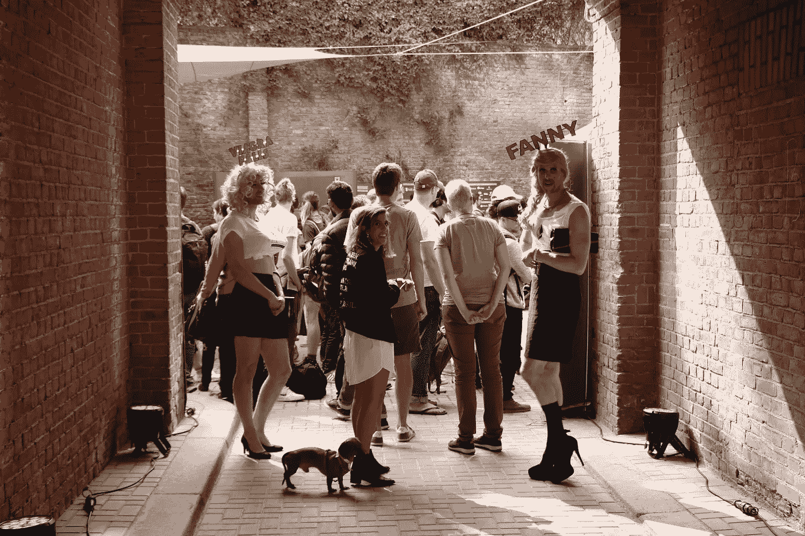

# 我从黑客马拉松中学到了什么

> 原文：<https://medium.datadriveninvestor.com/what-i-learned-from-hackathons-4c744b75ed39?source=collection_archive---------9----------------------->

Photo by [Alex Kotliarskyi](https://unsplash.com/@frantic?utm_source=medium&utm_medium=referral) on [Unsplash](https://unsplash.com?utm_source=medium&utm_medium=referral)

我想从一个坦白开始，我参加的第一个黑客马拉松是今年九月在柏林举行的。如果你知道我的以下情况，这个坦白听起来会特别奇怪:

*   我住在以色列——为什么要飞到柏林？！
*   三年多来，我一直以写代码为生——时间还很充裕。
*   我喜欢编程，就像我喜欢结识新朋友一样——在这一点上，黑客马拉松听起来太完美了。

这个帖子是我目前为止参加的两次黑客马拉松的经历，分别是 9 月的 ETHBerlin 和 11 月的 Liberthon。
我希望我的见解对你有价值。

# 你不需要的东西

在埃思柏林，我们有四个人在研究 [Pully](https://github.com/MeaninglessTechnoDebt/Pully) 。
波阿斯(和我一起做蒙蒂的人)，安东，阿维沙尔和我

Boaz 决定在 7 月份和我一起参加黑客马拉松。我们一起从以色列飞到柏林。
在黑客马拉松前 10 天，我们在 ETHBerlin 团队建设 [repo](https://github.com/ethberlin-hackathon/ETHBerlin-Teambuilding/issues) 上发布了我们的想法，但在活动开始后的几天内没有得到任何回应。

报名参加黑客马拉松，买机票，告诉我妈妈我不能回家过犹太新年，这有点让人紧张。
完全不知道谁在我们的团队中，也不知道我们是否真的能够说服任何人加入我们，也不知道我们决定实施的这个听起来不那么聪明的想法。

我总是觉得这是最可怕的部分。
太岁的想法，而且经常推而广之地把自己摆在那里。被别人评价和拒绝。

这个想法的产生并不容易。
不过，在 ETHBerlin 的案例中，我是幸运的。我的朋友 [Oleg Giberstein](https://medium.com/u/4f7190bbc0a4?source=post_page-----4c744b75ed39--------------------------------) 告诉我现有的直接借记系统有多糟糕(非常糟糕，仅供参考),所以决定专注于创建一个可行的基于加密的直接借记解决方案并不那么困难。

我记得当安东和阿维沙尔确认他们将加入我们时，我松了一口气。

我们有一个团队！！！

The Team. Photo by [freestocks.org](https://unsplash.com/@freestocks?utm_source=medium&utm_medium=referral) on [Unsplash](https://unsplash.com?utm_source=medium&utm_medium=referral)

Liberthon 是一个完全不同的故事。大约在黑客马拉松前两周，Avi 和 Nataly 加入了我。然而，这个想法完全是另一回事。

我记得当时的紧张气氛，我们完全没有准备。超负荷的工作让我们在黑客马拉松前 3 天没有一个准备会议。我们不知道我们要做什么，如何做，以及谁将负责什么。

我们最初有一些关于创建电子投票解决方案的计划。但是在我参加的预备会议之后，很明显，大约一半的其他团队都有同样的想法。
瞬间关闭。我们不得不改变它。

我看到一条推文，上面有一张 Glen Weyl 在 devcon4 上演示的幻灯片照片。经过一个小时的讨论，每个人都全力以赴为 NESSI 建立一个网络化的自我主权身份解决方案。

我们有主意了！！！

Not this Nessi

这两件事，(缺乏)一个团队和一个想法是我以前不参加黑客马拉松的最大障碍。但我并不真的需要它们。

你可以在网上、在预备会议上，甚至在当天加入一个团队(向在 ETHBerlin 这样做的人致敬)。
想法也是如此。

在你决定**要造**之后，决定**要造什么**和**谁要和**一起造就容易多了。

# 这不仅仅是一场比赛

在一天结束的时候，黑客马拉松只是你所经历的经历。你应该这样对待他们。
有趣的是，我本打算在艾伯林的 36 个小时中花将近 34 个小时在电脑屏幕前。我真的真的希望我们能赢。我们没有赢，但我也没有花 34 个小时在电脑前，我非常高兴。

起初，我怀疑我的计划可能不会像预期的那样实现。在会场入口处，我受到了两位出色的变装皇后的迎接。开幕式开始时，我 100%确定，黑客马拉松最精彩的部分不是 7500 美元的奖金，而是参加的人。

The entrance to ETHBerlin, photo from the ETHBerlin site

对李伯通来说也是如此。这么多不同的、令人兴奋的人。每个人都有话要说。从 TCR 如何被高估(设法说服我)到基于比特币的举报系统。有些人想谈论他们的产品，有些人想谈论价格。

但是他们都比普通人更了解密码。因为我不能谈论除了区块链以外的任何事情，所以这很棒。

老实说，仅仅为了多写几行代码而错过哪怕一次对话都是一种遗憾。

# 帕累托法则适用于黑客马拉松——这很伤人

帕累托法则认为 80%的效果来自 20%的努力。这在很多方面都适用于黑客马拉松。

20%的时间产生 80%的代码。

20%的代码产生了 80%的错误。

20%的 bug 消耗了你剩下的 80%的时间:)

我真的不应该对此感到惊讶，这位校长跟随了我一生。为了不陷入绝望和放弃的深渊，我们应该记住:

1.  大部分球队都和你处在同一阶段。
2.  如果你困了，小睡 20 分钟通常比盯着屏幕一个小时更有帮助。
3.  你正在为黑客马拉松结束时的演示而努力。**不是**一个实际的产品。相应地对你的 bug 进行优先级排序。

最后一点适用于整个黑客大会，而不仅仅是 bug。能够让人们在演示和评判过程中惊叹不已的功能将比消除边缘情况做出更大的贡献。即使这些特性有很多问题，并且只适用于特定的情况。

正如托尔斯泰所说:

> 所有获胜的团队都成功地进行了优先级排序，所有失败的团队都没有以自己独特的方式进行优先级排序

# 重要的不是你建造了什么，而是你如何推销它

当谈到你获胜的可能性时，推销是一个乘数。
所以一个好的广告不会让一个低劣的产品胜出，但是一个糟糕的广告肯定会让一个伟大的产品失败。

Not that kind of pitch

第一次(两次中的一次)迟到和毫无准备是我们没有获胜的最大原因之一。

负责推销的团队成员应该至少花 2 个小时积极准备演示文稿和她要传达的要点。
值得关注的要点(如 Liberthon 的 Tomer Weiss 所建议的):

*   问题和解决方案有多大(100 万)
*   你为什么选择你正在使用的技术(1M)
*   演示+执行中的困难(3M)

请注意，演示是营销中最重要的部分。
如果你的产品没有达到预期效果，你应该有一个清楚的解释。

我认真考虑了自己的建议，在 Liberthon 的演示不仅为我们赢得了掌声和当面称赞，还让我们赢得了第二名。

PS:给未来黑客马拉松组织者一个很酷的建议——让团队在开始黑客活动之前记录下他们想做的事情，并在他们的最终演讲中展示出来。

总而言之，黑客马拉松只是以下几个方面的结合:

*   创建精益创业。
*   去参加一个盛大的家庭聚会。
*   陆军睡眠预防演习。

尽管这些东西在纸上可能没有联系，但它真的很好。我希望如果你还没有参加过黑客马拉松，这篇文章会让你去参加。

在这最后一段，我要感谢两次黑客马拉松的组织者。一切都做得非常好，对于我的前两次黑客马拉松，我不能要求更好的体验。

愿接下来的会更好。

如果你觉得这篇文章有任何相关的，鼓舞人心的或有启发性的地方，请鼓掌，这样其他人也能感受到。

也请在[推特](https://twitter.com/YSvechinsky)上关注我