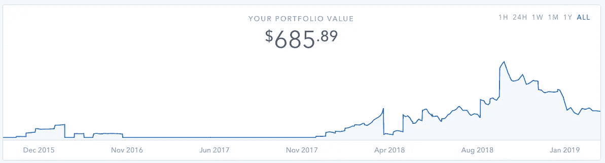
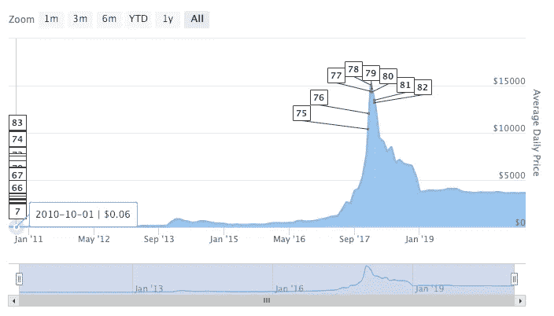
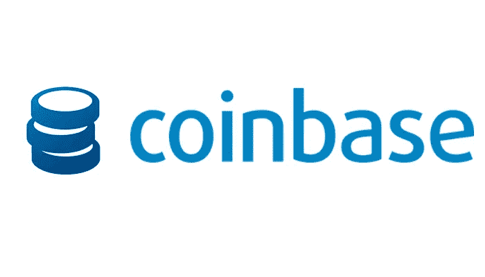
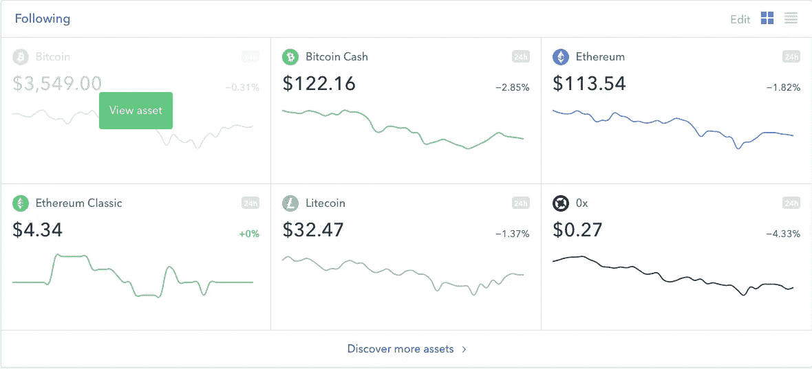
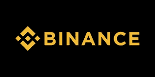
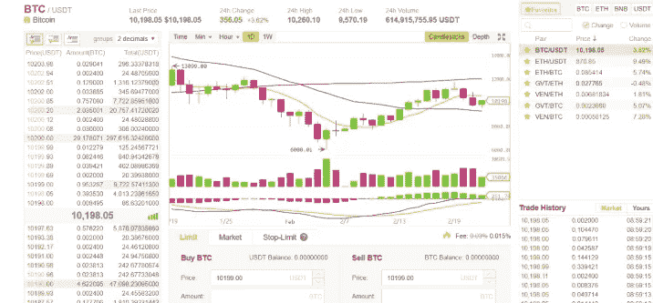
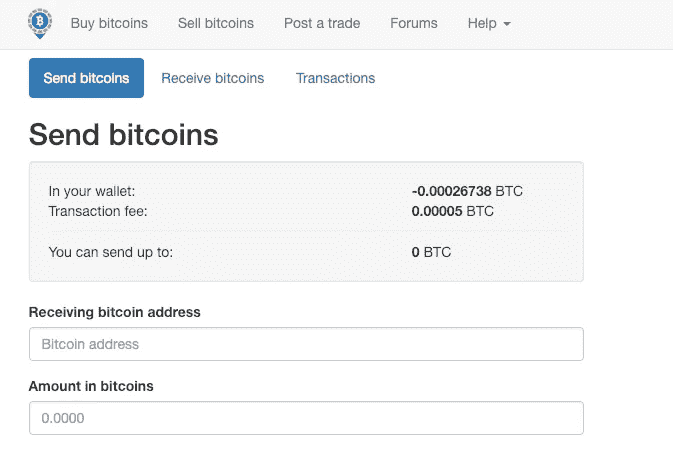

# 我从比特币基地、币安和本地比特币三年的加密投资中学到了什么

> 原文：<https://medium.datadriveninvestor.com/what-i-learned-from-three-years-of-investing-in-crypto-with-coinbase-binance-and-localbitcoins-bbed99ac0dd8?source=collection_archive---------2----------------------->

Part of the Coinbase User Dashboard showing my portfolio value over time

在过去的 4 年里，我一直使用比特币基地，币安和投资加密货币。我发现每一种都有利弊，这取决于你的目标是什么。我没有很多钱来投资，但加密货币领域实在太令人兴奋了，以至于我忍不住要尝试一下。加密货币的价值在过去的几个月里下降了，完全公开，我损失了钱。

**该评论对每个平台在安全性和用户体验方面的利弊进行了权衡。我还解释了为什么我主要使用一个而不是另外两个。我也将分享我的故事。**

# 早期的大幅上涨之后是一些失望

Source: 99bitcoins.com

**像我一样在 4 年前开始投资，当然有一些赚大钱的机会。**我第一次买 BTC 的时候，价格是 200 多美元。两年后出现了金融危机，我需要卖掉它。当它涨到 800 多美元时，幸运之神喜笑颜开。我也投资了 Etherium 和 LiteCoin，我赚了 1144.63 美元！幸运的是，对于那些没有以 800 美元卖出的人来说，接下来是一艘到 20，000 美元的火箭船，我完全错过了。但是作为一个新的投资者，尤其是刚接触 crypto 的人，我仍然对我花了近 3 周的时间完成的工作感到满意！

2018 年晚些时候，我有了一份新工作，可以再次投资。我大多是在$ 6-8K 左右买入的。然后“加密冬天”来了，价格现在在 35000 美元左右，抹去了我以前的收益。

但我仍然相信这种技术，并计划持有我的硬币足够长的时间，使我获得重大收益。当然，从长期来看，这项投资有可能接近于零，但我一开始就知道这一点。2019 年，这依然是高风险资产。它还是一项潜在高回报的资产！

# 比特币基地

[比特币基地](https://www.coinbase.com/join/5695afbc86868e0b550000f3)是加密领域的主要玩家，拥有超过 100 万用户，去年收入超过 10 亿美元。比特币基地是一个买卖 9 种加密货币(在撰写本文时)的平台，包括 BTC、ETH、LTC 等。它的工作原理是将你的银行账户连接到平台，这样你就可以存入或提取资金。比特币基地通过对交易收取少量费用来赚钱。

我的大部分交易都通过比特币基地进行。我在这个平台上拥有 6 项资产，我的大部分加密投资组合都在比特币基地钱包里。

## 安全性— 5/5

当然，最主要的问题之一是安全性。数百万美元被黑客入侵并消失的恐怖故事多年来一直困扰着人们对加密的信心。区块链软件本身是安全的。持有比特币最安全的方式可能是放在纸质钱包上。

但对于我们大多数人来说，我们希望网络服务能够方便地进行交易，幸运的是，对于比特币基地来说，小额费用和必要的信任是值得的。比特币基地从未被黑客攻击过，在所有加密交易平台中拥有最好的安全声誉。

## 用户体验— 3/5

Part of the Coinbase Dashboard

我们都希望有一个清晰、易用、有工具帮助我们分析投资的平台。不幸的是，总的来说，在这个领域，加密空间还有很多工作要做。

界面简洁明了，但它缺乏一种简单的方式来查看你的得失，我只是不明白为什么一家去年赚了 10 亿美元的公司没有在他们的应用程序中内置这样一个基本功能。有一个损益计算器，目前处于测试阶段，允许用户生成关于他们的利润和损失的报告。它之所以处于测试阶段似乎是有原因的。我生成的报表有一半是空白的！

但总的来说，它确实完成了工作，并且以一种无聊的方式看起来很舒服——非常符合我对金融应用程序的期望。

当您使用我的邀请链接并以加密货币:[https://www.coinbase.com/join/5695afbc86868e0b550000f3](https://www.coinbase.com/join/5695afbc86868e0b550000f3)买卖 100 美元或以上时，可免费获得 10 美元

# 币安

币安是目前交易量最大的交易平台，他们拥有超过 100 种可以买卖的加密货币。有，100 多。他们有很多！事实上，他们有这么多主机，这也是我当初注册使用这项服务的原因。我想尽早投资一些非常便宜的货币，以防它们升值。如果加密是一项高风险、高潜在回报的投资，那么早期未知的“另类投资”就更高了。所以我的加密投资组合中只有很小一部分是这些硬币。(我拥有少量的围棋硬币和卡达诺。)

币安同样通过收取小额交易费来赚钱。

## 安全性— 5/5

[币安](https://www.binance.com/?ref=26198212)相对较新，但在安全方面仍有出色的记录。2018 年 3 月，黑客试图进行大规模黑客攻击，但没有成功。尽管把你的资产托付给任何一家公司都有风险，但币安看起来和任何一家公司一样安全。

## 用户体验 1/5

Binance’s dashboard.

老实说，投资这些不在比特币基地的硬币是我继续使用币安的唯一原因。我受不了 UI。其实第一次用的时候，就让我很生气。币安界面更像是黑客梦想的仪表板，而不是普通用户的直观界面。我已经使用它很多年了，但我仍然很难在手机应用程序和网站上找到我想要的东西。不知道为什么这么差。但是当我想投资 alt 币的时候，这是我最好的选择。幸运的是，我不做日内交易，也不用经常用它来伤害我的眼睛。

点击这里查看 https://www.binance.com/?ref=26198212 的币安

# 本地比特币

[LocalBitcoins](https://localbitcoins.com/?ch=ymsh) 是一个有趣的早期加密交易，人们必须亲自见面才能进行交易。该公司总部位于芬兰，允许想买的用户和想卖的用户一起购买，并发布价格。然后，这些人见面，使用二维码或比特币地址，这可以在平台上创建。本地比特币只在 BTC 交易。

## 安全性— 3/5

好吧，任何涉及面对面交流的平台都不如我们可以在家使用的平台安全。由于这种面对面的互动，一些骗局在本地比特币上持续存在。这项服务最终是安全的，因为你使它。如果你知道外面有什么骗局，做好你的尽职调查，并且只在安全的地方见面，它应该和其他平台一样安全。LocalBitcoins 确实提供了一个信誉系统和托管来帮助你做到这一点。

## 用户体验— 4/5

平台很简单。它没有太多的功能，但也不意味着它是一个完整的交易平台。它更像是一个 craigslist，面向那些通过买卖比特币赚取额外现金的人。因此，它做它所说的事情，并且不难了解它是什么以及如何使用它。

点击这里查看本地比特币【https://localbitcoins.com/?ch=ymsh 

# 结论

总的来说，这些天我几乎只使用比特币。它持有我大部分的投资组合，也是被检查最多的。如果你想投资一些不是由比特币基地主办的另类投资，币安是个好地方。LocalBitcoins 使我能够在其他平台存在之前回购 crypto，但比特币基地等平台的易用性使它在 2019 年对我来说似乎已经过时了。

投资加密是一次很好的学习经历！我很高兴我一直在这样做，尽管我目前处于亏损状态。希望大收获在未来！

**免责声明:**如果你点击这些链接并注册，我会受益匪浅。但除此之外，我与这些品牌没有任何关系。我个人从不推广任何我不使用和受益的东西。我也拥有一些加密资产，我个人会从这些货币的升值中获益。

**加入 https://www.coinbase.com/join/5695afbc86868e0b550000f3:**使用我的邀请链接并以加密货币买卖 100 美元或以上，即可免费获得 10 美元:

**加入币安:**点击这里查看 https://www.binance.com/?ref=26198212[币安](https://www.binance.com/?ref=26198212)

加入本地比特币:点击这里查看本地比特币[https://localbitcoins.com/?ch=ymsh](https://localbitcoins.com/?ch=ymsh)

# 最后注意:

一个健康的投资组合应该包括几种类型的资产。分散投资是投资的基本原则之一，任何投资者都不应该把所有的钱都投入到一种类型的资产中，尤其是像加密这样高风险的资产。查看[我之前关于使用投资应用 Stash、Robinhood 和 Acorns 的文章](https://medium.com/datadriveninvestor/i-used-acorns-robinhood-and-stash-for-2-years-this-is-what-i-learned-and-earned-21baf91dda0e)，看看我是如何使用这些应用在一笔小投资上获得近 2k 美元的回报的。

要直接使用这些应用程序，请随时使用下面的链接！

加入 Robinhood 我们都将免费获得一只苹果、福特或 Sprint 之类的股票。一定要用我的链接。[http://share.robinhood.com/alexw94](http://share.robinhood.com/alexw94)

**今天就开始用橡子投资吧！**使用我的邀请链接获得 5 美元:[https://acorns.com/invite/QMMYSU](https://acorns.com/invite/QMMYSU)

藏起来:这是 5 美元。试试这个:【https://get.stashinvest.com/alex6wf9t[T21](https://get.stashinvest.com/alex6wf9t)