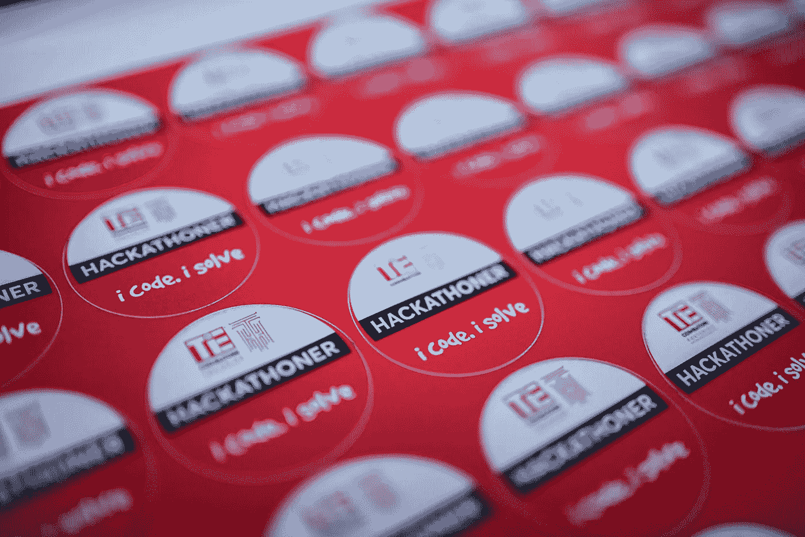
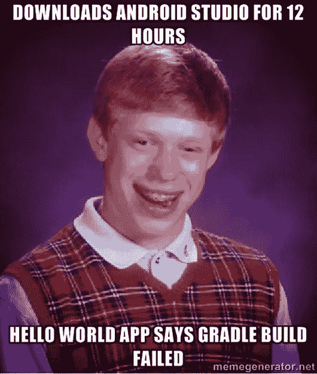
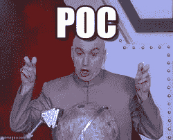

# 我从赢得我的第一次黑客马拉松中学到了什么

> 原文：<https://medium.datadriveninvestor.com/what-i-learned-from-winning-my-first-hackathon-57c5ac846e90?source=collection_archive---------13----------------------->

这是我的第三次黑客马拉松，我非常渴望获胜，但这一次我们几乎没有时间准备。所以我们想出了一个理论上可行的主意。这是一个非常简单的想法，但如果可行，它实际上可以挽救很多人的生命。因为我们的问题陈述希望我们解决一个公民问题，所以我们的想法也会吸引评委。所以我们有两天时间来完成整个项目(准确地说是 30 个小时)。我们被这场竞争搞得不知所措。一个挤满工程师、工程系学生和企业团队的礼堂足以让两个 17 岁的孩子气馁。但是我们决定我们的目标是在比赛结束时有一个工作模型来展示我们的概念证明。一开始很累，尤其是 android studio(我们的 gradle 脚本连续 3 个小时失败)。

幸运的是，到凌晨 4 点左右，它开始工作，我们进入了正题，在截止日期前 2 小时，我们的 POC 准备就绪。(在黑客马拉松中，耐心真的很有帮助)。

我们准备了幻灯片和演示给评委看，尽管我们的项目并不完美，但我们还是很满意。我们达到了我们设定的目标，所以评审结束了，评委们似乎有点印象深刻，但你永远不会知道。

所以评审结束了，我们去了闭幕式，希望至少能进入前 6 名。(有时一点点乐观会有帮助)

我们看到志愿者走向参与者，要求他们为推销做好准备。他们接近我们，但他们以为我们是 24 队，但我们是 74 队，所以他们走了，这令人心碎。但最后，他们终于给我们打了电话，我们做了最后一次推销。这不是最好的，但人们仍然鼓掌(耶！).我们回到座位上(感觉稍微开心了一点)，然后他们继续进行颁奖仪式。作为一个乐观的人，我希望获得第三名。但我们没有获得第三名或第二名，所以我们所有的希望都破灭了，然后他们宣布 74 队获得了第一名，我以为他们叫出了 24 队，但结果是我们。我很兴奋，也有点不知所措。我们还获得了 5 万卢比(700 美元)的现金奖励。

我们认为我们不会赢的主要原因是我们看到的所有项目似乎都比我们的好。我们的技术不像 ml/ai 的人那样花哨，也没有像物联网的人那样疯狂的模型(我们用旧手机代替，一个在演示中途停止了工作，但多亏我的队友迅速想到这不会影响我们的演示)。我们确实属于物联网类别。

另一件要记住的事情是，黑客马拉松中间有很多研讨会，我建议你参加，我们参加了，这对我们真的很有帮助。你可以从行业专业人士那里学到很多不同的东西，你可以让他们问很多问题。我们从他们那里学到了很多实用的东西。

我们获胜的主要原因可能是我们想法的简单性和实用性。这表明，黑客马拉松并不总是关于做最花哨的项目，而是一个可行的和与问题陈述密切相关的项目。不要因为听起来很酷就去做一些不切实际的事情。所以下次你去参加黑客马拉松的时候，尽可能真实地对待你的项目。另一个教训是，获胜的不总是最聪明的人，而是拥有正确想法和正确团队的人。我希望这对你的下一次黑客马拉松有所帮助。黑客快乐！(ps:不要忘了在这个过程中享受乐趣，你不必赢得每一场黑客马拉松，而是尝试享受自己，这可能会帮助你获胜。)

以下是了解我们项目更多信息的链接:

 [## FBDevC Coimbatore 的年轻人

### 重要的事情先来！脸书开发商圈哥印拜陀一岁了！

medium.com](https://medium.com/@FBDEVCCBE/the-young-minds-at-fbdevc-coimbatore-77c30a69cd6e)