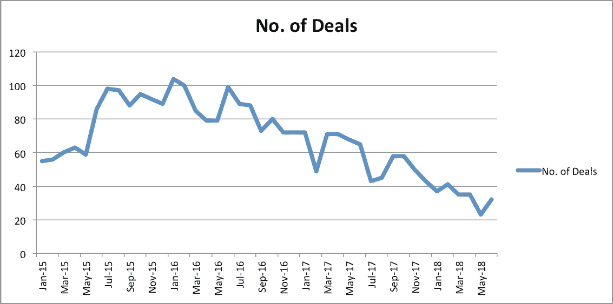
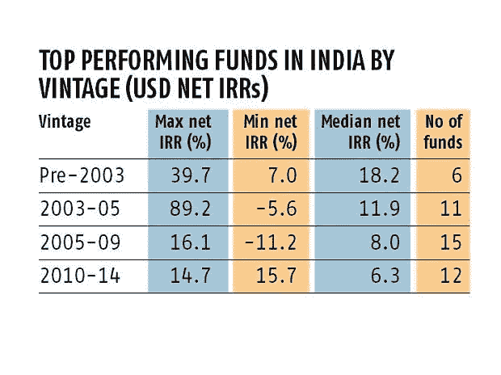
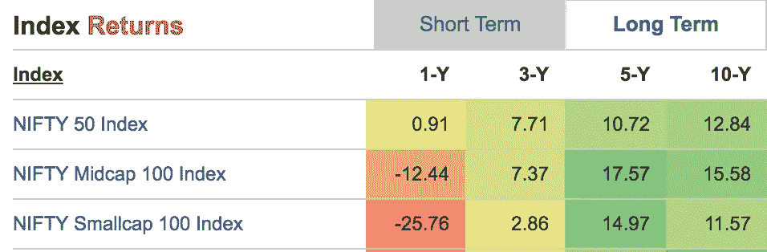
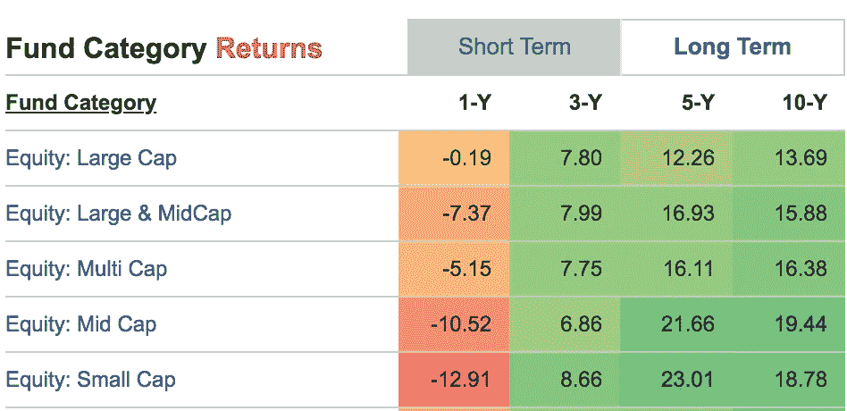

# 我从印度天使投资中学到了什么

> 原文：<https://medium.datadriveninvestor.com/what-i-learnt-from-angel-investing-in-india-c3c8d242fc63?source=collection_archive---------1----------------------->

天使投资在印度是一个相对较新的现象。随着 Flipkart、Zomato 和其他许多科技初创公司的崛起，它确实吸引了许多投资各种初创公司的人的注意，尽管这是一项非常高风险的投资。像 LetsVenture 这样的平台把它发展成了一个很好的基于网络的体验，在这里你可以搜索和找到正在寻找资金的创业公司。但是从最近几年开始，由于一些原因，获得投资变得越来越难。交易数量在 2016 年左右达到峰值，创业环境正在放缓。

*数据来源:*[*http://trak.in/india-startup-funding-investment-2015/*](http://trak.in/india-startup-funding-investment-2015/)

# **投资标准**

就我个人而言，大约五年前，我以最普通的方式被介绍给天使投资。我的几个朋友辞职后开始了新的创业，并在寻找投资。我相信他们正在做的事情，也想支持他们。我已经投资了股票市场，所以对资产负债表、估值和股票并不陌生。于是我做了前两笔投资。很快，这个消息在我的网络中传播开来，我开始每周都收到一些创业公司的介绍。

我的投资标准非常简单。

1.  对这个想法的真诚信仰。不完全是市场规模研究，而是从我有限的视角来看，一种看起来像是真正需求的感觉。例如，AhaTaxi 是最早解决小型出租车供应商双向收费问题的出租车公司之一。我认为这是真正的需要。另一个是 ShaadiSaga，一个婚礼相关服务提供商的市场。有一些地方我不相信这个想法，比如出租衣服或交付打印照片，因此没有投资。
2.  **创始人的承诺和性格**。我与创始人交谈，试图评估哪些创始人真正致力于他们的使命，而不仅仅是将它视为任何可以获得资助的业务。看起来可能在道德上偷工减料的创始人，或者试图制定可被操纵的股份协议的创始人，都被排除在外，即使这个想法对我很有吸引力。虽然强烈建议天使投资者应该评估实力和经验，但我通常更看重商业和执行计划中的技能和勤奋。
3.  **估价的合理性**。虽然创业公司估值是一件冒险的事情，没有或非常初始的收入可以作为任何预测的基础，但似乎许多年轻的创始人只是看到了天使投资的上升趋势，要求 200 万美元以上的估值，而没有太多的收入。这么早就与创始人谈判估值没有太大意义，因为最终如果初创企业成功了，那也没什么关系。然而，它确实展示了一个创始人所代表的东西。
4.  **我们公司的客户**——因为我也经营一家精品软件开发公司，任何给我们带来可观收入并寻求最终推动力的客户，我们也投资了他们的想法。其逻辑是，既然他们如此相信这个想法，作为技术合作伙伴，我们也应该分担一些风险和回报。

# **目前为止的结果**

总体而言，我们直接或通过我的公司 [iPragmatech Solutions](https://ipragmatech.com) 进行了六项投资。我从一开始就意识到这是一项高风险的投资，许多初创公司都会失败，到目前为止，我很幸运，因为大多数初创公司仍然做得很好。

1.  [太阳石商学院](https://sunstone.edu.in/)——零收入投资。3 年内以 2 倍回报退出。
2.  [脚印日托](https://www.footprintseducation.in/) —零收入投资。拥有 80 多个特许经营店，满足 5000 多个孩子的需求。
3.  [阿哈出租车](https://www.ahataxis.com/) —城际出租车。每月投资 30 次。n̶o̶w̶̶d̶o̶e̶s̶̶7̶0̶0̶0̶+̶̶t̶r̶i̶p̶s̶̶a̶̶m̶o̶n̶t̶h̶̶a̶n̶d̶̶l̶o̶o̶k̶i̶n̶g̶̶f̶o̶r̶̶n̶e̶x̶t̶̶r̶o̶u̶n̶d̶̶o̶f̶̶i̶n̶v̶e̶s̶t̶m̶e̶n̶t̶收回了 90%的投资。
4.  WeNomads 基于体验的旅行。零收入投资。生意结束了。
5.  [ShaadiSaga](https://www.shaadisaga.com/) —婚庆服务市场。投资于初始收入。̶r̶a̶i̶s̶i̶n̶g̶̶a̶n̶o̶t̶h̶e̶r̶̶r̶o̶u̶n̶d̶.̶收回了 70%的投资。
6.  [LeadSquared](https://www.leadsquared.com/) —基于 SaaS 的营销自动化和 CRM 软件。投资于初始收入。成功募集 b 轮。
7.  [贷款俱吠罗](https://www.loankuber.com/) —数字抵押平台。零投资，现在 AUM 7.5 铬。下一轮加注。

# **错过了公交车**

显然，有时你会错过公共汽车。早期的信息不容易获得，如果你不在网络中，你可能甚至不知道创业公司正在筹集资金。

让我以 Zoomcar 为例——我是它的第一批顾客之一，特别是因为他们的口号——*我们的关系始于信任，而不是金钱。*我很晚才知道他们正在筹集资金，那一轮已经结束了。

我的第二个遗憾是[的狗窝](https://www.dogspot.in/)。作为一名爱狗人士，我很早就看到了他们活跃的社区，并对他们筹集资金成为宠物用品市场很感兴趣。我也有机会投资，但没有快速做出决定。

以上两项都做得相当不错。然而，这是一个教训。创业投资实际上就是要快速做出决定，不要犹豫你的答案是“是”还是“否”。

# **我学到了什么**

1.  仍然是一个独家俱乐部——大多数进一步融资的初创公司都是知名天使投资者最初投资的公司。如果没有，对于创业公司来说，筹集下一轮资金是一项艰巨的任务。所以你应该坚持投资那些至少有一两个知名天使投资人的创业公司。
2.  需要很长时间——通常当风险投资基金投资创业公司时，你会有机会退出，尽管并不总是这样。但是你需要很长时间才能退出。在第一种情况下，我在 3 年后退出，但我的大部分投资没有显示出 5 年后退出的可能性。
3.  没有那么高的回报——我还没有看到任何创业投资的 5 到 10 倍的回报。大多数创业公司以不到上一轮投资两倍的价格筹集下一轮投资，这也需要一两年时间。加上创业投资的巨大风险，这并不具有吸引力——除非你碰巧发现了一个像中彩票一样的 Flipkart。
4.  需要付出很多努力——通读投资建议书、与创始人交谈并做出选择需要付出很多努力。然后你必须把协议准备好，并记录所有的文件。
5.  税收问题——即使是所得税当局也帮不上忙。对于所有关于“创业印度”的大讨论，所得税仍然对创业公司产生影响，因为他们的估价是任意的，不是基于资产的。作为投资者，你必须对此做出回应。我敢肯定，如果他们中的任何一个成功退出，我也会收到一些通知。

# **这与股票市场相比如何**

由于我是共同基金和股票市场的积极投资者，考虑我能产生多少回报是一件有趣的事情。如果有人做了大量投资，最好的希望是专业管理的风险投资基金。由于印度风险投资基金的数据很难获得，我比较了它们与私人股本基金的回报。事实证明，中间值并不那么令人印象深刻。

Top performing PE funds in India

*来源:*[*https://www . business-standard . com/article/specials/snapshot-of-private-equity-in-India-118011100079 _ 1 . html*](https://www.business-standard.com/article/specials/snapshot-of-private-equity-in-india-118011100079_1.html)

一些研究人员有充分的证据表明，与股票市场相比，风险投资基金的平均回报率并不高。

Tomer Dean 在他的文章中指出，大多数风险投资基金在 10 年内无法实现 3 倍的回报，也就是每年 12%的回报。

> 风险投资基金需要 3 倍的回报才能达到“风险回报率”，才能被认为是一项好的投资(1 亿美元基金= > 3 倍= > 3 亿美元回报)。下图显示了 5%的风投公司做到了这一点。正如我们所见，只有绿色的小薄片将它带回家。其他 95%的人在收支平衡和彻底亏损之间徘徊(记得调整通货膨胀)
> 
> [*https://TechCrunch . com/2017/06/01/the-meeting-that-show-the-show-me-the-truth-about-VCS/*](https://techcrunch.com/2017/06/01/the-meeting-that-showed-me-the-truth-about-vcs/)

另一位研究人员，来自剑桥大学的 Michael Mackenzie 在他的论文**风险投资基金的表现和 IPO 市场** 中显示，回报率与公共股票市场相当。

> 在这篇论文中，一个大型风险基金数据库的投资业绩被考虑了 28 年。结果表明，风险资本合伙企业的投资组合可以提供优于公共股票市场的平均回报，尽管单个基金的回报高度正偏。如果没有这些异常值，基金的表现水平会更符合公共股票市场的回报。[*https://www . research gate . net/publication/281127544 _ Venture _ Capital _ Fund _ Performance _ and _ the _ IPO _ Market*](https://www.researchgate.net/publication/281127544_Venture_Capital_Fund_Performance_and_the_IPO_Market)

现在让我们把它与印度股票市场进行比较。如果我们不考虑最近的危机，从 5 年多的角度来看，股票市场已经产生了丰厚的回报。

*来源:*[*【https://www.valueresearchonline.com/】*](https://www.valueresearchonline.com/)

共同基金的表现甚至更好。这里有一个与类别平均值的比较。

*来源:*[*https://www.valueresearchonline.com/*](https://www.valueresearchonline.com/)

所以我的结论是，天使投资在印度的风险回报比并不值得付出努力和损失流动性。如果你是一个小投资者，而且不属于大投资者的专属俱乐部，那么通过共同基金投资中型或小型公司，你可能会做得更好。

因此，虽然它教会了我很多新东西——塑造我们世界的各种商业理念，估值如何工作，但我与天使投资的短暂恋情已经结束。我已经决定把自己限制在天使投资，只投资于一个由知名朋友组成的小圈子，目标不是投资，而是支持朋友，他们比世界上任何金钱都有价值。

你的经历是什么？我很想通过你的评论了解一下。并深深感谢经验丰富的天使投资人的真知灼见。