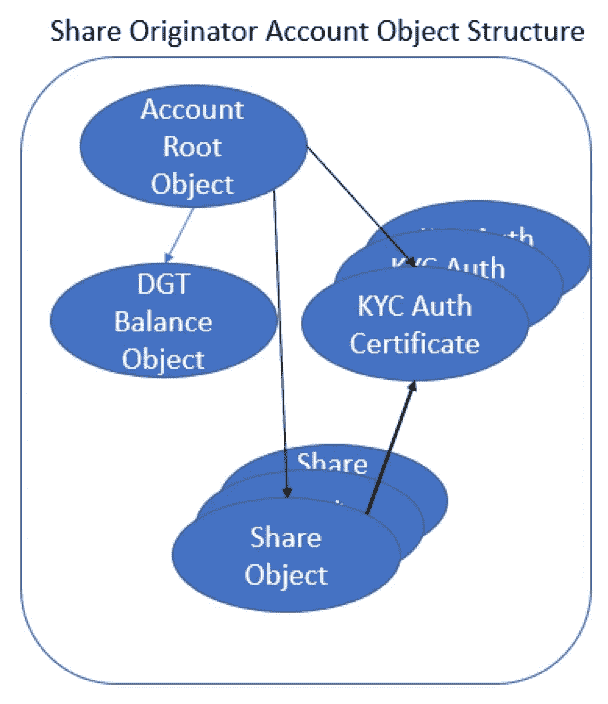
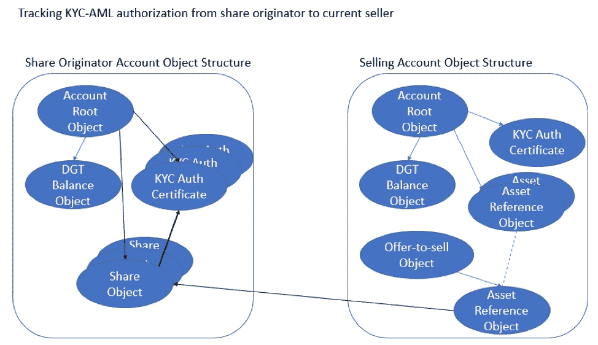

# 如果 KYC 反洗钱规则和法规可以在没有“特别……”的情况下强制执行，会怎么样

> 原文：<https://medium.datadriveninvestor.com/what-if-kyc-aml-rules-and-regulations-could-be-intrinsically-enforced-without-specially-45101a4bd274?source=collection_archive---------18----------------------->

**利用可证明的算法 KYC 反洗钱执法解决 KYC 反洗钱问题，在数据网格区块链** *上推广另一项来自 David Beberman 和 Prasaga R & D 团队的创新。*

作者:Prasaga 有限责任公司首席技术官 David Beberman

**概述**

下文详述了标题为“**剖析数据网格区块链上的可扩展区块链对象模型和可扩展智能对象资产的资产和价值转移**”[【1】](https://medium.com/@michael_11858/what-if-kyc-aml-rules-and-regulations-could-be-intrinsically-enforced-without-specially-c5ed7088987f#_ftn1)的论文，描述了使用授权对象实现管理了解客户(“KYC”)和反洗钱(“AML”)要求的示例。证券资产(如公司股票)的销售受世界各地的监管机构监管。这种要求的一个例子是向美国的合格投资者[【2】](https://medium.com/@michael_11858/what-if-kyc-aml-rules-and-regulations-could-be-intrinsically-enforced-without-specially-c5ed7088987f#_ftn2)出售。

 [## 总部设在瑞士的 ETP 进入加密交易市场-数据驱动的投资者

### 虽然金融市场几乎没有沉闷的时刻，特别是在引入…

www.datadriveninvestor.com](https://www.datadriveninvestor.com/2019/03/10/swiss-based-etp-enters-the-crypto-trading-market/) 

使用基于可扩展智能对象资产(“XSOAtm”)的“智能共享对象”概念，如下所示，使 KYC-AML 跟踪成为一种自动的内在操作，独立于原始共享账户、卖方账户或买方账户。以下是对数据网格区块链(“DGBtm”)、可扩展区块链对象模型(“XBOMtm”)和 XSOA 如何能够满足 KYC 法规的概念性描述。

**股票发起人账户**

创建共享的帐户称为共享发起帐户。这种账户的一个例子可能是一家新成立的公司，该公司通过私募备忘录进行私募销售。此类账户受其注册管辖地的法规约束，包括公司注册和遵守其中的规则和法规。可证明的、算法上强制的遵守是通过帐户所有者创建以下帐户结构直接实现的。

**准备股份发起账户**

发起者帐户向其自己的帐户发送共享创建事务，用总的授权份额作为共享对象填充该帐户。

发起账户证明，在 DGB 上，其被授权通过在其账户中创建 KYC-反洗钱授权证书对象来提供其股份对象。发起帐户可能包含多个授权证明，具体取决于不同的管辖区要求。

准备原始帐户的最后一步是从“共享”对象添加对一个或多个 KYC-AML 授权证书对象的引用。该引用使 share 对象能够将其授权与买方帐户的授权进行比较，并相应地允许或拒绝购买。我们将 share 对象代码固有的这一特性描述为智能 Share 对象。

**当前卖家账户**

提供待售共享对象的帐户称为当前卖方帐户。可以有多个这样的账户。每个账户必须遵守发起账户管辖地的规则和法规。此外，当前卖方账户也可能被要求明确地向股份发起账户的管辖地注册，以证明其被授权持有和出售这些股份。可证明的算法实施是直接启用以下帐户结构。

**准备当前卖家账户**

当前卖家账户向自身发送交易，创建一个或多个 KYC 反洗钱授权证书。卖方账户需要这些证书来向股票发起账户证明卖方被授权持有股票并进行销售。

股票发起账户将一部分股票转移到卖方账户。共享发起帐户所有者直接确信销售者帐户具有适当的授权，否则智能共享对象将拒绝转移。注意，如所描述的，共享对象永久地保留在共享发起帐户中，它是对共享对象的引用，以在共享所有者帐户之间创建和转移的资产引用对象的形式。

当前卖方账户出售股份的过程与任何其他智能对象资产出售的过程相同。如所描绘的，当前卖方账户创建具有一个或多个资产引用对象的要约出售对象(即报价)。当前卖方保证，任何成功的销售都可以证明遵守了所有的份额的司法管辖区的规则和条例，没有任何进一步的行动。

**买家账户**

购买待售股票的账户称为买方账户。每个账户必须遵守发起账户管辖区的规则和规定，才能从发起账户持有股份。此外，还可能要求买方账户明确地向股份发起账户的管辖地注册，以证明其被授权持有此类股份。可证明的算法实施是直接启用以下帐户结构。

**准备买方账户**

买方账户向自身发送交易，创建一个或多个 KYC 反洗钱授权证书。买方帐户需要这些证书来向当前卖方帐户证明买方帐户有权持有股票。

买方账户参照买方账户拥有的 KYC 反洗钱授权证书对象，以及支付股份的适当 DGT 金额，创建购买要约(即采购订单)。包含关系的增加如上所述。

股份的出售与任何其他智能对象资产的出售一样进行。如所描绘的，当前卖方账户包含出售要约对象，而买方账户包含购买要约对象。交易将两个对象关联起来，一旦被双方接受，资产和价值的转移就开始了。当前的卖方和买方都确信，任何成功的销售都可以证明遵守了所有份额的司法管辖区的规则和条例，而没有任何进一步的行动。

**补充评论**

以上是对象结构的简化示例，该对象结构可以容易地用 XBOM 创建，以使得能够遵守针对特定资产和特定账户的各种规则和规定，而不影响 DGB 的一般特征和能力。考虑到不需要遵守管辖区规则和法规的账户不受影响，关于同样不受管辖区规则和法规管辖的资产。例如，非政府资产账户之间的私下销售可能直接发生在任何账户之间。

可证明的算法执行的概念从个人账户实现中移除了规则和规章的执行责任:发起者、销售者、购买者。XBOM 通过使用通用的实时代码实现了这种算法实施，消除了所有个人帐户违反规则和规定的风险。

注意，在所有上述描述中，所有交互都是在帐户和相关对象之间直接进行的。XSOA 支持的智能共享对象消除了对专门授权的中介的需求。这有一个有益的副作用，即消除了作为集中点的中介。因此，DGB、XBOM 和 XSOA 以及相关技术促进了加密货币和资产的去中心化。

数据网格令牌、DGT、数据网格区块链、DGB、可扩展区块链对象模型、XBOM、可扩展智能对象资产、XSOA 都是 Prasaga，LLC 的商标。保留所有权利。

[【1】](https://medium.com/@michael_11858/what-if-kyc-aml-rules-and-regulations-could-be-intrinsically-enforced-without-specially-c5ed7088987f#_ftnref1)[https://medium . com/@ db eberman/anatomy-of-asset-and-value-transfers-with-extensible-区块链-object-model-and-extensible-2c 560 f 42 b 9 b 2](https://medium.com/@dbeberman/anatomy-of-asset-and-value-transfers-with-the-extensible-blockchain-object-model-and-extensible-2c560f42b9b2)

【2】[【https://www.investopedia.com/terms/a/accreditedinvestor.asp】](https://www.investopedia.com/terms/a/accreditedinvestor.asp)

*原载于 2019 年 6 月 19 日*[*https://medium.com*](https://medium.com/@michael_11858/what-if-kyc-aml-rules-and-regulations-could-be-intrinsically-enforced-without-specially-c5ed7088987f)*。*