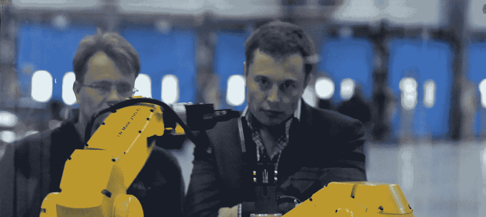

# 如果埃隆·马斯克没有任何问题呢？现实核查。

> 原文：<https://medium.datadriveninvestor.com/what-if-there-was-nothing-wrong-with-elon-musk-a-reality-check-5099e0b44b1b?source=collection_archive---------11----------------------->

Photo by [Steve Jurvetson](https://www.flickr.com/people/44124348109@N01)

这些天，很多人都在向埃隆·马斯克扔石头，并预测特斯拉的未来会很糟糕。有些人担心他的健康状况，担心他的行为会损害他的公众形象。其他人认为，我们已经走到了一个神话的尽头，这个神话是一个非常古怪、反复无常的企业家，他将带领人类走向救赎(可能是在火星上)，现在人们开始意识到，他的梦想只是梦想，他只是一个随机的反复无常的企业家。

## 超越神话，一家先锋公司

埃隆·马斯克(Elon Musk)不遗余力地在普通观察者眼中树立自己是人类救世主的形象——这是一个神话。在阿什莉·万斯写的《T2·埃隆·马斯克》一书中，你可以读到关于这位毫不妥协的冒险家的一切，他甚至会在一次聚会上把自己放在一个扔刀者面前，以取悦观众。

神话对于宣传来说是很棒的，因为它们可以让你和你的产品获得免费关注(现在他得到了很多这样的免费宣传)。然而，人们并不相信神话。他们所购买的，是让他们以一种新的、更先进的方式生活的体验和产品。人们生活在文明中，文明意味着进步，而进步意味着能够感受到并告诉你，你今天的生活比昨天过得更好。[如果你读过开特斯拉的人的评价，你就会知道我说的是什么样的“新”体验。](https://www.popularmechanics.com/cars/hybrid-electric/a23085684/review-tesla-model-3-performance/)除了天才企业家的神话之外，特斯拉实际上是一家先锋公司，它推出了一种全世界都会追随的产品/体验(就像苹果推出 iPhone，亚马逊推出电子商务)。

潜意识里，人们倾向于相信这个神话般的人如此成功，因为他是如此的神话和神奇。也许这是史蒂夫·乔布斯个人崇拜的遗产，在公众心目中树立了这种信念。当神话破灭时，人们会认为它留下的东西(反复无常、古怪、爱冒险的个性)对公司有害。不一定有直接的联系，因为不是埃隆·马斯克的偏心创造了特斯拉，这种偏心只是与它兼容，而不是它的起源。因此，如果你相信一个神话，现在不再相信，那也不会改变公司及其产品的本质。特斯拉仍然是一家先锋公司。

## 消费技术市场倾向于奖励先驱…

消费者对先锋公司有着特定程度的信任，甚至在一个先锋产品推出几十年后，他们仍然信任第一个向大众市场推出同类产品的品牌。

看看苹果吧，它是世界上第一家市值达到万亿美元的公司，距离第一部 iPhone 上市已经过去了将近 10 年。再来看看亚马逊，这家电子商务先驱，也是第二家估值达到万亿美元的公司，在它开始第一家网上书店业务的 25 年后。

如果你还怀疑先驱品牌的力量，只要想想先驱车企(福特、奔驰……)的寿命和今天的市值就知道了。

## …先驱们往往会奋斗数年

我记得亚马逊的早期，我们仍然习惯于通过拨号连接访问互联网(你们中的一些人可能还没有出生，或者当时没有使用亚马逊)。这是有史以来最伟大的网站，但它花了很长时间来加载。你可以在你的浏览器中输入“amazon.com ”,然后去给自己冲杯咖啡，然后回来，它仍然会加载。相信这种东西能卖给没有耐心的现代人任何东西，那简直是疯了。然而，看看我们现在在哪里。

苹果与失败的产品斗争了多年，现在没人记得了(记得[苹果牛顿吗？](https://en.wikipedia.org/wiki/Apple_Newton)—1993 年的 iPad 前身)。花了很多年才找到合适的产品和合适的方法，让人们的生活在没有它的情况下变得几乎不可想象。

特斯拉在竞争中有一个很好的优势(部分归功于其神秘的领导者),能够让人们不用花一分钱就能谈论它。不需要支付博客，影响者，广告。如果有一件事让神话更加强大，那就是公众的拒绝和回归优雅。

更新:[据法国杂志《挑战》](https://twitter.com/milstan/status/1045604563036893190)报道，2018 年 8 月，特斯拉的 Model 3 在美国销量排名第五，但如果我们看看总价 9.925 亿美元，则排名第一。与此同时，对埃隆·马斯克的攻击越来越激烈。