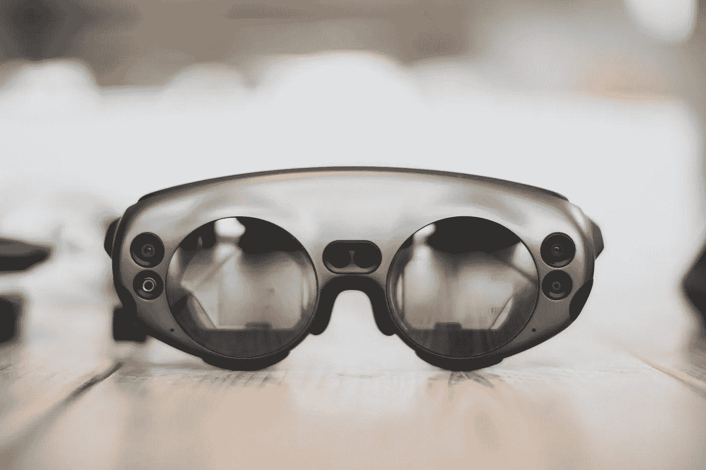
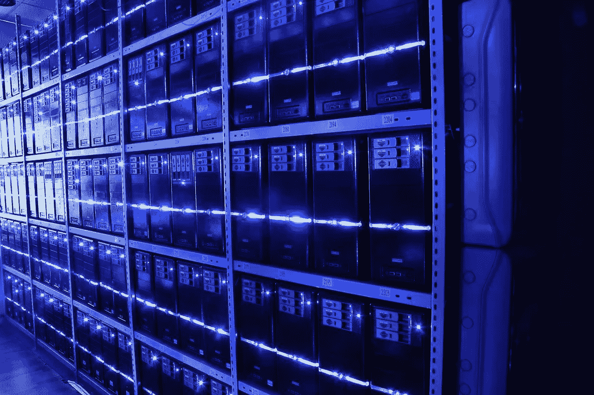

# 如果我们能在几秒钟内体验 80 亿人的生活会怎样？

> 原文：<https://medium.datadriveninvestor.com/what-if-we-could-experience-8-billion-human-lives-in-a-few-seconds-a9d5bcdead2a?source=collection_archive---------8----------------------->

## 这可能只是先进信息技术的问题

本周我得到了最新的科技更新，一款 Apple Watch Series 5 和 iPhone 11 Pro Max。

我已经二十多年没有戴手表了，但心率传感器技术太令人印象深刻了，无法绕过，特别是因为我每周跑 42 英里，除了体重和粗略的脉搏计数之外，没有任何生物特征跟踪。

我并不认为有绝对必要获得最新、最强大的智能手机，因为我的 iPhone 7 Plus 感觉足够快，可以满足我的所有需求，如果不是因为电池寿命只有 3 小时的话。以每秒 60 帧的速度录制 4k 视频的能力和大幅延长的电池寿命都由最先进的 A13 仿生片上系统支持，该系统具有智能手机上最快的 CPU 和 GPU，以及神经引擎和 85 亿个优化计算任务的晶体管，这些都令人印象深刻，我无法抗拒。

就手表上的个人跟踪功能以及令人难以置信的 1200 万像素摄像头和 4k 视频录制功能而言，我完全被这些设备迷住了。即使只是看着手表或 iPhone 屏幕，什么也不做本身也是一种享受，因为颜色如此鲜艳，显示屏如此清晰。

然而，我不会审查这个令人难以置信的硬件，因为有令人印象深刻的书面和视频审查在其他地方。我想考虑的是这项不可思议的技术的发展趋势。

*   如果我们不仅仅是跟踪我们的心率，而是拥有可以跟踪我们身体每一次运动的传感器，精确到毫秒或更少，并且一直工作，会发生什么？
*   如果我们不仅仅是在 1200 万像素的相机上拍摄几秒钟的 4k 视频，而是可以接近人眼大约 6 亿像素的分辨率，并且在我们周围的球体上记录更多的视频，会发生什么？
*   如果我们也能捕捉我们周围所有的环境噪音，会发生什么？

我会考虑这些问题，看看人类与科技融合后会发生什么。

# 人类已经在与科技融合

我们喜欢认为技术是“高科技”或未来的东西。然而，自从人类存在以来，甚至在我们进化成现代人类之前，我们就一直在这么做。例如，衣服和火的技术的使用已经允许我们在寒冷的地区定居，这是不可能的。

现在，我们联网的智能手机让我们能够获取所有人类知识。我们可以与世界各地的人进行即时交流，这种交流的距离远远超过我们的声音所能传递的距离或我们视觉所能看到的距离。

Apple Watch 和 iPhone 11 Pro Max 的增强录制功能只是一系列渐进技术改进的下一步。

未来的下一步会是什么？让我们考虑跟踪和记录机械身体运动、视觉信息和听觉信息。

# 身体运动

## 记录身体运动

让我们考虑使用记录设备来跟踪你身体的每一个动作，从大范围的身体特征，如你的臀部、手臂和腿，一直到手指或眼睑。

这些记录设备有可能作为小型植入式运动检测传感器存在。它们也可以是生物可降解的，这样它们就可以融化到身体里，被随后更高分辨率和更节能的版本所取代。

这些可植入的传感器将允许我们跟踪我们身体的每一个动作，并精确地将它们存储在云中。现在，我们只能说我们可以追踪到单厘米的空间分辨率和单秒的时间分辨率。我们生活中的每时每刻都在发生这种情况，并且不断地收集数据并将它们存储在云中。

## 体验身体运动

想象一下，未来植入我们所有肌肉的微小力反馈装置将电信号转化为机械力。

这将让我们感受到其他人在生活中经历过的记录下来的运动，类似于他们可能的感受。

用不同的步态走路会是什么感觉？或者某人的身体组成和形状与你的身体有很大不同？

A very rudimentary device for capturing all visual data. Future records would be barely visible.

# 视觉信息

## 记录视觉信息

目前，iPhone 11 Pro Max 有一个 1200 万像素的摄像头，每秒约 60 帧。相比之下，人眼可以看到大约 6 亿像素，每秒大约 100-1000 帧。

并非所有这些帧都进入了我们的意识，因为大脑根本没有处理能力，即使我们每秒钟意识到 1000 个不同的帧，它也不会发现所有这些信息都是有用的。因此，即使大约每秒 100 帧也很容易感觉像实况视频。

假设我们可以复制人眼的视觉敏锐度，但摄像机记录的是我们周围的一个完整球体。这种记录也是连续发生的。这意味着即使我们没有专注于某个特定的区域，即使我们看不到身后，即使我们睡着了，它也在记录。

这种记录日复一日，年复一年，年复一年，记录整个人类的生活，并将数据上传到云端。

## 回放视觉信息

如果我们回放这些信息，我们不仅会重温某人一生中通过他们的眼睛看到的东西，而且我们会看到远远超过他们有意识经历的东西，因为:

*   大多数信息，尤其是视觉信息，无论如何都不会出现在意识层面，而仅仅停留在潜意识的低级大脑过程层面。
*   如果信息不在他们的视野中，记录下来并回放的信息甚至超出了他们在发生时所能接触到的范围。
*   关于他们生活的大部分信息从来没有被有意识地回忆起来，因为他们睡着了或者没有有意识地处理视觉信息。

此外，如果我们要比较我们回放的记忆，它将与我们的技术记录的分辨率一字不差。相比之下，一个积极回忆记忆的人不是简单地从存储器中查询记忆，而是根据需要用记忆的数据片段重新创建记忆。因此，会有比精神重建更高保真的回放。

# 音频信息

## 录制声音

记录环境音频信息所涉及的问题与视觉信息非常相似。

这可以包括在大约 20 赫兹到 20，000 赫兹的人类听觉范围内的所有频率上进行记录。

如果我们的注意力不集中在这些声音上，大多数声音甚至不会被注意到，例如，在与某人的对话中，我们可能不会注意到背景中的多个其他对话，因为我们太忙于处理所说的话、辨别意思和思考回答。

## 播放声音

类似地，回放音频信息也非常类似于回放视觉信息。这将是关于获得可用的声音，这些声音可能是在录音时由于注意力不集中或由于睡眠而不能意识到和录音的人所不能获得的。

# 超越人类感官数据

## 技术增强了可访问的感官数据

所以让我们更进一步，超越人类的感官数据。我们不必局限于人类感觉器官能够记录的东西，因为人类的感觉只能捕捉一小部分现实。考虑下面的例子。

*   对于视觉数据，我们可以超越 400 到 700 纳米(nm)之间的可见光谱，包括:
    —10-400nm 的紫外线等较低波长
    —700nm 到 1 毫米的红外线等较高波长
*   类似地，对于音频数据，我们可以超越 20 到 20，000 赫兹之间的听觉频率
    ，将高于 20，000 赫兹的频率转化为超声波
    ，将低于 20 赫兹的频率转化为次声

这将扩大我们所拥有的感官数据的范围。它可以被解释为扩展我们的意识仅仅是为了能够记录更多的数据。

## 情感数据

现在，让我们也考虑一下，我们有传感器能够测量人类大脑突触中神经递质和化学物质的确切浓度，记录大脑神经元活动的电触发。然后，我们可以将它与肌肉运动甚至心率运动结合起来，重建和合成更完整的身体体验。

未来几十年，科学将会进步，因此我们也可以利用这些数据来重现情感体验。

有趣的是，心理学中一个被广泛接受的模型是，运动可能实际上来自已知的指示情绪的身体感觉，而不是在经历情绪后产生的身体感觉。

一个有趣的例子是看到危险，比如一条蛇。视觉信息传播很快，比我们有意识的大脑处理信息的速度快得多，并直接到达杏仁核，进而诱发我们称为恐惧的身体感觉。

Imagine if all the information for reliving a human life could be stored in cloud data centers

# 重温人类生活

## 大量的数据

当然，在人的一生中，记录所有这些感官数据可能会达到 Pb 甚至 EB 的规模，但信息技术的惊人进步将允许我们也可以经济高效地将所有这些数据存储在云中。

使用这些记录的信息，我们可以通过植入我们肌肉的植入设备，通过我们的视神经或我们的耳朵播放数据流，这样我们就可以过完整的人类生活。

## 加快播放速度的神经假体

现在让我们考虑一下，我们拥有可以扩展大脑处理能力和注意力的神经假体。在许多方面，这已经通过咖啡因、Adderral 或莫达非尼等物质以微弱的形式存在。我们有可能用这些神经假体在比生活更短的时间内回放整个人生。

有了足够强大的技术，我们可以在几天、几小时、甚至几分钟、几秒钟内重温整个人类的生活。

# 重温多重人生

## 不止一条命

因为重温一个人的生命所花费的时间可能比实际生活的“未压缩”版本要少得多，这意味着我们可以过不止一个人的生命。

两种生活可能是彼此认识的人的不同视角，也可能是两个随机的人过着完全不同的生活。不难想到有趣的情况。

## 活在当下

抛开所有隐私、伦理和技术方面的考虑，我们可以将这种情况从两个人的生命扩展到 2 亿 200 万人，然后扩展到今天地球上所有的 80 亿人。

这显然需要巨大和先进的处理能力，因为它可能需要复制和播放数据，就像通过人类生活的外部感觉器官流向内部化学物质进行感觉的信息一样。

然而，它并没有被物理定律明确禁止(因此，根据默里·盖尔·曼和其他人支持的“极权主义原则”，它是强制性的)，它只是需要极其大量的计算能力，并简化为一个“纯粹的”工程问题。

也许随着未来量子计算和/或利用整颗恒星的能量进行计算的能力，所需的计算量将很容易实现。

## 重温另一个现实，看得更深

我们读小说和看电影，是为了体验不同的视角或可能跨越多年甚至几个世纪的现实，并在几个小时内以共鸣的方式重温这一切。请注意，这些也是数据传输和重新体验的形式，只是从头到尾的数据减少了很多，甚至可能是虚构的。

然而，在通过使用技术来重新体验另一个现实方面，原理是相同的。

## 想象一下，在几秒钟内，我们可以从 80 亿人的生活中学习到什么？

这真的是令人难以置信的考虑，它可能会与更进一步的先进信息技术。