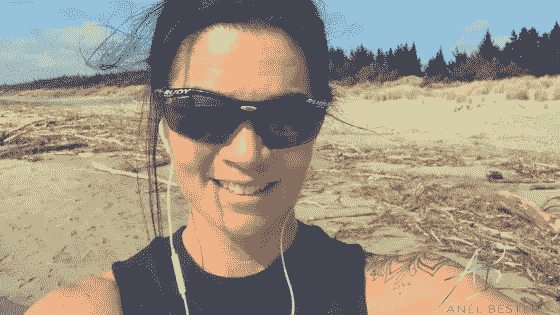

# 如果你放弃挣扎，做你来这里想做的人呢？

> 原文：<https://medium.datadriveninvestor.com/what-if-you-dropped-the-struggle-and-be-who-you-came-here-to-be-bb9c9554299b?source=collection_archive---------44----------------------->

随着 LinkedIn 2018 年顶级声音榜单的发布，人们的反应至少可以说是令人羞愧的。

大多数人看着我，认为我是一个外向的吹牛的婊子，

那些了解我的人，

会告诉你我是完全相反的。

我是一个内向的人，只忠于自己的目标。

那个不管我在裤子里怎么挣扎都会出现的人。

被放在聚光灯下让我看起来很不自在。

这就是为什么我不为获得掌声或认可而工作。

我喜欢做顶尖高手背后的教练。

然而，对我来说真正有趣的是**的评论，在所有的努力工作之后，这是值得的。**

这让我感到内疚。

因为老实说，

我觉得我的工作并不辛苦。

OMG 完全相反。

上周末，我终于听从了所有爱心人士的建议，请了两天假，

从“工作”中断开连接，

试图“放松”。

到了周六晚上，我他妈的都要疯了！

到了周日早上，我偷偷拿出笔记本电脑，关起门来开始创作、写作、计划。

**抗拒我是谁，否认我的本性，试图符合他人的期望和要求，将我来这里要做的事情融入工作生活心态，在这种心态下，日子和活动由日历和时钟决定**

**是硬 AF！**

允许自己做灵魂工作是世界上最容易的事情。

让信息在我体内流动。

走出我的头脑，进入我的心灵，然后从爱的空间创造。

让我的坏女人自由支配，她在拥挤、推搡、折磨、汗水和泪水中茁壮成长。

当我在我的区域时，其他人就他妈的让开，因为焦点和强度是原始的、原始的和狂野的。

在创造强烈的生活体验时，这是人类潜能与精神力量相遇的地方。

我这样做不是为了荣誉、认可或金钱。

我这样做是因为这就是我。

我选择成为什么样的人。

我这样做是因为当我选择释放抑郁、受害者和痛苦的枷锁时，

我选择真实地出现在所有选择被我的疯狂所鼓舞的人面前，

从生存的苦差事中醒来，

并有意识地选择茁壮成长。

对我来说最难的是融入社会！

OMG 去参加鸡尾酒会，谈论完全不相关的废话和细节，看到我躲在浴室里等着时钟敲十点，这样我就可以逃跑了。

说香草让我有排便的冲动(感谢平克·弗洛伊德的艺术表达)。

坐在我的屁股上无所事事是痛苦的。

作为一名成功人士，我发现很难满足普通人的期望。

我发现妥协很难。

因为人们想让我们慢下来，却不明白以他们蜗牛般的速度前进是多么消耗体力。

他们想让我们沉溺于他们的悲惨想法中，认为骗局是一场斗争。

他们希望我们降低标准和期望，因为显然我们的标准和期望太高了。

让我们说站出来或站出来，这对其他人都不公平。

在我们的生活、公司和工作中选择卓越是不现实的。

什么？

那个？

操？

如果相反，你停止了 ***的挣扎，不再是你所知道的那个*** *的自己，会怎么样？*

*如果你不再受* ***的束缚，不再压抑内心的兽性*** *会怎样？*

*如果你挣脱了你心中的* ***监狱*** *那个让你当众微笑，私下痛苦尖叫的监狱，会怎么样？*

*如果我的朋友，*

*你做了决定，让所有不愿意* ***拥抱你全部潜能的美丽，***

*可以留守。*

尊重他们的选择和自由意志，

就像你尊重你自己一样？

你会是谁？

你会怎么出现？

你会离开谁？

妈的，你要躲谁？

你将如何用神奇的经历来填满你的每一天？

你会怎么庆祝你的胜利？

昨天有人建议我庆祝顶级语音识别。

我在我的小组里做了一个小时的现场直播，分享了我的心，我的灵魂，我的目标！

这是我对生活的感激和欣赏的最有意义、最快乐的表达。

如果你不再假装自己是除了 T35 之外的任何人，你就可以得到这个

**真他妈的宏伟！！**

亲爱的，这和你做什么无关。

这与你采取的行动无关。

这是关于你选择成为什么样的人，以及你选择如何定义这种体验。

是的，你会绊倒的。

现在也是。

看看刚刚过去的这个周末。

我是说真的，我怎么会相信他们什么都不做就能给我充电呢？？？？

然而，人类经历的一部分是矛盾。

而是时不时地脱离你自己，你的真相，

看着专家，做着他们研究证实的事情，

然后自己决定。

如果对你的灵魂(不一定是你的身体)来说，感觉美妙、容易、流畅，

多做那种事。

*如果从另一方面来说，你的灵魂感到疲惫、压抑、不安、糟糕*

**住手！**

别说了。

我今天邀请你坐下来，选择你渴望成为的人。

光彩照人。

庆祝你最大的潜力。

然后，

如果你真的致力于自己的发展，

# 做你自己！

一开始并不容易。

你的内心会充满恐惧和愤怒。

会有人恳求、威胁和抨击你。

坐下来的诱惑会很大。

你只需要比所有这些都更强大。

因为当你想到它的时候，

唯一保证会陪你一生的人，

就是你。

为什么不选择拥有最好的你呢？

当然，这总是一个选择。

只有死亡不可避免。

繁荣永远是真正勇敢者的选择。

带着对你深深的爱和感激，

安内尔。

