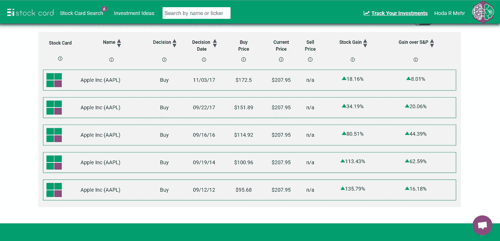

# 如果你上次升级 iPhone 时买了 1 股苹果股票会怎么样？

> 原文：<https://medium.datadriveninvestor.com/what-if-youd-picked-up-1-share-of-apple-s-stock-the-last-time-you-upgraded-your-iphone-47e1bc718b3e?source=collection_archive---------5----------------------->

数字会说话，我不需要！

iPhone 10:2017 年 11 月 3 日:+18%

iPhone 8:2017 年 9 月 22 日:+34%

iPhone 7:2016 年 9 月 16 日:+80%

iPhone 6:2014 年 9 月 19 日:+113%

iPhone 5:2012 年 9 月 12 日:+135%

[https://stockcard.io/AAPL](https://stockcard.io/AAPL)

本周，苹果公司市值达到 10 亿美元。是的，你没看错。它有十二个零。这样的市场估值将投资该公司股票的 10 年回报率推高至 600%左右。这让我想起了新 iPhone X 上市时，我和朋友们在餐桌上的一次谈话。

我耐心地享用着我的食物，桌子周围的科技界大佬们兴奋地讨论着升级手机的利弊。

在晚宴的某个时刻，餐桌上的一个叛逆灵魂宣布他将转向新的 Pixel 手机(谷歌的新手机，售价约 650 美元)！哦，亵渎！

我内心的股票投资者呆子气再也受不了了…

“你们就是那些告诉我你们不知道如何投资股票市场的人？你担心你可能会为苹果的股票支付过高的价格？”

转过头来，愤怒的双眼通红…

我继续享用最后一点甜点…

“让我告诉你一些乡亲们！这正是你要开始的地方。你拿着 1000 美元去买你的新“表情机”，然后把它投资到 1000 美元的股票上。这就是你开始的方式…你也是‘像素人’！youuu tooo！”

如果你这样做了，当苹果公司的市值达到 10 亿美元时，你会是一个快乐的露营者！大多数时候，合理的投资不需要疯狂、复杂的模型或隐藏的内部信息。它就在我们周围！我们只是决定忽略它！