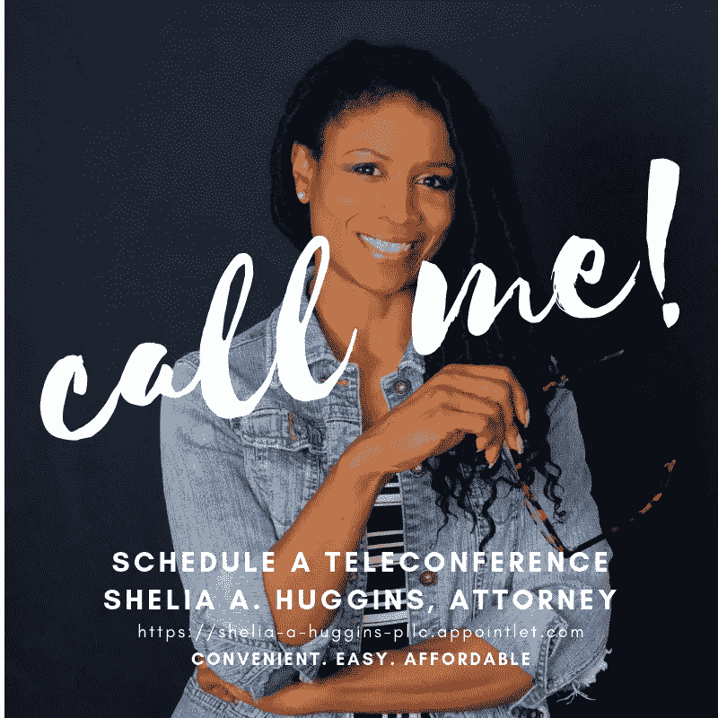

# 当你要求我签署你的保密协议时，我在想什么…

> 原文：<https://medium.datadriveninvestor.com/what-im-thinking-when-you-ask-me-to-sign-your-non-disclosure-agreement-2bf9c161c1b9?source=collection_archive---------57----------------------->

Shelia A. Huggins, Attorney

我明白了。真的。你有一个想和律师谈谈的想法(…暂时跳过这个)。你打电话给我。你想告诉我这件事，但你说我必须签署一份保密协议，然后你才会和我谈这件事。我提醒你，我是一名律师，你对我的咨询将构成律师-客户特权。我就是这么说的。我在想的是…

> 想法多如牛毛；每个人都有。

我脑子里有各种各样的想法，鉴于这个星球上有超过 70 亿人，我非常确定我的大多数想法都不是原创的。因此，如果我们都有这么多相似的想法，为什么还要签署这些保密协议呢？

> 做工作，执行想法。因为最终都是关于执行的。

如果我的话还不够。你可以在我最新的视频中看到我变得更加清晰……有了它，你必须在最后遵循提示。

Shelia A. Huggins 是一名商业法律律师，专注于合同、娱乐、社交媒体、体育和新媒体开发。

Shelia A. Huggins

连接:

*YT@sheliahuggins*

*YT@sheliahugginsnow*

【李@sheliaahuggins

*IG@sheliahuggins*

*FB@sheliahugginslaw*

*FB @ sheliannhuggins*

*Patreon@sheliahuggins*