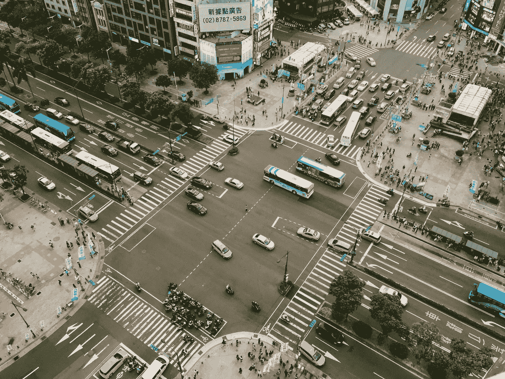
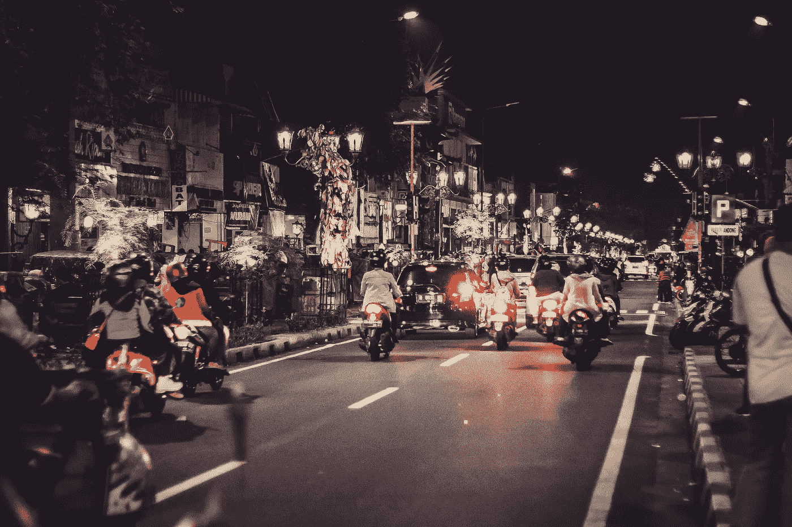

# 印度交通与对话设计有什么共同点

> 原文：<https://medium.datadriveninvestor.com/what-indian-traffic-has-in-common-with-conversation-designing-47eca4ca062?source=collection_archive---------12----------------------->

印度人和交通堵塞有着密切的关系。对于在繁忙街道上的印度人来说，交通就像一个每天在路上蓬勃发展的活的生态系统。印度道路上的混乱有一种模式，可以教给我们很多关于对话设计的知识。它既怪异又有趣，即使是交通堵塞也能说明一些模式和逻辑解释。

围绕这个利基市场的最大难题是如何让聊天机器人变得智能和完全自主。每个聊天机器人都被赋予一个名字，以模仿某些人类个性，这就提出了人为建立情感及其影响的问题。无论一个[聊天机器人](https://www.datadriveninvestor.com/glossary/chatbot/)变得多么聪明，总有一个可控判断、情绪调节、维持效率、解决方案可靠性和客户满意度的因素。

 [## 对话营销是一个词|数据驱动的投资者

### 在购买之前，先谈一谈。这样做的营销人员将走在游戏的前面。这是保罗·因斯的前提…

www.datadriveninvestor.com](https://www.datadriveninvestor.com/2019/01/31/conversational-marketing-is-the-word/) 

印度路上的交通堵塞几乎不遵守规则。尾随、不必要的鸣笛、干变道和两轮车蜿蜒穿过裂缝是常见的景象。即使在这种不规则的情况下，通勤者也有一个模糊的模式来获得理由。

# 获得潜力

让我们从世界上任何交通堵塞的常见场景开始。交通堵塞时，两轮车、轿车、卡车和其他车辆(例如 autorickshaw)的行为略有不同。现在，每辆车都想向前移动，占据前面的空隙，但是，尺寸和机动性的变化导致这些车的机动方式不同。与汽车或卡车相比，像自行车这样的交通工具更有可能在交通堵塞时增加距离。随着车辆开始变得越来越重，它们的增益潜力将会越来越慢。无论交通堵塞的原因是什么(红灯、事故或拥堵)，车辆的这种行为在任何印度道路上都很常见。

如果道路被视为一个通道，在这种情况下，聊天机器人或对话式 [AI](https://www.datadriveninvestor.com/glossary/artificial-intelligence/) 系统和车辆被视为信息包，包越小，它越有可能更早到达目的地。汽车座椅和空调的舒适性无法否认这样一个事实，即在印度的道路上，清除交通拥堵需要更多的时间。简明扼要的短句易于理解。

Same query, different response. Two different chatbots form the same industry type.

这些信息在聊天机器人行业至关重要。这一因素决定了客户的旅程，并衡量客户满意度。成功地将信息传达给客户的潜在收益取决于对话能够多容易地满足用户隐藏的意思。

对话式设计应该能够填补问题的空白，不仅完美地回答问题，还能激发终端用户继续参与对话。在交通拥挤的十字路口排成一行的汽车是自行车和踏板车寻找空隙并占据它的机会。对话障碍也是如此。

这些对话障碍可能表现为冗长的答案、非结构化数据、不连贯的回答。较小的信息包更容易传递和解释。

# 随机之美

Randomness leading to clarity

每天上班的路线都是一样的。但是，一个人被困在交通中的点是不同的。即使交通堵塞的区域是相同的，但不是堵塞车辆的确切位置。被困在这些不同地点的人的思维框架是等待前面的车辆移动或让出通道来改变车道。人们无法预先决定它将以何种方式穿过车流。这里的要点是，每天每辆车都必须在同一路段以不同的速度以不同的方式前进，以清除相同的交通堵塞。

Two similar sentences, but the bot responds it smartly.

对话式设计也有类似的影响。客户可以在多天内以多种方式询问相同的问题，目的都是为了解决他或她的问题。在为特定查询设计对话时，聊天机器人应该在多个地方让用户相信它已经理解了上下文。但是这有什么关系呢？我们用一个简单的例子来理解。

一个用户问:我想要一款香水。聊天机器人得到的回答是:我们的库存中有以下几种香水，然后是清单。另一个人问:有什么好的香水吗？这个问题的答案和‘我想要一款香水’是一样的。但是，如果对话人工智能回答:我们有一些你可能会喜欢的最好的香水，然后是清单。这种方法的一个小小的改变，让客户更有兴趣与聊天机器人保持对话。这就是建设性随机的美妙之处。

当聊天机器人捕捉到查询的确切偏差时，整个对话体验就像是在和真人对话。[机器学习](https://www.datadriveninvestor.com/glossary/machine-learning/)和[自然语言处理](https://www.datadriveninvestor.com/glossary/natural-language-processing/)发挥了巨大作用，使这种体验成为可能。以询问的方式处理问题决定了聊天机器人的聪明程度。这就像说“用他们的道具在他们的游戏上打某人”。

# 握手

There is a pattern in chaos as well

让我们再次回到印度公路交通堵塞的场景。一个人被困在其他汽车和车辆中的自行车上。他看到另一辆自行车在他前面，比如说，四辆车前面。就在这一刻，他的大脑不由自主地试图在道路缝隙中画出一个图案，以达到前面的自行车。或者，如果他看到另一辆自行车穿过他，他会即兴跟随他或她的领导。跟随领导的效果在汽车上也有所体现。

Customer is not sure but the system driving the conversation ahead.

在会话写作中，这种现象有很大的商业价值。如果客户不能引导对话，那么系统应该引导。这是业内经典的经验法则。谈话中不应该有任何停顿。众所周知，如今，注意力持续时间很短，如果前方没有富有成效的对话，人们不会在某个路口等待。

理解现实生活问题的影响以及它如何能够导致对系统的更好解释是非常重要的，这里的系统是聊天机器人或对话式人工智能。这篇文章给出了两个非常不同的现象的模糊的相似性，但尽管如此，它们在某种程度上是相关的。