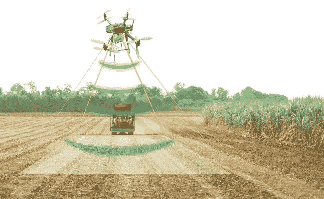
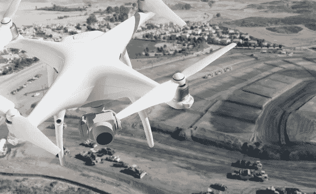
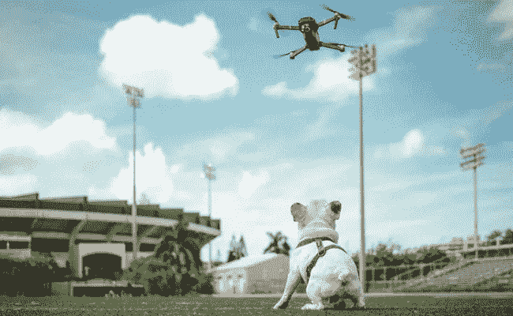

# 哪些行业应该采用无人机来赢得更多的市场份额

> 原文：<https://medium.datadriveninvestor.com/what-industries-should-adopt-drones-to-win-more-market-share-b89d989725f1?source=collection_archive---------1----------------------->

毫无疑问:无人机行业正在崛起。它一直在快速发展，2018 年[带来了对更美好未来的希望](https://readwrite.com/2018/02/16/drones-will-evolve-2018/)。今天，无人机不再被认为只是用来娱乐的飞行相机。事实上，商用无人机有各种应用，从  飞行送货到  执行[救援任务](https://readwrite.com/2017/09/01/att-sends-drones-to-aid-in-disaster-relief/)。

由于它们速度快，相对便宜，并且不受压力，它们在人类失败的情况下做得很好。但无人机对企业来说最迷人的是，这项技术可以解决特定的行业问题。请继续阅读，了解无人机如何帮助企业克服重大挑战。

# 无人机行业的现状

2016 年，全球无人机出货量超过 [10 万台](https://globenewswire.com/news-release/2018/02/28/1401040/0/en/Commercial-Drone-Market-to-hit-17bn-by-2024-Global-Market-Insights-Inc.html)，总市值超过 20 亿美元。仅在美国，无人机活动的价值就从 2012 年的 4000 万美元上升到 2017 年的 10 亿美元。根据麦肯锡[的一份报告](https://www.mckinsey.com/industries/capital-projects-and-infrastructure/our-insights/commercial-drones-are-here-the-future-of-unmanned-aerial-systems)，到 2026 年，商用无人机每年将对美国 GDP 产生 310 亿至 460 亿美元的影响。

2018 年的无人机市场继续上涨。最新统计显示，到 2025 年，全球商用无人机(UAV)市场将达到[130 亿美元。奇怪的是，无人机](https://www.statista.com/topics/3601/commercial-uavs/)[还没有见证它们的繁荣](https://www.forbes.com/sites/richardlevick/2018/05/15/drone-industry-just-beginning-to-take-off/)。无人机才刚刚开始征服世界。

造成这种情况的主要原因是对无人机行业的监管。无人机操作的严格规则减缓了采用。这很可悲，因为这意味着无人机在商业上的商业应用正在受到限制。虽然无人机已经被证明是高效的，但它们不能满负荷工作。

# 监管是无人机行业面临的主要挑战

很明显，在你的野餐地点上空驾驶无人机拍摄惊人的照片与递送有人付费的包裹是不同的。在第一种情况下，你将无人机作为一种爱好，在第二种情况下，你将它用于商业目的。与个人无人机不同，用于商业目的的无人机必须满足一定的要求。

在美国，联邦航空管理局(FAA)目前控制着无人机的个人和商业用途。此外，一些州有自己的具体要求。

2016 年 8 月，FAA 公布了其针对小型无人驾驶飞机的新法规。根据联邦航空局的规定，要驾驶无人驾驶飞机系统，飞行员必须证明自己的资格。他们必须持有  远程飞行员证书，或者至少由持有美国联邦航空局颁发的证书的远程飞行员监督。

法规还包括对无人机的操作限制。无人机的重量必须小于 55 磅(25 公斤)，飞行高度不得高于地面 400 英尺，并且只能在白天操作。但最重要的是，无人驾驶飞机系统必须只在飞行员的视觉视线内或在观察者的视线内飞行。这一规定削减了无人机的潜力，因为它使它们无法独自执行长途任务。这就是为什么，就目前而言，无人机在商业上的商业应用受到了限制。

就在最近，国家科学、工程和医学科学院在其[报告](http://www8.nationalacademies.org/onpinews/newsitem.aspx?RecordID=25143)中建议联邦航空局放松一点，考虑无人机的整体利益。由于无人机能够完成困难的任务，如提供来自危险或人类无法到达的位置的实时数据，因此无人机可以拯救生命，减少伤害。以检查高压电线为例。派无人机去做这项工作既安全又快捷。

可悲的是，到目前为止，联邦航空局的规定没有任何变化。

由[欧洲航空安全局(EASA)](https://www.easa.europa.eu/sites/default/files/dfu/217603_EASA_DRONES_LEAFLET%20%28002%29_final.pdf) 和其他全球监管机构制定的法规与美国联邦航空局的法规相似。这意味着在任何地方将无人机用于商业目的都是一个真正的挑战。然而，即使在这种限制下，企业也有可能从无人机中受益。例如，受管制航班的数据平台可以在受控空域提供自动化的联邦航空局授权。此外，由于这项技术，无人机可以安全飞行，并知道禁飞区。这使得各种行业可以轻松[将无人机用于商业目的](https://www.intellias.com/navigating-drones-miles-ahead-of-eyesight/?utm_source=medium.com&utm_medium=referral&utm_campaign=CM&utm_content=drones)。

# 今天可以从无人机的使用中受益的行业

现实中，商用无人机在商业上的使用方式有很多种。例如，今天使用无人机的行业包括媒体、娱乐和野生动物摄影。但许多其他商业领域，如农业和耕作、建筑和施工、物流、房地产和保险也可以受益于这项技术。以下是无人机如何帮助这些行业内的企业。

# 农业和耕作

想象一下:在一大片玉米地里，一些植物突然生病了。这在早期阶段是看不到的，而且场地太大，每天都检查不到。这种疾病可能导致农民失去一半的收成和一半的收入。这就是无人机在商业中可以发挥作用的地方。

农业是无人机的主要采用者之一。多亏了无人机，精准农业(常规农业与收集有价值数据的技术相结合)成为可能。

无人机有能力在数百公顷的范围内飞行，并提供精确的产量图像。更重要的是，无人机不只是收集原始数据；他们也可以对其进行处理，并向农民展示他们的发现。使用[归一化差异植被指数](https://earthobservatory.nasa.gov/Features/MeasuringVegetation/measuring_vegetation_2.php)，无人机可以创建一个显示植物状况的地图。在这张地图的帮助下，农民们可以看到田地里作物需要特殊处理的薄弱环节。这使得农民可以在任何严重损害发生之前解决问题。农民还可以监测作物的日常变化，看到它们的生长。

但这并不是无人机能为农业做的全部。无人驾驶飞机在[作物周期](https://www.technologyreview.com/s/601935/six-ways-drones-are-revolutionizing-agriculture/)的许多环节提供帮助。他们在种植前检查田地，种植作物，甚至喷洒药物。无人机还收集关于土壤、水、条件和作物成熟度的宝贵数据。这些信息有助于有效地分配水、杀虫剂、肥料和其他资源。

不用说，所有这些都提高了收成的产量和质量。

# 保险

保险公司实际上是首批采用无人机技术的公司之一。早在 2015 年，美国联邦航空局就允许[几家保险公司](https://www.wsj.com/articles/aig-receives-faa-approval-for-drone-use-1428499777)使用无人机进行检查。如今，无人机在保险公司中越来越受欢迎。这是因为[无人机技术对保险业](https://www.intellias.com/drones-and-location-based-services-using-drones-in-the-insurance-industry/?utm_source=medium.com&utm_medium=referral&utm_campaign=CM&utm_content=drones)非常有益。

首先，无人机允许公司估计大型物体的保险费用。在建筑物周围飞行，无人机可以收集大量有价值的信息，帮助保险公司评估财产保险的成本。无人机还定义了建筑物中的薄弱点，这导致了防止保险索赔。最重要的是，无人机允许保险公司评估任何发生的损害。

由于无人机可以比人类更快地做事，无人机在商业中的使用可以帮助保险公司减少理赔的周期时间。这对这个行业来说是一个巨大的进步。根据 J.D. Power 的研究[,客户满意度取决于索赔周期。索赔处理得越快，客户就越高兴。](http://www.jdpower.com/press-releases/2014-property-claims-satisfaction-study)

# 建筑和施工

据[高盛](http://www.goldmansachs.com/our-thinking/technology-driving-innovation/drones/)预测，未来五年，建筑领域将是无人机最大的商业买家。尽管今天无人机在建筑和施工行业中被积极使用，但无人机技术在建筑中的商业应用正在增加。

想象一下，人类检查一座桥的所有部分需要花费多少时间、金钱和精力。但是你猜怎么着？无人机可以轻松应对这项任务。它们都比人快，比传统飞机便宜。此外，无人机可以帮助建筑行业应对其最大的挑战——[低建筑生产率和财务回报](https://www.mckinsey.com/industries/capital-projects-and-infrastructure/our-insights/imagining-constructions-digital-future)。

由于摄像机、红外线和地理定位传感器，无人机可以[捕捉现实](http://www3.weforum.org/docs/WEF_Shaping_the_Future_of_Construction_full_report__.pdf)，这意味着它们可以从多个角度对真实物体进行数字扫描，从而允许计算机创建精确的 3D 模型。这种建筑信息建模有助于防止建筑错误和有效地分配资源。在建筑工地上空飞行无人机可以在项目开始前进行高清调查，跟踪进度，并更好地管理流程。

# 物流

在物流方面，无人机技术既可以用于供应链送货，也可以用于家庭无人机送货。例如，无人机非常适合放在[仓库](https://www.logisticsbureau.com/drones-in-distribution-thinking-inside-the-box/)里，它们在那里帮助管理库存。

尽管如此，物流行业面临的最大挑战之一是最后一英里的配送。将产品直接送到顾客家中仍然是非常低效和昂贵的。客户交付涉及空间分配和频繁的小批量运输。基本上，送货到家是包裹递送系统中最薄弱的环节。

幸运的是，无人机技术可以帮助企业解决这个问题。无人机帮助企业的方式之一是提供快速廉价的送货服务。由于无人机可以优化它们的运动并选择最佳路线，因此它们可以比人类驾驶员更快地到达客户的家。更好的是，他们可以提供当天送达。而且当天送达的需求还在不断上升。

事实上，[研究](https://www.mckinsey.com/industries/travel-transport-and-logistics/our-insights/how-customer-demands-are-reshaping-last-mile-delivery)显示，到 2025 年，即时和当天送达将占快递市场的 25%。因此，减少时间和成本可以提高客户满意度。此外，高科技解决方案提高了供应商的竞争力。由于[送货选择对在线客户很重要](https://www.mckinsey.com/industries/travel-transport-and-logistics/our-insights/creating-value-in-transportation-and-logistics)，无人机送货将成为在线零售和电子商务的必需品。事实上，美国邮政署​的一项研究显示，75%的美国公众预计无人机送货将在 2021 年实现。

# 不动产

如今，另一个可以受益于无人机使用的行业是房地产行业。多亏了无人机，检查每一处房产变得更便宜、更快捷、更不危险。以屋顶检查为例，无人机可以比人类更有效地完成这一任务。无人机有助于评估财产的状况和成本。无人机还能提供显示[大小、边界和地貌特征的精确地图。](http://www.abovenv.com/wp-content/uploads/2016/08/TheTruthAboutDrones_mapping-1.pdf)

但最棒的是:无人机可以促进房地产行业的销售。如今，客户不再寻找代理人带他们参观房产，而是自己在网上搜索选择。对于在线客户来说，没有什么比漂亮的房屋图片和视频更重要的了。幸运的是，无人机提供了所有这些。无人机可以拍摄大型物业的漂亮航拍照片。这有助于顾客了解房子的大小，并了解附近的环境。此外，无人机可以拍摄令人惊叹的视频旅行，让网上买家一瞥房子里是什么样子。

# **无人机的未来**

毫无疑问，无人机在现代数字世界中有一席之地。今天，你可以看到无人机在检查、救援、监控和连接。得益于明显的好处，无人机技术的商业应用正在增长。无人机速度快，价格便宜，并且能够执行危险的任务。除此之外，随着更宽松的监管和先进的自主技术，无人机给企业带来的价值只会在未来增长。很可能很快人工智能操作的无人机将会自己照顾自己，而不需要人类控制者的帮助。无人机的自主性可以为无人机打开这么多的大门。商业无人机在商业中的使用方式也有可能改变。所以一定要系好安全带，为无人机时代的开始做好准备。