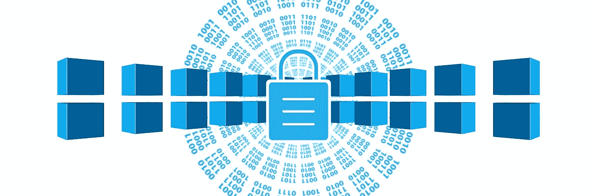

# 区块链中的区块是什么？

> 原文：<https://medium.datadriveninvestor.com/what-is-a-block-in-the-blockchain-c7a420270373?source=collection_archive---------0----------------------->

比特币是基于区块链的，大家都知道。但是这个区块链是什么？更准确地说，人们怎么能想象区块链的各个组成部分，即区块呢？

区块链是一串数据块。每个块可以被认为是分类账中的一页。各个模块由几个组件组成。大致可以分为块头(block header)和块体(block body)。

# 块标题

块的头部分为六个部分:

1.  软件的版本号
2.  前一个块的哈希
3.  Merkle 树的根哈希
4.  自世界协调时 1970 年 1 月 1 日 T00: 00 以来的时间(秒)
5.  当前难度的目标
6.  现在

# 软件的版本号

在大多数情况下，软件版本号无关紧要。然而，具有特定版本号的矿工可以表示他支持哪个协议决策。

# 前一个块的哈希

可以说，前一个区块的散列就是区块链链。因为前一个块的哈希包含在新块的哈希中，所以区块链的所有块都是相互构建的。没有这个组件，每个块之间就没有联系和时序。

# Merkle 树的根哈希

块中包含的所有事务都可以聚集在一个散列中。这是 Merkle 树的根散列。

# 自世界协调时 1970 年 1 月 1 日 T00: 00 以来的时间(秒)

块本身的时间戳。自 1970 年 1 月 1 日起，时间以秒为单位。

# 当前难度的目标

目标表明新的散列值必须有多小才能声称有效。换句话说，每个哈希都有一个以位为单位的大小。目标的位数越低，就越难找到匹配的哈希。开头有很多零的哈希比没有零的哈希小。了解更多关于工作证明的**难度。**

# 现在

nonce 是由工作证明增加的变量。通过这种方式，挖掘器猜测一个有效的散列，一个比目标更小的散列。

这六个组件构成了块标题。块头在比特币中起着基础作用，因为它将所有块连接在一起。你可以把它想象成卡车的驾驶舱。这是卡车通过网络控制的重要文件。

# 分程序体

缸体可以想象成卡车的装载空间。它包含用块确认的所有事务处理。

当一个挖掘器构造一个块时，它验证事务。也就是说，他检查发送者确实有足够的钱花。他可以很容易地从区块链那里读到这些信息。如果发送者想要发送十个比特币，则矿工查看过去的块以查看发送者是否已经获得十个比特币。

块中的事务不只是在一个列表中，而是在一个所谓的 Merkle 树中。

# 什么是 Merkle 树？

Merkle 树的名字来自数学家 Ralph Merkle。发现很多信息可以用一个散列来表示。为此，首先对数据本身进行哈希处理。然后，散列被再次散列并合并。最后，Merkle 树被合并成一个散列。这最后一个散列也称为根散列，即树的根。它用一个相对较短的字符串表示其“叶”(单个事务)和“分支”(叶的散列)的所有信息。

只要知道所有的分支和叶子，就可以快速而容易地创建根散列。我们记得哈希函数的功能:它在一个方向上清晰而快速地工作，在另一个方向上不可能分解。如果根散列是已知的，但是事务是未知的，则不可能猜测出事务。

因此，仅有根哈希是不够的，必须保存块的其余部分。因此，挖掘器可以在任何时候通过再次散列块中包含的信息来验证根散列。只要散列函数是相同的，对于给定的数据输入，挖掘器总是得到相同的散列。这非常方便，因为他们只能检查它们是否与 hash 在同一层。

# 挖掘:对特殊散列的搜索

在这种背景下，更容易理解工作证明的挖掘。在挖掘时，块的块头被递增地改变以获得特殊的散列。标题由五个常量和一个变量组成。常量是软件的版本号、前一个块的散列、Merkle 树的根散列、时间戳和以字节为单位的搜索散列的目标大小。

变量是随机数。随机数是一个加一的数。然后，挖掘器对数据进行哈希处理，并检查数据产生的哈希是否低于搜索的目标值。如果哈希值大于目标值，挖掘器重复该过程；因此，它将 nonce 加 1，再次哈希和检查。它会重复此操作，直到找到低于目标的哈希，或者从另一个哈希低于目标的 networker 中获得另一个数据块。然后获取这个新块，并将其用作下一个块的基础(使用新散列作为“前一个块的散列”)。

挖掘是一个高度重复的过程，其目标是找到一个特殊的哈希。一旦找到散列，游戏再次开始。找到特殊哈希的概率取决于难度。平均每十分钟比特币就会发现一个新的区块。难度不断适应，所以这个平均值保持不变。

这个过程的特殊之处在于，特殊散列只能通过猜测来找到。这个速率消耗了计算能力，因此也消耗了能量。看一下特殊散列就足以看出它是特殊的，因为它是以零开始的。

以下是比特币区块链的一个例子:

0000000000000000000094 BFA 4 EDB 1245 c 347 e 42452 e 4418 e 9 Fe 5a 1d 24 e 335 b 16

# 哈希:区块链的套娃

一个块可以简化为一个 matryoshka 图像。最小的娃娃是未脱毛的事务。下一个信封是这个事务的散列形式。此后，两个散列事务被散列在一起。所以散列越来越多地被合并。最后只剩下一个 hash，根 hash，或者最大的 matryoshka。

作者:马尔科·维德里

 [## @ cryptomarks(@ VidrihMarko)| Twitter

### 来自@cryptomarks (@VidrihMarko)的最新推文。自由记者/作家和密码爱好者。…共和国

twitter.com](https://twitter.com/VidrihMarko) 

*图片通过 Pixabay*