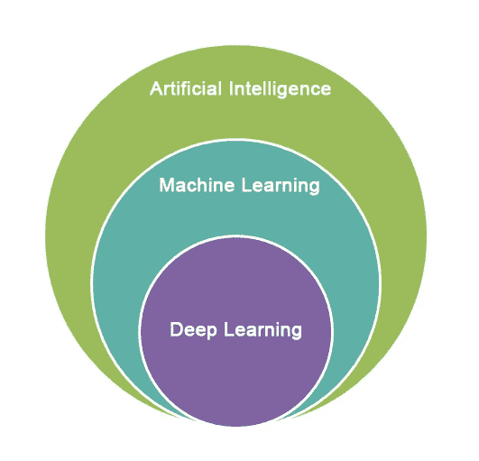
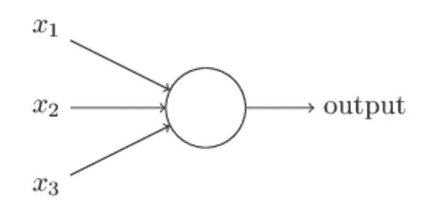
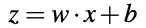
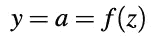
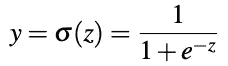
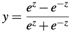
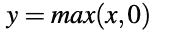
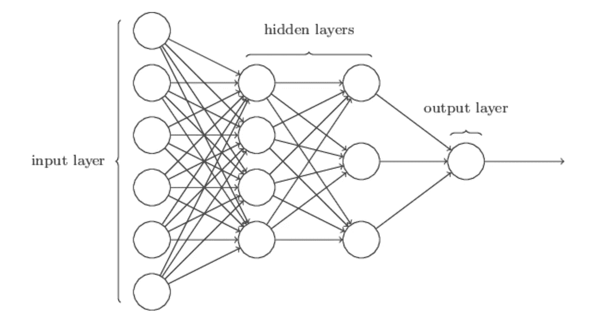

# 什么是神经网络？

> 原文：<https://medium.datadriveninvestor.com/what-is-a-neural-network-9ca88b29f7cb?source=collection_archive---------3----------------------->

最近人工智能、机器学习、深度学习、神经网络这些词正在不胫而走。那么，这些术语是什么？

维基百科将“人工智能”定义为由机器展示的智能。换句话说，它是对设备解释外部数据、从这些数据中学习并使用这些数据来实现其目标的能力的研究。

“机器学习”是人工智能的一个子集，在人工智能中，机器学习完成一项任务，而无需显式编程。传统编程和机器学习的区别在于，在传统编程中，你向机器传递一个输入和一组规则，机器给你一个输出，而在机器学习中，你传递一个输入和输出，机器学习形成输出的一组规则，以便你可以使用这些规则在将来自动获得输出。

“深度学习”是机器学习的子集，涉及由大脑结构和功能激发的算法，称为神经网络。我们可以从书写的角度来考虑这个问题:如果你让十个人写同一个单词，每个人的单词看起来会非常不同，从草书到印刷体，或者从潦草到整洁。人脑可以理解这一切都是一样的，但是一个正常的计算机系统怎么会知道呢？换句话说，我们如何让机器像人脑一样智能地工作？这就把我们带到了神经网络。在我们试图了解什么是神经网络之前，让我们看看它最基本的构建模块，即神经元。

**什么是神经元？**

像在人脑中一样，神经网络的基本构件是神经元。它的功能类似于人的大脑，也就是说，它接受一些输入，然后发出一个输出。每个神经元都是一个小型计算单元，它将一组实数值作为输入，对它们执行一些计算，并产生一个输出值。

为了理解神经元的工作，让我们首先理解几个术语的含义。

**权重**:一个神经元的每个输入( *x* )都有一个相关的权重( *w* )，这个权重是根据它对其他输入的相对重要性来分配的。

神经元的工作方式是，如果输入的加权和大于特定阈值，它会给出输出 1，否则输出 0。这是神经元的数学模型，也称为感知器。

每个神经单元接受其输入的加权总和，总和中还有一项称为偏差。

**偏差**:偏差是一个常数，用于调整输出和输入的加权和，使模型最适合给定的数据。

使用向量符号来表示输入的加权和更容易，因此我们根据权重向量 *w、*输入向量 *x、*和偏差值 b 来定义加权和 *z*

神经元的输出( *y* )是输入 *z* 的加权和的函数 f。函数 f 是非线性的，称为激活函数。

**激活函数:**激活函数的目的是将非线性引入神经元的输出。它接受一个数字，并对其执行一些数学运算。实践中使用了几种激活函数:

1.  **Sigmoid** :接受实值输入，并将输出映射到范围[0，1]。

2. **Tanh:** 它与 sigmoid 函数非常相似，但它将输出映射到范围[-1，1]。

3. **ReLU:** 这是最常用的激活函数，称为矩形线性单元(ReLU)。当 x 为正时，其值等于 x，否则为 0。

每个激活函数都引入一些属性，使其比输入的线性加权和更有优势。例如，ReLU 非常接近线性，并且对于非常高的 z 值，y 值比 sigmoid/tanh 激活变化更大。Sigmoid/Tanh 激活将任何异常值映射到平均值。在一般实践中，已经发现 ReLU 比 sigmoid 或 tanh 激活执行得更好。

**神经网络**

神经网络由层组成，层是神经元的集合，不同层之间有连接。这些层通过首先计算输入的加权和来转换数据，然后使用分配给神经元的激活函数对其进行归一化。

神经网络中最左边的一层称为**输入层**，最右边的一层称为**输出层。**输入和输出之间的层，称为**隐藏层。**任何神经网络都有 1 个输入层和 1 个输出层。然而，根据问题的复杂程度，不同网络之间隐藏层的数量是不同的。此外，每个隐藏层可以有自己的激活功能。

任何具有两个或两个以上隐层的神经网络称为深度神经网络。神经网络通过学习每一层中每个神经元的权重来做出准确的预测。他们学习的算法被称为“反向传播”，我将在后面的文章中介绍。

至此，我希望你对神经网络、它的基本结构和与之相关的各种术语有一个基本的了解。这方面的进步正在快速增加，现在就开始了解它会很好，因为炒作是真实的！

## 来自 DDI 的相关故事:

 [## 用 7 个步骤解释深度学习

### 和猫一起

medium.com](https://medium.com/datadriveninvestor/deep-learning-explained-in-7-steps-9ae09471721a)  [## 数据科学和软件工程哪个更有前途？

### 大约一个月前，当我坐在咖啡馆里为一个客户开发网站时，我发现了这个女人…

medium.com](https://medium.com/datadriveninvestor/which-is-more-promising-data-science-or-software-engineering-7e425e9ec4f4)