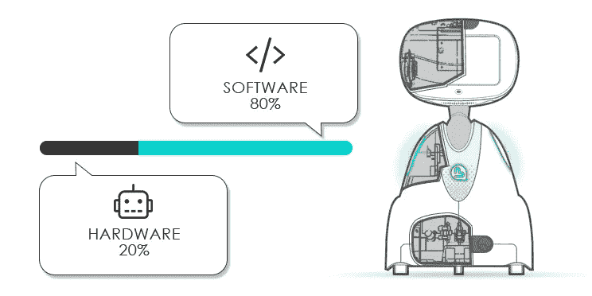

# 什么是机器人(21 世纪)？

> 原文：<https://medium.datadriveninvestor.com/what-is-a-robot-in-the-21st-century-cb42e79603c3?source=collection_archive---------3----------------------->

Inside Buddy, Your Emotional Robot

取决于你问谁，你会得到不同的机器人定义；有些人把机器人定义为一个像电器一样的机械装置(比如你的 Vitamix 对其他人来说，这是一个计算机程序。有些人认为机器人可以被定义为这两种东西。

这可能解释了为什么许多人将机器人归为硬件家族，尽管实际上更多的机器人是用软件而不是硬件设计的。这个软件有助于创造一个更智能的机器人，有一个更“有逻辑和能力的大脑”

 [## 模式和机器人:复杂的现实|数据驱动的投资者

### 哈耶克的名著《复杂现象理论》(哈耶克，1964)深入探讨了复杂性的话题，并断言…

www.datadriveninvestor.com](https://www.datadriveninvestor.com/2019/03/04/patterns-and-robotics-a-complex-reality/) 

**巴迪你的情感机器人:80%的软件和人工智能，20%的硬件** 在蓝蛙机器人公司，我们工作在机器人技术最创新的领域，这就是为什么尽管我们喜欢冰沙，但我们不能将电器定义为机器人。
我们对机器人的定义是一台能够自主感知、思考和移动的计算机。

**Buddy Senses** [Buddy](http://bluefrogrobotics.com)通过感知周围事物的传感器(用于视觉的 2D 和 3D 摄像头、用于音频感知的麦克风、爱抚传感器和用于距离估计的红外传感器)收集他做出决定所需的信息。这些传感器收集各种信息，包括光线、图像、声音、触摸、压力和位置。

**巴迪互动** 巴迪使用灯光、动作、一系列类似人类的表情、自然语言处理(NLP)和对话管理与人交流，让他们知道他的感受和想法。
通过视线检测、面部识别、观察和模仿他人的动作以及合作，他能够识别他人的目标、意图、欲望和信念。Buddy 使用自己的思维理论来改善与人类用户的互动。例如，他能够解读主人的意图，并对主人的情绪、注意力和认知状态做出适当的反应，以预测他们的反应并修改自己的行为，以满足他们的期望和需求。

巴迪认为
巴迪通过他的控制面板获得智能，就像大脑和由各种电路板组成的中枢神经系统。他的大脑赋予他记忆、计算、学习和智力的能力。他的人工智能来自于他获取知识和技能的能力，以及能够以特定的方式应用这些知识和技能的能力，例如解决问题或进行有用的工作。通过他的传感器，他收集信息，能够做出决定并根据决定采取行动，适应新的任务，甚至可以利用已经学到的信息和技能，改变它们以获得新的任务。

**巴迪移动** 巴迪在轮子上准确、快速、平稳地移动。他运动的身体部位帮助他交流和执行各种任务。
为了移动，巴迪使用效应器(轮子和摄像机/眼睛)来对环境产生影响，并使用致动器(马达)来产生运动。

**独立自主** 我们研发中的一个关键设计原则是自主性，这意味着我们的伙伴可以自由地与其环境互动并探索它。与机器人的决策和行动事先被严格编程或由遥控器驱动相反，巴迪可以根据内部状态和外部环境感知自适应地选择自己的行动。

**走向通用人工智能** 设计巴迪的行为和认知能力，更多的是与一个职业而不是一份正常的工作有关。当然，建立巴迪的认知架构智能和自主精神不是在公园散步。一路上有几个障碍，包括巴迪是同类中的第一个。因此，他需要一种新的技术组合。为了开发我们的机器人，我们依靠经验发展科学的高度跨学科努力，如发展心理学、神经科学和比较心理学；以及机器人、人工智能、机器学习、深度学习等计算和工程学科。从根本上说，这是一门正在被创造的新科学和新技术。这是令人兴奋的，因为我们正在将人类的需求纳入人工智能和硬件等式，以创建一个非常有用的复杂机器，可以帮助教育、娱乐和护理。

机器人革命即将到来！投资未来。
机器人是下一次技术革命。它们将在客户与技术的互动中发挥巨大作用。巴迪是一个具有颠覆性和创新性的机器人，它将改变我们的生活、学习、利用信息、娱乐甚至关心健康的方式。他将成为我们日常生活的一部分，帮助提高我们的生活质量。
[蓝蛙机器人](http://www.bluefrogrobotics.com/investors/)为家居生活的未来设想了一个更美好的世界，这个愿景就是巴迪。在您的帮助下，我们制造的机器人将以可承受的价格，用第一个智能、移动、有情感的个人机器人来打破传统的助理设备模式。

消费机器人是一个新市场。有些人认为这是通过一个。但我认为这是一条学习、理解和寻找服务消费者的新途径的道路。我认为，永远记住有时要达到非凡的高度，你需要有耐心、激情和对未来的信任，这一点至关重要。尤其是当你构建未来的时候。巴迪是未来，让他更好地管理我们的生活，我们生活的空间，让我们微笑。