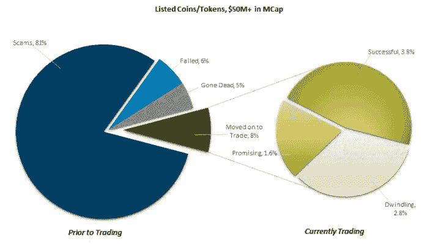
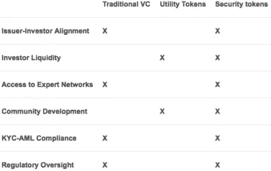

# 什么是安全令牌产品(STO)？

> 原文：<https://medium.datadriveninvestor.com/what-is-a-security-token-offering-sto-1758e14a3b52?source=collection_archive---------1----------------------->

首次公开募股(ico)是 2017 年的金融巨星。2017 年，硬币发行在全球范围内产生了高达 60 亿美元的启动资金。然而，估计其中 80%是骗局。进入 2018 年，STO 时代开始，为区块链投资者提供更多保护，并为数字经济的大规模采用铺平道路。

# ICO +法律合规= STO

简单地说，证券是一种代表实际资产的经济工具。股票、债券和管理财产信托都是证券的例子。传统上，当购买证券时，操作是以传统的方式在纸面上完成的。安全令牌在功能上表现相同；不同之处在于，它通过区块链交易确认所有权。安全令牌为投资者提供了许多金融权利，如股权、利润分红、收入股、投票权和访问许多其他投资机制的权利。

# 关于安全代币，投资者需要知道什么？

安全令牌不是加密货币或与不受监管的 ico 相关的令牌。

安全令牌实际上是数字化的传统证券。你是否已经投资于证券(股票、债券、房地产、风险投资等)。)，那么你可能已经习惯了持有证券意味着什么。例如，安全令牌可以将股票证书转换为数字版本。

**依从性被编程到令牌中。**

安全令牌由许多智能合约组成。智能合同是一个简单的程序，设计用于在自动满足特定标准时执行。智能合约还决定了如何以合规的方式购买、交易和出售令牌，由于它们是基于区块链的，所以交易是不可变的、可追踪的和完全透明的。

**流动性更强**

全球流动性可能是证券最有价值的特征。安全令牌具有象征资产部分所有权的能力，可以在全球安全令牌交易所交易。这两件事对于传统证券来说几乎是不可能的。

**它们是传统证券的决定性、功能丰富的替代品。**

在传统的证券市场中，交易执行在很大程度上由于涉及的中介机构的数量而消失。交易实际上是不可能的。传统的证券管理方式包括 excel 电子表格、纸质证书、律师、托管人、会计师和转账零售商，这些都需要花费大量的时间和金钱，更不用说出现人为错误的可能性了。但是，由于安全令牌被数字化，许多这些过程变得不必要，从而使安全令牌更加准确和高效。

他们不值得信任

与安全令牌相关的所有操作(发行、交易、购买、出售等)都在区块链上列出，这被视为一种“无信任”程序，因为区块链本质上是不可变的和公开的。当通过安全令牌执行交易时，各方之间不需要信任。数学会解决这个问题。

# 是什么让 STO 对企业如此有益？

*   全球资本准入
*   营销产品和服务的新方法
*   更好的条件
*   低进入成本
*   超越传统安全范围的可能性

# 普雷迪亚的 STO

在之前的[文章](https://medium.com/predya/introducing-predya-38f04d10a065)中，我们介绍了我们革命性的基于人工智能的加密货币交易资产管理解决方案。在下文中，我们将介绍 pred ya STO 的所有细节以及如何参与。目前，以下是我们产品的核心特征。

**卢森堡有限公司的利润单位** — Predya's token (PYA)是一种 Offering 证券，由 1998 年成立的卢森堡有限公司的利润单位支持。

**KYC/反洗钱检查** —为了顺利入职，Predya 将确保 KYC/反洗钱检查。

Predya 的红利 — PYA 提供 Predya 红利的经济权利。代币不仅具有内在价值，还代表着对支付 off固定收益的公司的金融债权。

电子邮件取代邮寄信件的方式；由于交易和资产支持证券管理方面的便利，我们预计证券代币将取代传统证券。我们已经目睹了资本、企业和财产的符号化。随着新的和即将出现的在线证券代币交易所和市场的出现，以及各种各样的代币的交易符合全球范围内的法规，投资者的可能性是前所未有的。投资者将不会投资于“安全代币”，他们将投资于一类前所未有的资产。

# 加入我们的网络研讨会！

人工智能和加密资产管理的融合听起来像科幻小说。然而，这并不是虚构的。我们将在不久的将来举办一场网络研讨会，在卢森堡的一家五星级酒店进行直播。这将是全面了解 PREDYA initiative 的绝佳机会，正如我们所知，革命性的人工智能技术“PREDYCT”将创新加密货币交易。请前往此[网页](https://predya.io/en/webinar/)并输入您的个人信息以获取您的证书。

不要错过这个见证 PREDYA 行动的机会。网络研讨会上见！

*感谢您阅读我的文章，它最初发表在我的个人网站***。如果你想联系我，或者如果有你想让我报道的话题，请给我发电子邮件到 thesparkblog@renatozamagna.com。**