# 什么是行动观？

> 原文：<https://medium.datadriveninvestor.com/what-is-action-view-e5455f79f251?source=collection_archive---------4----------------------->

本周，我了解了 Ruby on Rails 的魔力。我们从 Sinatra 开始，这是 Rails 构建的基础，将模型-视图-控制器(MVC)惯例灌输到我们的头脑中。控制器处理模型和视图之间的路由逻辑和工作流。该模型处理存储在数据库中的信息，并根据控制器的响应为客户机(也就是浏览器/用户)呈现视图。有道理，都是团队合作！

在辛纳特拉，我们创造了**。erb** 查看带有大量 html 标签(<标签>、<输入>、<表单>等)的文件。)，但是当我们开始在 Rails 中创建视图文件时，所有这些标签突然消失了，这些神秘的形式“帮助器方法”(。标签，。文本 _ 字段，。text_area 等。)变得对我们可用。显然，这些“辅助方法”实际上为我们生成了 html 标签！Rails 的魔力来自哪里？

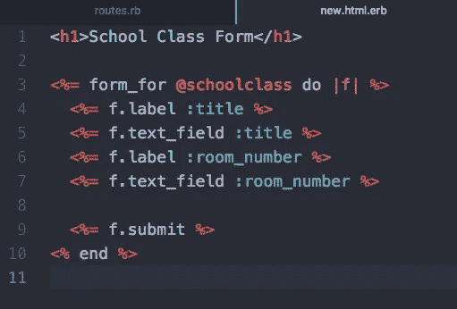

Example of an .erb view file in Sinatra VS. an .erb view file in Rails

魔术是从行动的角度来看。动作视图是作为 Rails 的一部分构建的，但它可以在 Rails 之外独立使用。它是一个处理视图模板查找和渲染的框架，并提供了视图助手来帮助构建 HTML 表单。到客户机的最终 HTML 输出由 3 个 Rails 元素组成:一个代码模板，一个包装它的布局模板，以及视图可能引用的所有部分。

**模板**—

1.  ERB 模板—包含在“冰淇淋甜筒”**<% %>**&**<% = %>**标签和 html 代码中的 ruby 代码片段的组合。文件扩展名以**结尾。erb** 。
2.  构建器模板—使用名为 *xml* 的 XmlMarkup 对象生成 XML 内容，该 XML markup 对象具有文件扩展名**。建造者**。
3.  Jbuilder 模板—使用名为 *json* 的 Jbuilder 对象生成 JSON 内容，该对象的文件扩展名为**。jbuilder** 。它是由 Rails 团队维护的一个 gem，包含在默认的 Rails team 文件中。

**Partial templates** (又名“**partials**”)—通过从模板中提取代码片段来分离文件，并在整个应用程序的模板中重用它们，从而将渲染过程分成更易于管理的块。

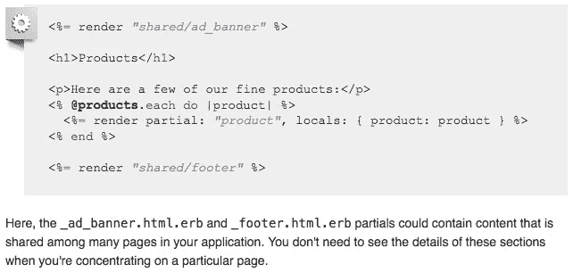

Example of partials from the [rubyonrails.org](https://guides.rubyonrails.org/action_view_overview.html#partials) guide.

**布局**——用于在 Rails 控制器操作的结果视图模板周围呈现一个公共视图模板。一个例子是，一个网站将有一个导航栏的布局，应该出现在所有的网页渲染。

神奇的“助手方法”实际上是动作视图的助手。有许多不同的助手类型，你可以在 [API 文档](https://api.rubyonrails.org/v5.2.1/classes/ActionView/Helpers.html)中看到它们的完整列表。上面神奇的例子中使用的动作视图助手是 FormHelper。有两种类型的表单帮助程序:

*   **form helper**——使用核心方法 **form_for** 专门处理模型属性。

```
# Note: an @article variable will have been created in the controller (e.g. @article = Article.new)
<%= form_for [@article](http://twitter.com/article) do |f| %>
  <%= f.label :title, 'Title' %>:
  <%= f.text_field :title %><br>
  <%= f.label :body, 'Body' %>:
  <%= f.text_area :body %><br>
<% end %>
```

*   **FormTagHelper**——不使用核心方法 **form_tag** 处理模型属性。必须手动指定 url 路径/路由、名称和值。

```
<%= form_tag '/articles' do %>
  <%= label_tag 'title'  %>
  <%= text_field_tag :'article[title]'  %>
  <%= submit_tag 'Save' %> 
<% end %>
```

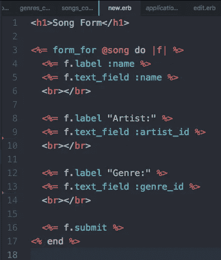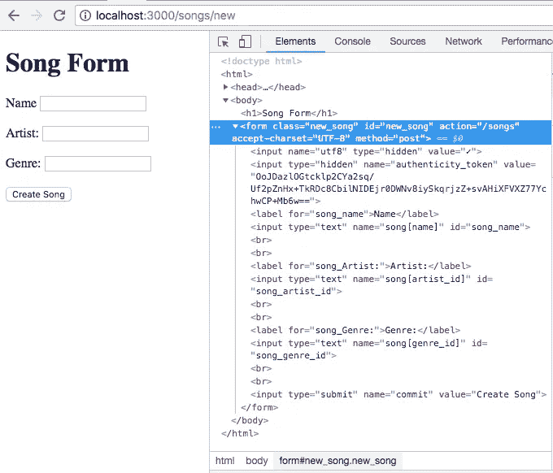

Example of the magic of ActionView FormHelper methods generating html code.

**表单助手**

*   **label** (object_name，method)——返回一个 label 标签，为指定属性的输入字段添加标签。生成 html 标签的 **Tags::Label** 类可以在 Rails github 文件路径
    [action view/lib/action _ view/helpers/Tags/Label . Rb](https://github.com/rails/rails/blob/v5.2.1/actionview/lib/action_view/helpers/tags/label.rb)中找到。我发现有趣的是，在 Tags::Label 类中，它的 render 方法调用了 label.rb 文件第 70 行的 FormTagHelper“Label _ tag”方法。

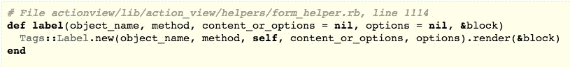

The FormHelper label method behind the magic.

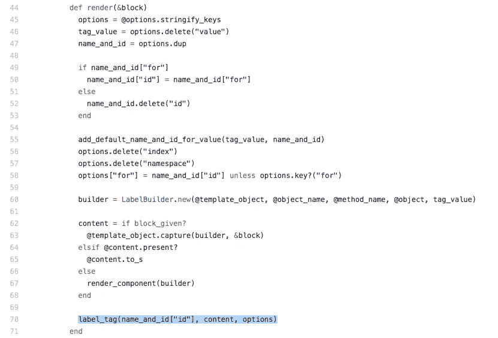

Screenshot of the Tags::Label class’ render method that’s used in the FormHelper label method.

**FormTagHelper**

*   **label_tag** (name = nil，content_or_options = nil，options = nil，& block) -创建一个标签 html 元素。似乎在 label_tag 方法下面实际上还有另一层，因为它在第 218 行调用了“content_tag”方法(见下图)。content_tag 方法可以在 Rails github 路径[action view/lib/action _ view/helpers/tag _ helper . Rb](https://github.com/rails/rails/blob/fc5dd0b85189811062c85520fd70de8389b55aeb/actionview/lib/action_view/helpers/tag_helper.rb#L269)中找到。它的返回值是一个 HTML 块标记，所以看起来这个方法是真正生成 HTML 代码的方法。或者是？content_tag 方法还调用可以在同一文件中找到的“tag_builder”和“content_tag_string”方法。这是一个无尽的方法迷宫，只是为了找到“魔法”的来源。

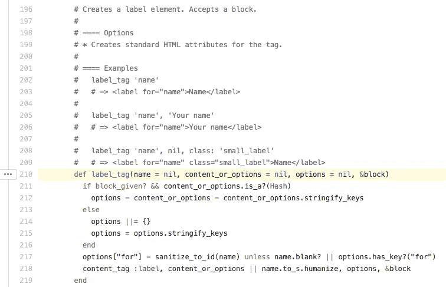

Screenshot of the label_tag FormTagHelper method in [github](https://github.com/rails/rails/blob/fc5dd0b85189811062c85520fd70de8389b55aeb/actionview/lib/action_view/helpers/form_tag_helper.rb#L210).

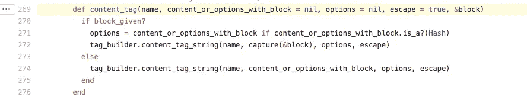

Screenshot of the content_tag method called by the label_tag FormTag Helper in [github](https://github.com/rails/rails/blob/fc5dd0b85189811062c85520fd70de8389b55aeb/actionview/lib/action_view/helpers/tag_helper.rb#L269).

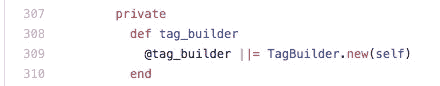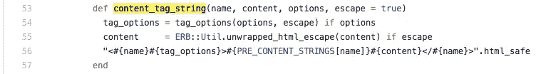

Screenshot of the [tag_builder](https://github.com/rails/rails/blob/fc5dd0b85189811062c85520fd70de8389b55aeb/actionview/lib/action_view/helpers/tag_helper.rb#L308) and the [content_tag_string](https://github.com/rails/rails/blob/fc5dd0b85189811062c85520fd70de8389b55aeb/actionview/lib/action_view/helpers/tag_helper.rb#L53) method called by the content_tag method found within the FormTagHelper label_tag method that’s used in the FormHelper label method. Github path:
“[rails/actionview/lib/action_view/helpers/tag_helper.rb](https://github.com/rails/rails/blob/fc5dd0b85189811062c85520fd70de8389b55aeb/actionview/lib/action_view/helpers/tag_helper.rb)”

**form helper 方法的其他示例**

*   **text _ field**(object _ name，method)——返回一个“文本”类型的输入标签，用于访问指定的属性。

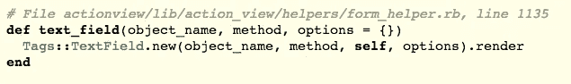

The FormHelper text_field method behind the magic.

*   **date_field** (object_name，method) —返回一个“date”类型的#text_field，默认值是通过调用“strftime”生成的，对对象的值使用“%Y-%m-%d”，就好像它是一个 DateTime 实例一样。“[strftime](https://ruby-doc.org/stdlib-2.3.1/libdoc/date/rdoc/DateTime.html#method-i-strftime)”DateTime 方法根据“%Y-%m-%d”格式字符串格式化日期。
*   [**fields _ for**](https://apidock.com/rails/ActionView/Helpers/FormHelper/fields_for)(record _ name，record_object = nil，options = {}，& block) —围绕特定的模型对象创建一个作用域，如 [#form_for](https://api.rubyonrails.org/v5.2.1/classes/ActionView/Helpers/FormHelper.html#method-i-form_for) ，但不创建表单标签本身，因此它可用于指定同一表单中的其他模型对象。这似乎可以用来访问同一模型实例或相关模型实例中嵌套属性散列中的信息(一对多)。

**来源:**

 [## 动作视图概述- Ruby on Rails 指南

### 在 Rails 中，web 请求由动作控制器和动作视图处理。通常情况下，动作控制器负责…

guides.rubyonrails.org](https://guides.rubyonrails.org/action_view_overview.html) [](https://github.com/rails/rails/tree/fc5dd0b85189811062c85520fd70de8389b55aeb/actionview) [## 铁轨/铁轨

### Ruby on Rails。在 GitHub 上创建一个帐户，为 rails/rails 开发做贡献。

github.com](https://github.com/rails/rails/tree/fc5dd0b85189811062c85520fd70de8389b55aeb/actionview)  [## action view::Helpers::FormTagHelper

### 提供了许多方法来创建不依赖于分配给模板的活动记录对象的表单标签…

api.rubyonrails.org](https://api.rubyonrails.org/v5.2.1/classes/ActionView/Helpers/FormTagHelper.html)  [## action view::Helpers::form helper

### 表单帮助器的设计使得使用资源比使用普通的 HTML 更容易。

api.rubyonrails.org](https://api.rubyonrails.org/v5.2.1/classes/ActionView/Helpers/FormHelper.html)  [## class:action view::Helpers::tag helper::tag builder-rails/rails 文档(主)

### 库"(主) "索引(T)" " " "标记生成器

www.rubydoc.info](https://www.rubydoc.info/github/rails/rails/ActionView/Helpers/TagHelper/TagBuilder)  [## class:action view::Helpers::Tags::Label-rails 文档(4.1.7)

### 集合 _ 复选框，#集合 _ 单选按钮，#集合 _ 选择，#分组 _ 集合 _ 选择…

www.rubydoc.info](https://www.rubydoc.info/docs/rails/4.1.7/ActionView/Helpers/Tags/Label)  [## label(action view::Helpers::form helper)-API dock

### 返回一个标签标记，用于标记对象上指定属性(由方法标识)的输入字段…

apidock.com](https://apidock.com/rails/ActionView/Helpers/FormHelper/label)