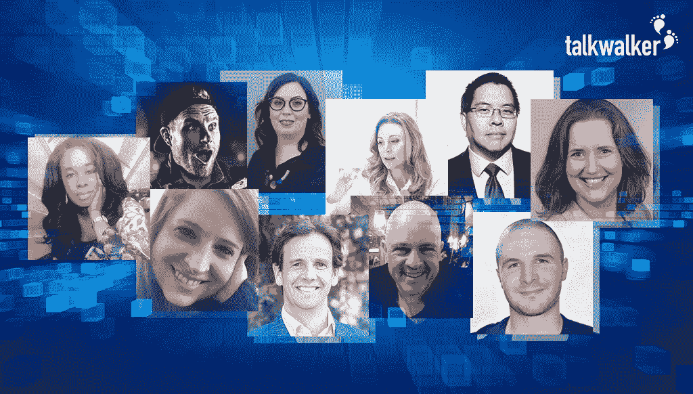
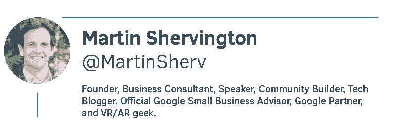
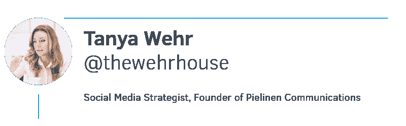
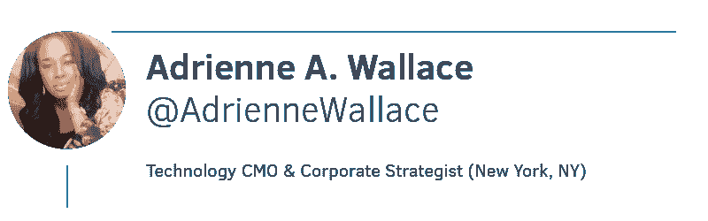
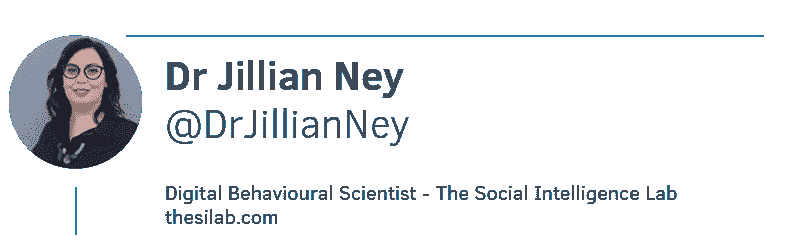
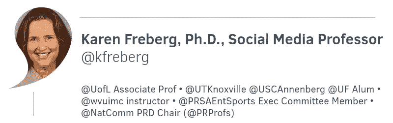
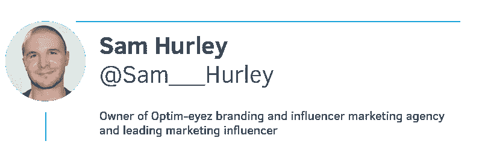
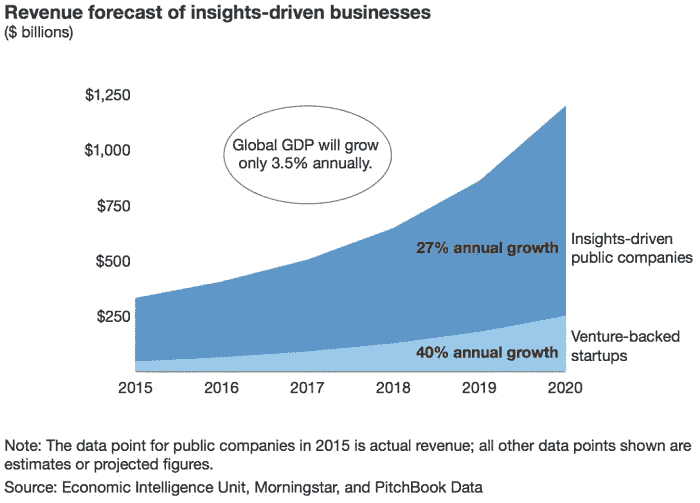

# AI 是什么？有哪些 AI 趋势？营销专家有他们的发言权！

> 原文：<https://medium.datadriveninvestor.com/what-is-ai-what-are-the-ai-trends-marketing-experts-have-their-say-3c3170ada725?source=collection_archive---------21----------------------->

10 experts talk about the future of artificial intelligence.

[试驾 Talkwalker AI 引擎！](https://www.talkwalker.com/artificial-intelligence-form)

# 什么是人工智能&为什么它很棒？

我已经瞥见了人工智能对营销的[未来影响，这太棒了。**人工智能驱动的 martech 为信息带来了新的信任水平**，改善了信息的交付方式，并为营销专业人员的高层决策提供了更准确的见解和预测分析。](https://www.talkwalker.com/artificial-intelligence-form)

我们不要怀疑人工智能。我们不要反抗了。让我们不要害怕变化，害怕进步。不管你喜不喜欢，它正在发生。这已经发生很多年了。AI 不可怕。它只能做我们让它做的，我们教它的。我们仍然是负责人。

当火车在 19 世纪初首次出现在铁轨上时，人们发誓以这样的速度行驶——每小时 48 公里——人体会融化。

你不会融化的。

AI 不会抢走我们的工作。为了我们自己的目的，我们可以选择、使用和滥用人工智能。

# 人工智能未来

因此，我挑战你们——营销专业人士——跳上人工智能引擎。来增强你的交流。自动化您的流程。微调你的数据。以节省时间和降低成本。至…

*   分析数字环境，提供精确的见解和实时更新
*   在虚拟现实场景中与目标受众和团队成员共享内容
*   向消费者提供精确的个性化内容
*   实时预测、监控和应对危机
*   跟踪和评估趋势
*   确定具有更大数据覆盖范围和数据准确性的指标
*   全球管理内容本地化
*   向布尔人挥手告别，跳上 [Talkwalker 的人工智能引擎](https://www.talkwalker.com/blog/ai-launch-2018-ai-trends)

# 来自营销专家的人工智能趋势

假新闻？科学突破？让我们看看我们的专家是怎么想的…

# 专家…有哪些 AI 趋势？

# 媒体监督的未来

“在 Trust Insights，我们看到了人工智能的三大趋势。

*   第一，AI 的准备。规划未来的公司必须清理他们的数据基础。**公司现在认识到拥有一个干净的数据仓库的重要性**，但是努力让他们的房子井然有序。最进步的公司一直拥有良好的数据治理；对于其他人，我们强烈建议他们查看 ISO 38500 2015 治理标准— [即时洞察:MarTech 治理框架](https://www.trustinsights.ai/experience/thought-leadership/instant-insights/instant-insights-martech-governance-framework-iso-38500-standard/)。
*   第二，归因分析是人工智能最有趣的应用之一，在今天相对成熟的人工智能技术下可以实现。过去花费数百万美元和需要大量硬件的事情现在可以在笔记本电脑上完成，因此证明营销渠道、战术和战略的价值比以往任何时候都更容易实现。
*   第三也是最后一点，**自然语言处理已经成熟为营销人员的一个有用的工具箱**。我们每天所做的很多事情都围绕着非结构化数据——社交媒体对话、内容营销、音频和视频——所有这些数据都是非结构化的，并且难以以其原始形式量化。得益于数十年的学术研究和现代计算能力，各种规模公司的营销人员如今都可以获得埋藏在非结构化数据中的洞察力。

在与营销相关的人工智能领域，还会有更多的东西出现，但这些都是今天任何规模的组织的营销人员都可以利用的趋势和技术。"

*克里斯，你给了我们新的* [*AI 引擎*](https://www.talkwalker.com/artificial-intelligence-form) *一个旋转。你觉得怎么样？*

“Talkwalker 的新机器学习能力对媒体监测行业非常重要，更重要的是，让 **Talkwalker 在媒体领域的人工智能方面获得先发优势**。他们正在建立的训练数据集有一个明显的优势——有动机、高素质的用户对媒体和情感进行注释。这与更一般的项目形成对比，在这些项目中，没有核心客户提供培训数据，导致有用的结果较少。这些数据是媒体监控的未来。”

# 人工智能将帮助企业在正确的时间将正确的信息传递给正确的受众

“人工智能和营销仍处于初级阶段。在不久的将来，我们将继续看到对话机器人越来越复杂，以及跨客户关系平台的机器学习的出现。简而言之，**人工智能将帮助企业“在正确的时间将正确的信息传递给正确的受众”**从而影响消费者的决策。“预测性销售线索评分”目前更多地出现在企业层面，也将成为所有行业所有业务层面的一种需求——反馈到“谁最终从哪些渠道购买”,从而影响未来的资源分配。早期，但对于精明的营销人员来说是激动人心的时刻。”

# 人工智能对日常消费者和营销人员意味着什么

“像社交媒体一样，人工智能将在我们如何使用它的过程中展示我们的真实自我。人工智能将继续发展，并在我们的日常生活中得到越来越多的应用。这是至关重要的，有一个积极的回应，教育人民如何人工智能工程，以及提供透明度的影响。透明度是采用独立于技术社区的关键。一般来说，我们倾向于看到更高和更低层次的人工智能迭代，无论它看起来像少数报告还是聊天机器人，但我们需要弥合这一差距，并思考人工智能对日常消费者和营销人员意味着什么。”

# 始终需要运用良好的判断力和道德

“围绕人工智能对专业工作的影响的叙述通常在否认和技术恐慌之间两极分化。

今天 **12%的公关技能已经可以由人工智能承担或显著增强**。在接下来的五年里，这个数字可能会上升到 38%。

这些发现来自[一份名为《仍然需要人类](https://www.cipr.co.uk/sites/default/files/11497_CIPR_AIinPR_A4_v7.pdf):公共关系技能和工具分析》的新报告，该报告由 CIPR 的#AIinPR 小组出版。它研究了技术的影响，特别是人工智能对公共关系实践的影响。

技术正以多种方式影响着公关，包括任务的简化；倾听和监控；和自动化。

但不管任务和技能可以自动化或受益于人工智能，人类干预、编辑、敏感性、情商、应用良好的判断和道德将永远是需要的。

技术为新产品和服务创造机会。快速适应新技术的组织获得竞争优势。"

# Talkwalker 的 AI 功能让我大吃一惊！

**“talk walker 的 AI 特性让我大吃一惊！**它可以轻松分析定量指标(如对话量)和定性指标(如对话情绪)，这种深入分析**提供了宝贵的见解**来确定我们客户的社会表现。”

# AI 对营销人员来说是个时髦词，但他们理解吗？

“我注意到,“人工智能”已经成为营销人员的时髦词汇，但许多应该或可能理解它的人实际上并不理解。这种情况必须改变，因为首席营销官是一个品牌的文化代言人。我们绝对需要专家，也强烈呼吁 CMO 和首席技术官团队作为合作伙伴一起工作，这样创造和销售人工智能或将其作为核心功能(用于他们生产的软件和服务)的技术品牌才能胜出。

重要的是，我们不仅要有了解产品的运营团队，还要有跨职能和营销团队，他们要了解产品是如何制造的，如何正确分析内部和外部数据，并利用它来交付成果。真正的挑战是这如何影响我们使用的人工智能和算法偏见的存在。

我使用苹果的 Siri，也使用亚马逊的 Alexa 服务。Alexa 没有丰富地列出代表多样化和不断增长的少数群体的东西，因此肯定不会像苹果的人工智能一样承认它的全球客户群。数据没有被编程到亚马逊一侧的 AI 中，因为程序员没有文化参考或与多样性合格终端用户调用的主题相关联；所以存在算法偏差。

我们需要小心地减轻和限制有偏见的人工智能的实例，因为它会导致服务、购买和销售中的歧视性做法。"

# 工具不能提供洞察力，但人类可以

“从市场研究的角度来看，人工智能的影响是巨大的，并提供了许多机会。它将有助于以更快的速度和更低的成本分割和编码大型数据集，包括社会数据。

人工智能将在识别情绪、个性和行为方面变得更好，但公司仍将需要人类来理解其中的原因。我们**仍然需要人类的洞察力来理解数据**并解释它对商业的意义。工具不能提供洞察力，但人类可以。"

# 图像识别赋予消费者购买力

“过去几年，我一直对图像识别的可能性非常感兴趣。图像识别已经掌握在许多品牌手中，他们经常利用它在整个互联网上发现他们的标志和产品，但有一个新的用途真正引起了我的注意。Snapchat 刚刚宣布与亚马逊合作，直接从 Snapchat 应用程序提供“视觉搜索”购物。这项技术允许用户拍一张他们朋友的鞋子的照片，如果被认出并在亚马逊上可以买到，他们将被带到那个产品页面，立即购买某样东西。**作为消费者，看到自己喜欢的东西，拍张照片，并能立刻购买**/研究它，这是多么令人惊奇的事情？这就像购物的 Shazam(哦，对了，Shazam 本周刚刚被苹果以 4 亿美元左右的价格收购……)。”

# Talkwalker AI 引擎让梦想成真

“人工智能不仅仅是社交媒体、数字和营销领域的一种趋势。它不仅将改变我们与行业技术的互动方式，也将改变我们在课堂上的互动方式。

人工智能是一个正在兴起的关注领域，在课堂上被涉及，甚至被整合到课堂练习和活动中。教导学生人工智能在帮助专业人员完成特定任务(例如收集数据、为特定目的创建机器人、为研究进行数据挖掘等)应该成为社交媒体和数字技术不断发展的课程的一部分。

此外，我们将看到我们开展业务、个人和职业活动的方式发生一些重大变化。

我们还必须承认，人工智能的使用和整合可能会因学科和职业而异。关键是要认识到这样一个事实，即**人工智能将成为营销传播组合**中不可或缺的一部分。虽然人工智能无法取代人类的交流和洞察力，但它仍然可以为我们的个人和专业活动提供重大价值。"

*你觉得* [*Talkwalker 的 AI 引擎*](https://www.talkwalker.com/artificial-intelligence-form) *怎么样，凯伦？*

“Talkwalker 通过将人工智能引擎集成到媒体监控中，实现了每个公关和社交媒体专业人士的梦想。我们必须找出如何消除所有噪音的日子已经过去了。有了这个工具，我们能够捕捉有意义的、相关的和**实质性的结果，这些结果将提供更多的信息洞察**。这一新特性可用于工业界和学术界的任何领域。这个工具可以**为学生展示 AI** 的影响和集成。我迫不及待地想把这个分享给我的教育同仁和学生们！”

人工智能正迅速成为日常生活的一部分——在营销领域也是如此。

# 你将如何在一个人工智能饱和的世界中脱颖而出？

“如果你还没有准备好让你的企业在亲密和高度准确的层面上扩大客户参与，现在绝对是时候了。

我们手边总是有如此多的数据，但直到现在我们才开始明白如何有效地利用这些数据来实现无缝的客户体验。

人工智能是主要原因— **这一切都与洞察力有关**(你可以打赌你的数据将推动这一令人印象深刻的市场增长):

*到 2020 年，洞察力驱动的企业将每年窃取 1.2 万亿美元*

根据叙事科学的数据，61%拥有创新战略的公司正在使用人工智能来识别数据中的机会，否则他们会错过这些机会。没有这种策略的公司只有 22%。

我们只是刚刚触及这项相对较新技术的表面，像这样的趋势没有显示出放缓的迹象。

虚拟助理、物联网、核心营销自动化、数据分析和预测是当今的热门应用，预计在不久的将来:

*   显著地**提高了创作不死板的书面营销内容的能力**(已经有[许多令人大开眼界的解决方案](https://postfunnel.com/get-noticed-3-nifty-marketing-automation-hacks-try-now/)可用)
*   能够离开社交媒体图像等的选择。对机器来说，随着上下文被越来越好地理解
*   付费搜索/竞价活动的几乎无需干预的管理
*   更大部分的 **SEO 管理自动化**，包括外联(例如，甚至[销售电子邮件现在可以智能部署](https://www.fusemachines.com/)，而无需持续的手动输入)

" [83%的电子邮件营销人员未能制定人工智能计划。](https://econsultancy.com/only-17-of-email-marketers-planning-for-ai-more-than-half-will-innovate-with-automation/)”

*   随着越来越多的 SaaS 厂商能够以可承受的价格提供人工智能解决方案，以及中小企业认识到这一潜力，上述所有技术在小型企业中得到更广泛的采用
*   需要更强有力的数据隐私法规和招聘——创造新的管理角色(同时耗费企业更多资源)
*   随着人工智能被融入几乎所有的营销过程，人们对它的议论和提及逐渐平息

" [Adobe 发现，47%的数字化成熟组织(拥有先进数字化实践的组织)都有明确的人工智能战略。](https://towardsdatascience.com/15-artificial-intelligence-ai-stats-you-need-to-know-in-2018-b6c5eac958e5)

那么，你将如何在一个人工智能饱和的世界中脱颖而出？

和之前的回答一模一样:

**人类+机器的正确组合将占上风**(预算肯定有很大帮助)。"

# 谢谢你们，你们太棒了！

AI 是什么？AI 的未来如何？

商业领袖认为人工智能对他们的成功至关重要。72%的人认为这将是未来的商业优势。

在 Talkwalker，我们不仅提供人工智能驱动的营销技术——图像识别、情感分析、人工智能引擎——我们每天都在使用它。我们已经投资并正在收获收益。是吗？

你已经阅读了我们的营销专家预测的人工智能趋势。你怎么想呢?是时候试一试，说出你的想法了…

注册并乘坐 [Talkwalker AI 引擎](https://www.talkwalker.com/artificial-intelligence-form)兜风！

*最初发表于*[*【www.talkwalker.com】*](https://www.talkwalker.com/blog/what-is-ai?utm_medium=referral&utm_source=medium.com&utm_term=EN&utm_content=ai-launch-2018-ai-trends&utm_campaign=ai-launch-2018-ai-trends)*。*