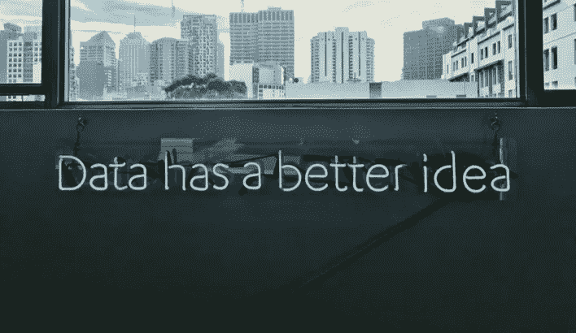
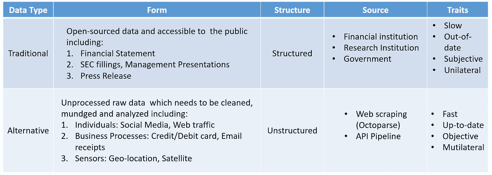
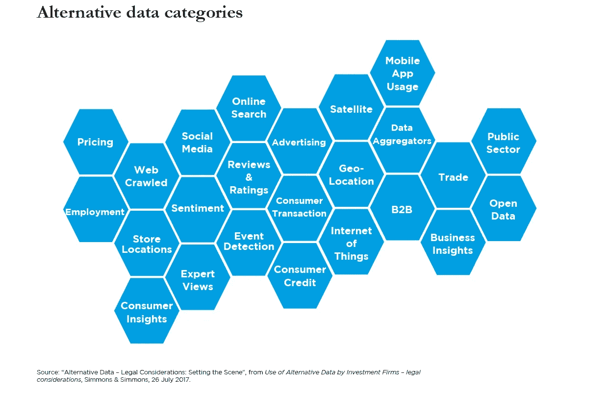
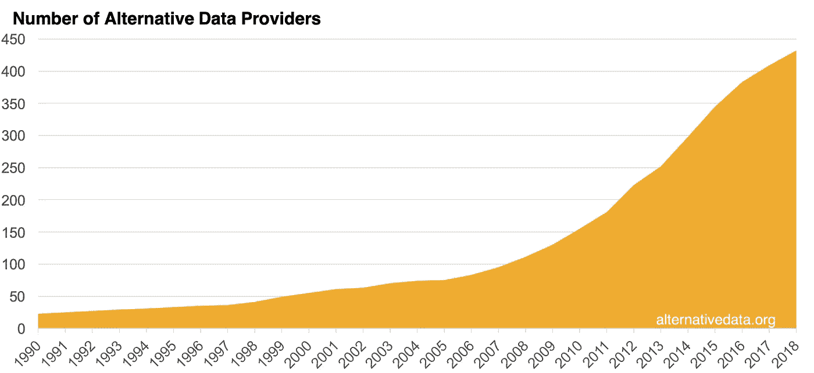
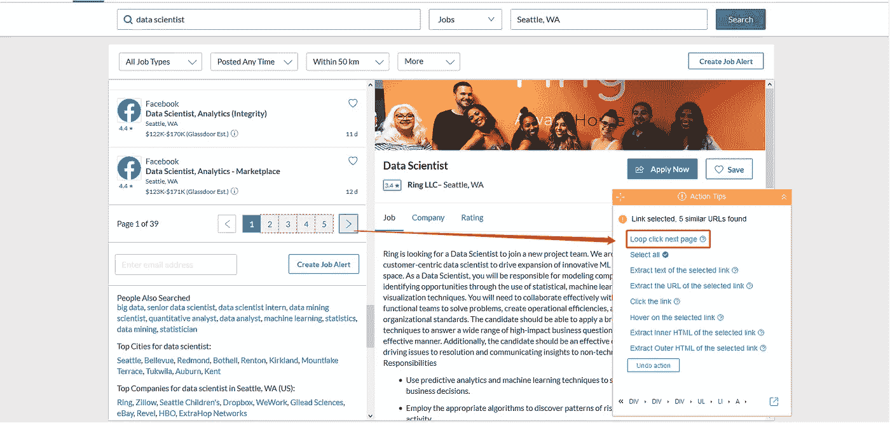
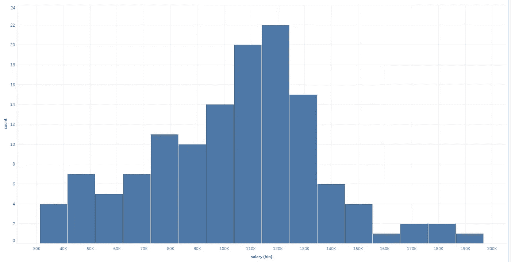

# 什么是替代数据，如何使用它？

> 原文：<https://medium.datadriveninvestor.com/what-is-alternative-data-and-how-can-you-use-it-de779b0b63b8?source=collection_archive---------10----------------------->

Photo by [Franki Chamaki](https://unsplash.com/@franki?utm_source=unsplash&utm_medium=referral&utm_content=creditCopyText) on [Unsplash](https://unsplash.com/search/photos/alternative-data?utm_source=unsplash&utm_medium=referral&utm_content=creditCopyText)

**什么是替代数据？**

[**替代数据**](https://www.octoparse.com/blog) 由于其规模和复杂性，通常被视为**大数据**或**穷尽数据**。这些数据集通常比传统数据集更难访问和结构化。替代数据为获得独特而及时的洞察力打开了大门，而这是传统数据源无法提供的。

替代数据的早期采用者之一是对冲基金，他们采用这些数据并将其纳入投资模型。使用和分析替代数据有助于他们发现不可预见的风险和潜在的投资机会。如今，在信息爆炸的时代，替代数据的使用已经快速扩展到各个行业。

**那么，为什么替代数据如此诱人？**

让我们长话短说。移动数据提供商 Thasos 收集了特斯拉工厂智能手机设备发出的数万亿个地理坐标，发现 2018 年 6 月至 10 月间夜班增加了 30%。夜班的显著增加表明了特斯拉 Model 3 产量的增加。塔索斯随后推断，特斯拉的股价会上涨。正如预期的那样，特斯拉 Model 3 的产量翻了一番，其份额增加了 9.1%。Thasos 用来帮助交易者预测股票走势的是替代数据。这是一个很好的例子，说明当数据看起来不一定相关时，它可能是一个至关重要的战略洞察力。

 [## 成为数据科学家所需的 8 项技能|数据驱动型投资者

### 数字吓不倒你？没有什么比一张漂亮的 excel 表更令人满意的了？你会说几种语言…

www.datadriveninvestor.com](https://www.datadriveninvestor.com/2019/02/07/8-skills-you-need-to-become-a-data-scientist/) 

除了来自智能手机设备的地理坐标，还有许多其他取决于特定行业的替代数据，例如人们使用应用程序时共享的信息、信用卡/借记卡交易数据、科技公司的专利数据、政府合同等。根据一项研究，2017 年已经确定了 24 个类别的 482 个数据集。

**一些最流行的替代数据类型有:**

*   网络抓取数据—从公共网站提取的数据。网络数据通常可以通过使用蜘蛛/网络爬虫来提取。一些最受欢迎的数据包括商业数据(产品信息、价格等)、工作列表、房地产数据等等。
*   网页流量——网页上的用户访问时间、用户数量和用户活动。这些数据可以帮助营销人员在网上改变消费者的购买决策。
*   地理位置-当地零售店停车场的卫星图像数据，用于衡量当地经济。

**如何获取替代数据**

替代数据可能很难获得，因为它确实不太容易获得，而且**不太结构化**。尽管近十年来替代数据提供商的数量激增，但由于以下原因，从各种来源获取大量数据对企业来说仍是一项挑战:

*   高费用——获取有价值的数据非常昂贵。正如 Thasos 的创始人斯基比斯基先生总结的那样，一些客户甚至每年支付超过 100 万美元。
*   长时间—一些替代数据需要更长的时间。对一些公司来说，他们没有资本在整个过程中提供资金。
*   数据价值——管理层不确定数据可能带来的潜在资产。突然跟风可能会让企业负债累累。
*   然而，许多人仍然担心网络抓取的法律含义。到目前为止，还没有反对网络抓取行为的法规，但有我们应该遵循的道德准则。

From: [alternativedata.org](https://alternativedata.org/alternative-data/)

目前，**目前最平易近人的解决方案是通过** [**网页抓取**](https://www.octoparse.com/) 。对于有预算的企业来说，网络抓取是获取数据的一种廉价替代方式。而且不准确的风险比数据源提供商的二手数据要低得多。Web 抓取自动化了数据提取过程，允许您以您想要的方式抓取数据。

为了更好地说明网络抓取如何帮助获取替代数据，我将以房地产市场为例。这里的目标是提取西雅图数据科学家的工资，并与住房市场相关。然后我们可以大胆猜测一下房地产市场的下一个繁荣领域。( [**看看这个视频，建立一个爬行刮工作板**](https://www.youtube.com/watch?v=kSIx1-RokR0) )

*   首先，使用[**octo parse**](https://www.octoparse.com/blog)**和我们从[glassdoor.com](https://www.glassdoor.com/Job/seattle-data-scientist-jobs-SRCH_IL.0,7_IM781_KO8,22.htm)得到的 URL 以及西雅图一位数据科学家的搜索结果启动一个新项目**
*   **其次，设置一个分页，这样我们就可以从所有页面中提取所有的工作列表。**

****

*   **第三，选择页面上的第一个职务列表。然后按照操作提示，点击“选择所有子元素”来定义提取字段。Octoparse 将以相同的模式选择所有数据字段。然后，我按照操作提示上的指导，单击“全选”命令来确认选择。如果选择成功，所选字段将变为绿色。**
*   **第四，单击“提取数据”命令。**

**现在我们得到了数据，我用 Tableau 将数据可视化。我用的模板是“**直方图**”。对于本例，我们将绘制西雅图一名数据科学家的工资范围。**

****

**大多数数据科学家赚了大约 12 万美元。他们能在西雅图地区买得起房子吗？根据 Zillow 的负担能力计算器，一个 12 万美元的工资制造者可以买得起一栋 52 万美元的房子。然而，在西雅图，一栋中等价位的独栋房子要花费[68.5 万美元](https://towardsdatascience.com/data-analysis-predicting-the-housing-market-using-python-eae4f9fbd4e5)。虽然感到有些负担，但他们可以转向像伦顿这样的郊区，那里单户住宅的平均价格约为 50 万美元。因此，租金 12 万美元的开发商可能会更青睐 Renton，因为他们正在西雅图-贝尔维尤地区寻找价格更低的房子。**

**最后，我一直使用的工具是 Octoparse。它是一家可靠的 [**网络抓取服务提供商**](https://www.octoparse.com/) ，拥有为世界 500 强企业提供世界级服务的悠久历史。它还提供智能网页抓取软件，不需要任何编码技能。在这种情况下，您可以构建 web crawler，从选定的来源收集数据，并通过 API 将其集成到您的数据库中。**

**来源:**

**[https://towards data science . com/data-analysis-predicting-the-housing-market-using-python-ea E4 f 9 FBD 4 e 5](https://towardsdatascience.com/data-analysis-predicting-the-housing-market-using-python-eae4f9fbd4e5)**

**[https://www . lockton international . com/GB/articles/alternative-data-after-gold-rush-what-is-risks-investors](https://www.locktoninternational.com/gb/articles/alternative-data-after-gold-rush-what-are-risks-investors)**

**[https://www . wsj . com/articles/your-smarts-location-data-worth-big-money-to-wall-street-1541131260](https://www.wsj.com/articles/your-smartphones-location-data-is-worth-big-money-to-wall-street-1541131260)**

**[https://alternativedata.org/alternative-data/](https://alternativedata.org/alternative-data/)**

**[https://www . geek wire . com/2017/look-bay-area-西雅图-rises-2nd-best-tech-city-u-s-passing-Washington-d-c/](https://www.geekwire.com/2017/look-bay-area-seattle-rises-2nd-best-tech-city-u-s-passing-washington-d-c/)**

***原载于 2019 年 8 月 2 日 https://www.octoparse.com**T21*[。](https://www.octoparse.com/blog/what-is-alternative-data-and-how-can-you-use-it)**