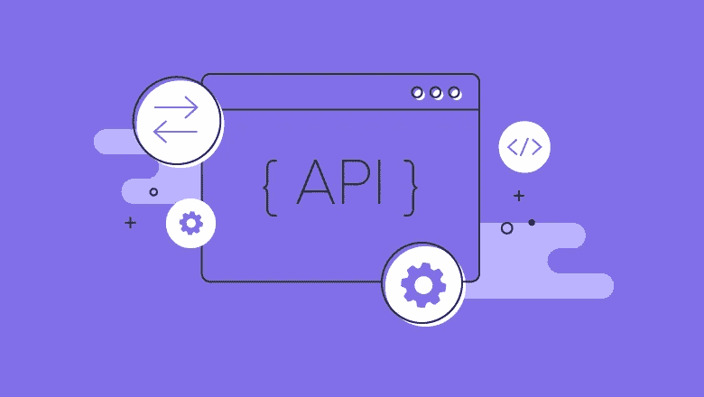
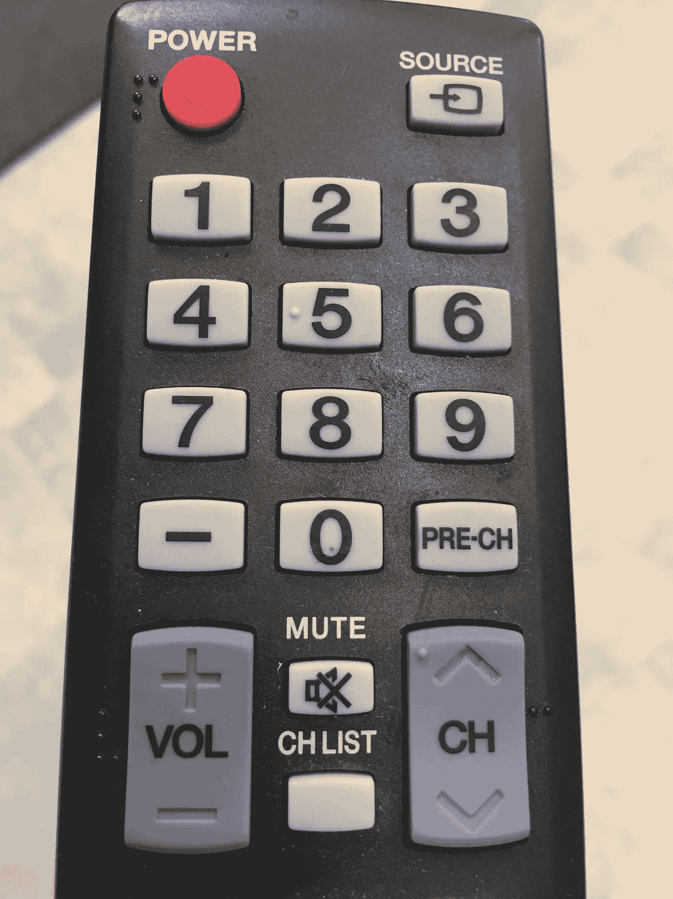
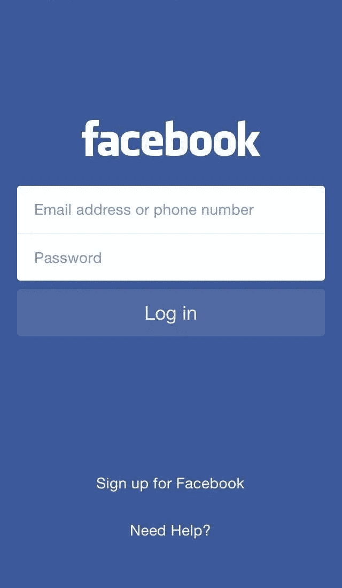

# 什么是 API？你是不是误会了？

> 原文：<https://medium.datadriveninvestor.com/what-is-api-are-you-misunderstanding-it-368b451f0ee6?source=collection_archive---------11----------------------->

## # 7—每日邮报

## 当我对我的朋友说“API”这个词时，有些人认为我是指后端 API，有些人认为那是 Web API，有些人认为是 RESTful API。那么谁是对的呢？

Photo by [Kevin Grieve](https://unsplash.com/@kevin_1658?utm_source=medium&utm_medium=referral) on [Unsplash](https://unsplash.com?utm_source=medium&utm_medium=referral)

API(在计算机科学中)代表“应用程序编程接口”。太短了，我们稍微改一下语法吧！

 [## 雅虎财经 API |数据驱动投资者的 6 种替代方案

### 长期以来，雅虎金融 API 一直是许多数据驱动型投资者的可靠工具。许多人依赖于他们的…

www.datadriveninvestor.com](https://www.datadriveninvestor.com/2019/02/25/6-alternatives-to-the-yahoo-finance-api/) 

> 👉🏻" API 是一个允许开发者编写应用程序的接口."

## 那么什么是接口呢？

术语“界面”也被许多技术人员误解，尤其是那些母语不是英语的人。开发者通常在 OOP 中引用*接口*。然而，这只是实际“接口”概念的一个应用。

我们来看一些现实生活中的例子！

时间旅行 90 年👴🏼这里我们有一台老式电视机📺。它有一个屏幕，你可以看到当前频道的内容，两个轮子的控制，一个用于切换频道，一个用于改变音量，还有一个按钮用于打开和关闭。

我们刚刚提到的是**一个老派电视的接口**。屏幕、频道控制、音量控制和电源按钮是我们用来实际使用整个电视的工具。我们不知道当我们转动频道控制时，大盒子里会有什么魔法，但我们知道只要这样做，屏幕就会改变，显示其他内容。我们也不知道如何通过调节音量来提高音量。而**这样的神奇工具被称为接口**。

几十年过去了…现在我们有了一个遥控🕹！

上面所有的按钮都是遥控器的接口。我们知道，按“1”，我们现在在电视上看到的是频道 1，按“2”，我们看到的是频道 2。就是这样。我们不知道遥控器和电视之间发生了什么超能力，它们甚至没有连线。

> **“就是管用！这太酷了。."**

那就是使用一个界面的**感受。**

现在让我们来看看一个更小的东西，一瓶🧂.你看到它帽子上的说明了吗？

*“紧紧关闭”*顺时针箭头↩️*“打开……”*逆时针箭头↪️.

然后，我们知道，只要向正确的方向转动瓶盖，我们就能打开或关闭瓶子。

盖子和瓶子是如何首先相互配合，然后可拆卸，然后可以再次配合的？我们不在乎。**刚刚成功了！因为那是瓶子的接口**。

我们讲得太多了，现在回到软件上来！那是一个**脸书手机应用的界面**。我们只需键入我们的电子邮件/电话号码和密码，然后按登录。流浪汉。*“您的密码不正确！”* 🛑.

哦，我的错，再输入一次*“你永远不知道我的密码*😁".就这样，重新登录。耶！这是我的 Facebook😉。

啊等等！应用程序如何知道我输入了错误的密码？脸书把我的密码存放在哪里？……嗯……**我们不管！因为是接口！**

✊🏻总之，界面是一个更大的物体的一部分，是一套允许人们与宿主互动的工具。或者更抽象一点，接口是更大更复杂的东西的一部分，它暴露给其他对象，允许其他人与宿主对象交互。用户不需要关心接口内部实际发生了什么。此外，接口通常附带一套说明如何使用它们的指令。

**也就是说，应用程序编程接口是一组功能，实现一些特定的功能，并向开发人员公开，以便他们可以在此基础上进行交互和创建应用程序。API 通常附带一个名为 API doc & reference 的文档，描述公开的函数。**

例如:

*   *React API* 是一组允许开发者创建 Web 应用的函数。
*   *Medium API* 是一组远程 HTTP 端点，允许 Medium 的前端开发人员创建这个漂亮的浏览器界面，以实际创建文章、保存文章、发布文章，并将我的文章带给包括您在内的数百万读者！
*   *Web API* 是一组暴露在互联网上的远程端点。

## **总之**

API 是一个抽象术语，指的是一组功能，这些功能使开发人员能够拥有一些特定的功能，他们可以在这些功能的基础上创建应用程序。