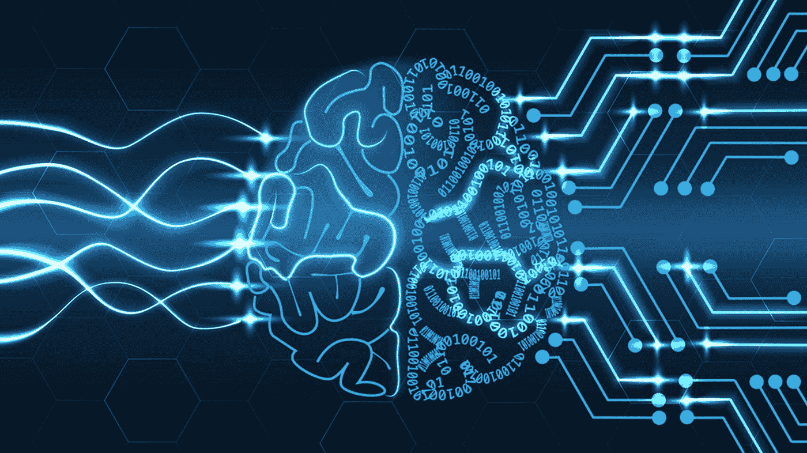
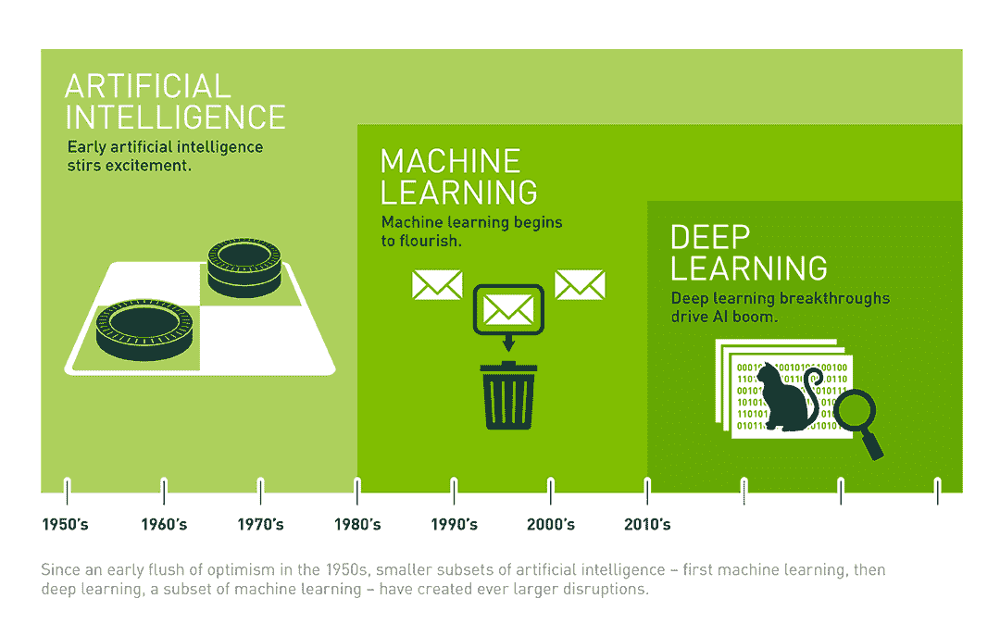
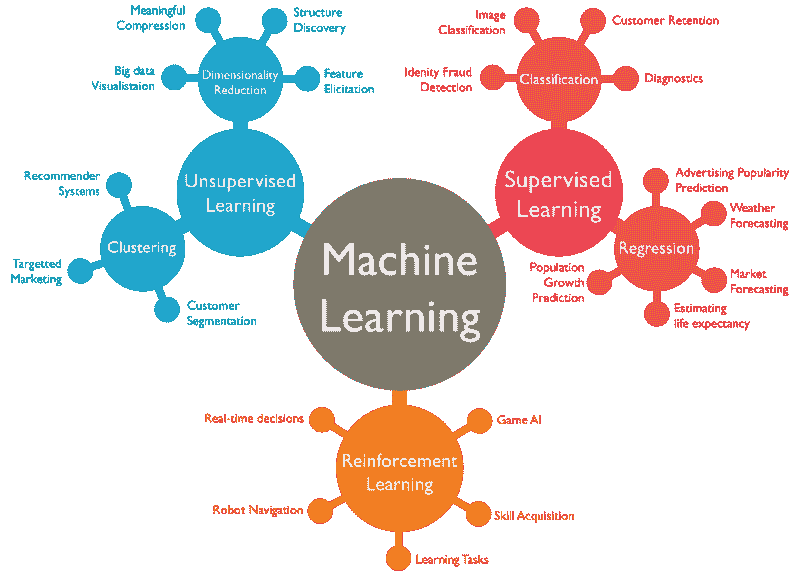
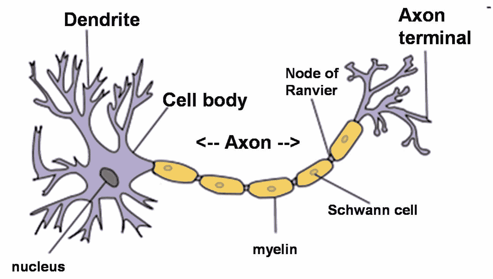
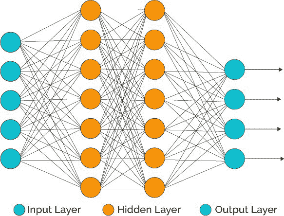
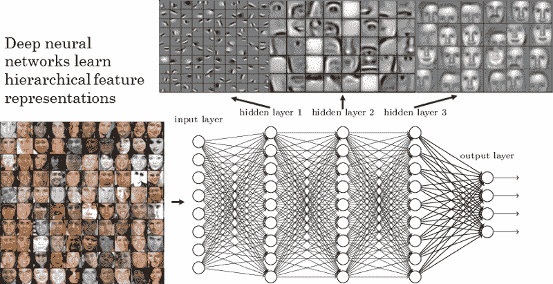

# 什么是人工智能？

> 原文：<https://medium.datadriveninvestor.com/what-is-artificial-intelligence-eeb863bf3fee?source=collection_archive---------3----------------------->

花点时间。想想你在做什么。想象一下 10 年后的自己。你认为世界将走向何方？

你有没有想过世界前进的速度有多快？你想过互联网有多革命性吗？

我们所做的一切都围绕着这个叫做互联网的东西。现在想想，如果没有互联网，一切都会变得如此过时。这就像生活在另一个时代，我们在几十年内从历史走向现代；地球存在时间线上的一眨眼。

但是，你知道还有什么令人惊讶吗？

我们前进的速度也在增加。它创造了这个指数图，看起来越来越陡。那么离下一个**大事件还有多长时间？**

我觉得不到 10 年。而它就在这个术语之内:**人工智能。**

**那么，什么是人工智能？**

简单地说，人工智能 **(AI)** 是计算机科学的一个领域，旨在强调机器像人类一样行为的能力，包括观察、学习、规划和决策等复杂任务，以解决问题。它最早是由约翰·麦卡锡在 1956 年创造的。

这很简单，因为:

**人工+智能**

**人造的**表示不自然的东西

**智力**获取和应用知识和技能的能力

人工智能=机器精心设计的智能行为。

如果我们深入研究，AI 可以分为两类:

**通用人工智能:**拥有人类智能的所有特征

狭窄的人工智能:展示了人类智能的某些方面，有点像特殊化。

*   其他领域缺乏
*   一台非常擅长识别图像，但除此之外什么都不会的机器是狭义人工智能的一个例子
*   还记得 ***生产线吗？—*** 每个部分都专门做一件特定的事情

很简单，对吧？还有更多。

AI 就在你身边，太神奇了。现在，你对人工智能的第一个看法是会走路会说话的机器人，但并不一定是那样。看上面的图片。那是人工智能！叫做**自然语言处理(NLP)** 。我们稍后会谈到这一点。

任何有技术诀窍的人肯定都遇到过叫做**机器学习**和**深度学习**的术语。如果你还没有，恭喜你今天学到了新东西！

这是术语之间的基本流程。先说**机器学习**。

**机器学习:**

*   通过结合大量数据+快速迭代处理和智能算法来工作，允许软件从数据的模式或特征中自动学习。

机器学习的核心是一种实现 AI 的方法；它从例子中学习。没有机器学习，人工智能也是可能的，但需要数十亿行代码。

那是非常不切实际的！

**ML 中的关键点:**

*   它自动建立分析模型。
*   使用神经网络、统计学、运筹学和物理学的方法来发现数据中隐藏的见解
*   没有**明确的**编程

一台没有数据的机器就像一个新生的婴儿。随着婴儿的成长，他通过眼睛拍摄的无数图像、语言和经验来学习，这通常是一种试错的形式。

就像俗话说的，你从错误中学习。甚至机器也会。这里的**关键要点**是人类和机器**以同样的方式**学习！唯一的区别是机器要快得多，也更有效率。

Arthur Samuel 将机器学习(ML)定义为“在没有明确编程的情况下赋予计算机学习能力的研究领域。”

机器学习**分支的可视化表示**

我将在以后的文章中深入讨论机器学习的类型。

**但是哪里可以用机器学习呢？**

机器学习允许许多事情的自动化。

我们来看一个用例:**自动驾驶汽车**

自动驾驶汽车使用机器学习来“感知”环境。这是通过集成在汽车中的传感器和软件实现的，这些传感器和软件对周围环境进行实时分析。传感器拍摄照片，记录声音，并将其输入机器，然后机器根据数据做出决定。

这是一辆可以自己驾驶的汽车。长途驾驶变得不那么累了！

继续前进。让我们更深入地研究**(没有双关语的意思！)**

****深度学习:****

**深度学习是一种实现机器学习的方法。这是迄今为止实现机器学习的最佳方法，也是一个非常有趣的概念。**

****

****人脑**是我们人体内最高级的认知“机器”。它的工作原理是神经元网络被一起激发。深度学习模仿了同样的过程。**

****

**一个**神经元**包含**的三个**主要部分:一个**细胞体**，它指挥神经元的所有活动，**树突**(树枝)，它是一种短纤维，从其他神经元接收信息并将这些信息传递给细胞体，最后，**轴突**是一种长的单纤维，它将信息从**细胞体传递给其他神经元的树突。****

**一个机器神经元被称为**感知器**。感知器通过二进制网络相互连接，共同创建人工神经网络(ANN)。感知器的功能类似于神经元，它们从不同的来源获取输入，并输出二进制数字(0，1)**

**通过连接许多感知器，我们创建神经网络层。**

**层的网络创建了神经网络。这被称为深度学习，因为网络是“多层深度的”**

**这是一个**人工神经网络**的例子。它由多层组成。我将在以后的文章中详细解释神经网络。**

****

**在这个网络中:**

1.  ****输入层:**这里数据被输入到机器。在这个例子中，这包括许多人的肖像。**
2.  ****隐藏层 1:** 它学习识别轮廓或基本面部元素**
3.  ****隐藏层 2:** 基于轮廓和初始分析，机器创建更复杂的面部特征，如眼睛、鼻子、嘴，并开始识别复杂的面部元素**
4.  ****隐藏层 3:** 机器将人脸拼接起来，与输入的数据进行比对。它试图从以前的例子中识别重复出现的模式和特征**
5.  ****输出层:**提供基于数据分析的答案，在本例中，是整张脸的图像。**

**这是过度简化了，是深度学习的一个非常基础的表示。它会变得更加复杂。但是伴随着复杂性，它带来了更多的潜力！**

****这里的关键要点**是深度学习**模仿**人体内的神经元和神经系统，以便**实现**机器学习。**

**像深度学习一样，还有更多实现机器学习的方法。这些包括**贝叶斯网络**、**支持向量机(SVM)、提升和打包决策树、*k*-最近邻、朴素贝叶斯、判别分析和逻辑回归。****

**人工智能是一个广阔的领域。你挖掘得越深，你就越有潜力。在我看来，人工智能将成为未来许多技术的核心支柱。人工智能在任何行业都有用，包括医疗保健、银行、制造业、IT 和几乎任何东西！**

****关键要点:****

*   **计算机科学的一个广阔领域，强调机器像人类一样表现的**能力。这包括观察、学习、计划和解决问题的决策等任务****
*   **两类:**通用 AI:** 可以做多项任务，**狭义 AI:** 专门 AI**
*   **机器学习通过结合大量数据+快速迭代处理和智能算法来工作，这允许软件在没有**显式编程**的情况下找到数据中的模式和特征**
*   **机器学习是**实现人工智能的一种方式。****
*   **机器学习的概念是机器以与人类相同的方式学习！唯一的区别是机器要快得多，效率高得多。**
*   **使用机器学习和深度学习的一个很好的例子是在**无人驾驶汽车****
*   **深度学习是目前实现机器学习的最好方法**
*   **深度学习基于多个层，这些层形成由感知器(机器的神经元)组成的神经网络。**
*   **深度学习模仿人体的神经元。这允许它基于数据和通过分解事物来构建答案和响应**

**你可能会遇到的其他一些术语:**

****认知计算:****

*   **人工智能的一个子领域，致力于与机器进行自然的、类似人类的交互**
*   **最终目标——通过解释图像和语音并连贯地回应来模拟人类流程**

****计算机视觉:****

*   **依靠模式识别和深度学习来识别图片或视频中的内容。**
*   **如果他们能够处理、分析和理解图像=实时捕捉图像或视频，并解读其周围环境**

****自然语言处理(NLP):****

*   **计算机分析、理解和生成人类语言(包括语音)的能力**
*   **下一阶段是自然语言交互**
*   **正常随意的谈话**

**如果你喜欢读这篇文章，给它点个赞，分享一下。关注我了解更多！**

**如果你对学习人工智能和区块链等趋势技术感兴趣，请访问 [**intellee.ca**](https://www.intellee.ca/)**