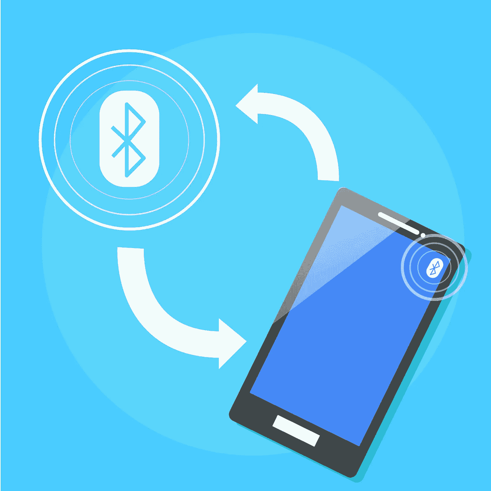
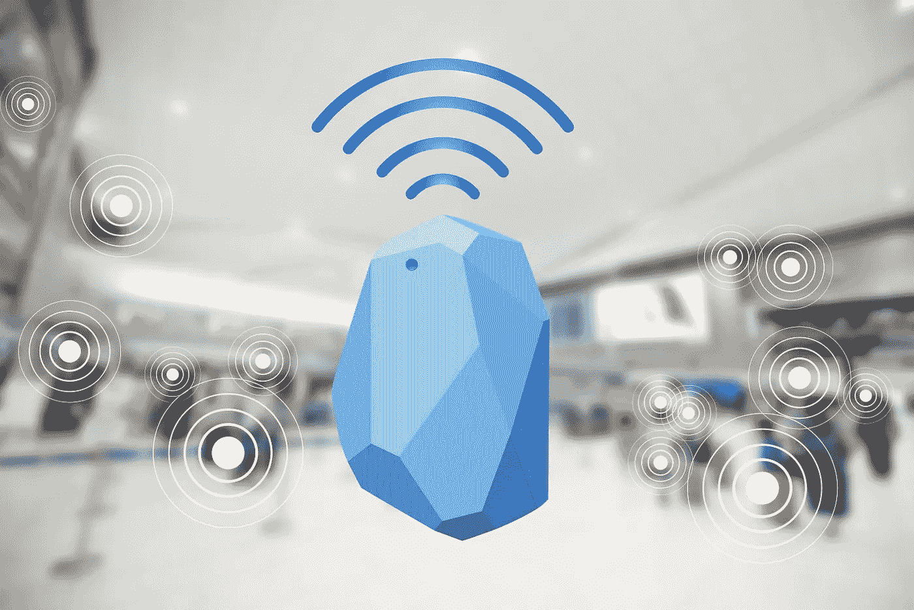

# 什么是信标技术，它是如何工作的

> 原文：<https://medium.datadriveninvestor.com/what-is-beacon-technology-and-how-does-it-work-365ac6dbc260?source=collection_archive---------11----------------------->

现代技术已经发展到如此地步，它可以完全改变我们看待某项技术的方式，而无需改变核心前提。让我们来看看智能手表。对大多数消费者来说，第一代智能手表是作为玩具出现的，但随着技术的进步，苹果等公司的最新一代智能手表可以让计时器、气压计和其他设备的技术发挥作用。

信标和天文钟一样古老。今天的信标可能像很久以前的信标一样提供功能，但是它们更加智能，能够做更多的事情。在我们进入所有细节之前，让我们先了解一下什么是信标。

# 什么是信标技术？

信标是一个和你家里的路由器差不多大小的小盒子，如果用户离它足够近，它会通过蓝牙向用户设备发送编码信息。旧的信标使用光信号来发送位置信息，但最新一代的信标使用蓝牙。这让营销人员对其客户的购物习惯有了更多的了解，并让用户收到更多关于附近交易的定制提醒，如果他们想收到这样的消息的话。基本上，这些设备极大地改善了消费者基于位置的搜索，并为广告商提供了客户活动数据。这对双方都是双赢的。

 [## 2019 年移动应用开发之路——数据驱动投资者

### 任何在移动应用程序开发行业工作的人，无论他们是专注于在伦敦开发 iOS 应用程序还是…

www.datadriveninvestor.com](https://www.datadriveninvestor.com/2019/01/15/the-path-of-mobile-app-development-in-2019/) 

# 信标是如何工作的？

假设你的商店里有一个灯塔。这种信标将向用户的手机发送一条信息，用户只能通过手机应用程序查看这条信息。根据你使用的操作系统，beacon 行业将这些应用称为 iBeacons 或 Eddystone 应用。对于 iPhone 用户，你的设备至少需要 iOS 7 或更高版本才能支持此类技术。Android 用户至少需要 Android 4 才能在手机上运行 Eddystone 应用。

有趣的是，这个应用程序甚至不需要打开，你的手机就能接收到这个信号。这听起来与许多用户不喜欢使用的 RFID 技术非常相似，因为它与身份盗窃和其他侵犯行为有关，但信标不同。只有在你的手机上安装了可以接收信号的应用程序，并且你可以选择完全不接收信息的情况下，信标才会起作用。

# 信标技术的类型

自从苹果在 2013 年推出 iBeacon 以来，随着越来越多的信标设备被创建，应用开发框架开始考虑这种新出现的技术。如今，有许多类型的信标，它们由大小、电池容量及其对外来元素的反应来定义:

*   基本信标——这些信标的大小与 Wi-Fi 路由器差不多
*   小信标——这些信标足够小，可以放进你的口袋，但同样有效
*   USB 信标—紧凑且易于部署
*   父信标—跟踪和收集关于其他信标的信息
*   特殊信标—这些设备不会受到外部条件的影响，例如水、灰尘、防静电和任何其他外部因素。

# 信标技术的好处

信标提供了许多好处，任何地方的企业都将能够利用存储在信标内的关于其客户的所有信息获得许多新的优势。[移动应用开发服务](https://skywell.software/mobile-app-development/)不断完善技术，以使其更加精确，并释放信标隐藏的潜力。营销人员可以利用信标来获取大量信息。例如，如果你将信标信号连接到你的谷歌广告账户，它将为你的搜索者的离线活动提供大量信息，甚至可能允许你跟踪店内访问。如果你在谷歌搜索后显示用户的广告，你就有可能知道有多少在线访问者真正进入了你的商店。如今，考虑到公司在数字广告上花了多少钱，这样的信息比以往任何时候都更重要。

它还让您能够收集更准确的数据，了解顾客如何在您的商店走动。这些信息对于调整或优化商店布局和产品列表非常有用。例如，如果数据显示用户正涌向您的家居装饰商品，那么您可以使用从设备中获得的数据来订购更多相同或类似的商品。或者你可以考虑在商店的各个部门走动，这样最受欢迎的商品就更容易买到，也更容易被消费者看到。

我们希望所有关于 beacon 技术如何工作的信息将帮助您决定它是否对您的业务有用。这项技术相对较新，但鉴于它提供的所有优势，它可能会成为主流，因为它让企业了解客户行为，否则不可能获得这些信息。找到如何使用信标只是成功的一半。另一半是利用获得的信息，分析它以更好地了解你的受众，并利用它来支持或增强你当前的营销努力，以促进销售。

*最初发表于*[*sky well . software*](https://skywell.software/blog/what-is-beacon-technology-and-how-does-it-work/)*。*