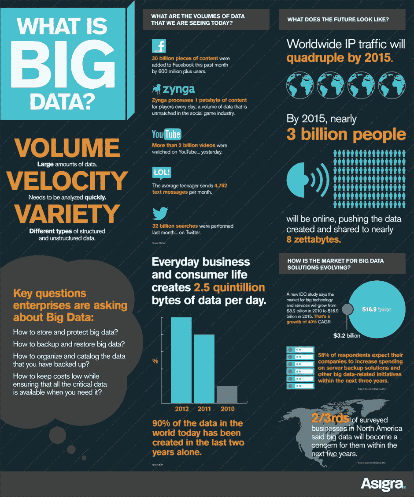
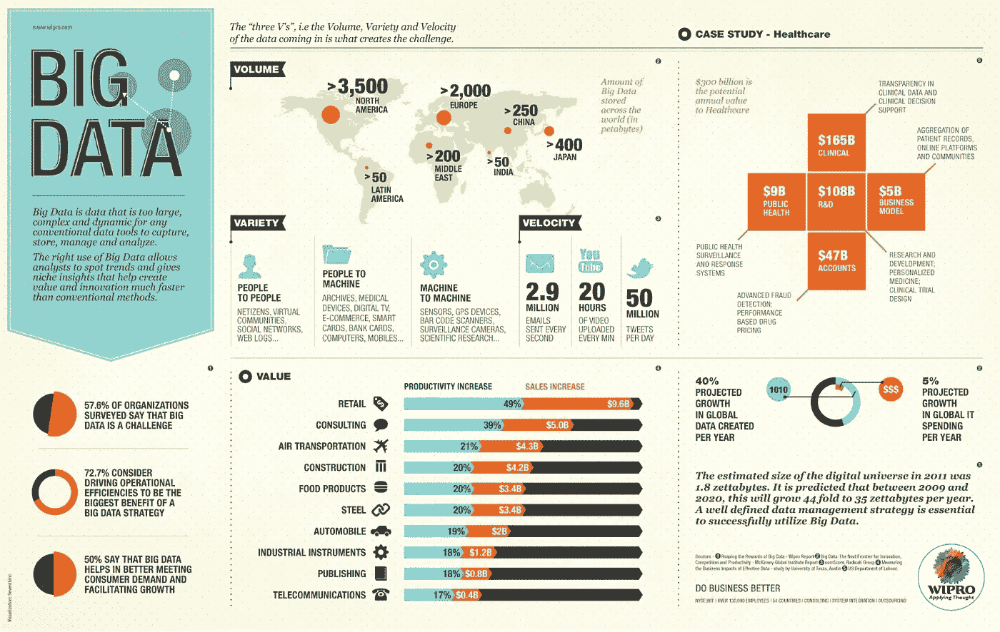

# 什么是大数据？每个人都应该知道的简史

> 原文：<https://medium.datadriveninvestor.com/what-is-big-data-a-brief-history-everyone-should-know-4b08a83993b8?source=collection_archive---------16----------------------->

由于自我改进的冲动，人类总是试图在产生新的信息系统和存储现有知识库方面达到极限。这些实践是通过收集数据并将其转换成全世界都可以访问的信息而获得的。从数据中获取信息对于调控社会和经济生活至关重要。然而，随着数据源的激增，获取的数据总量也大幅增加。

这一切都始于自数字时代开始以来我们产生的数据量的爆炸式增长。这之所以成为可能，主要是由于计算机数量和能力的增加、互联网的扩展以及能够从我们生活的真实物理世界获取信息并将其转换为数字数据的技术的发展。

这就是为什么像[大数据](https://www.forbes.com/sites/bernardmarr/2017/03/14/the-complete-beginners-guide-to-big-data-in-2017/#315d20cc7365)这样的现象来拯救和确保适当的数据存储、管理和处理，考虑到容量、价值、多样性、准确性和速度的属性。

**定义大数据**

在深入探讨大数据何时出现并转化为大数据的问题之前，让我们先澄清一下确定其实际含义的困难。

大数据这个术语定义了分布在众多系统中的任何类型的数据；高技术、高容量、高速度、高种类的信息资产，用于捕获、存储、分发、管理和分析信息。它也是处理结构化和非结构化数据的各种工具、途径和方法，以便将它们用于特定的任务和目的。

如今，大数据仅仅意味着存储和处理大量信息。

**大数据的演进**

大数据的优势可以追溯到很久以前，关于数据如何变大的故事有许多不同的解释和观点。让我们按照历史喜欢的方式整理所有的信息——按时间顺序。

**1865 年**

商业智能这个术语进入了人们的视线——被 Richard Miller Devens 用于识别、提取和数据分析。

**1940 年**

牛津英语词典提出的术语[信息爆炸](https://en.oxforddictionaries.com/definition/information_explosion)成为信息革命的起点，信息革命进一步演变为“大数据”的概念。

**1970 年**

IBM 数学家 Edgar F. Codd 开发了一种关系数据库模型——允许使用简单的索引系统获得记录的分层文件系统。这意味着任何人都可以使用数据库，不仅仅是计算机科学家。

**1976 年**

企业开始使用物料需求计划(MRP ),使计算机和数据存储可用于日常例行任务。

**1991 年**

这一天被认为是互联网的诞生之日，每个联网用户都可以下载其他网络用户上传的数据。

**1997 年**

1.迈克尔·考克斯和大卫·埃尔斯沃斯在 IEEE 第八届可视化会议上发表了“[面向核外可视化的应用控制的需求分页](https://www.evl.uic.edu/cavern/rg/20040525_renambot/Viz/parallel_volviz/paging_outofcore_viz97.pdf)”。这被认为是美国国家航空航天局(NASA)的科学家在 ACM 数字图书馆中首次记录使用“大数据”一词，报告了他们在可视化方面面临的问题，这意味着计算机系统面临一个有趣的挑战。他们称这一事件为“大数据问题”

2.拉里·佩奇和他的大学朋友谢尔盖·布林基于新算法——页面排名——推出了最受欢迎的搜索引擎——谷歌。

3.迈克尔唯恐发表了"[世界上有多少信息？他估计数字世界每年以十倍的规模发展。](http://www.lesk.com/mlesk/ksg97/ksg.html)

**2001 年**

Doug Laney 定义了“三个 v”，即大数据的速度、多样性和容量。传统的定义特征是由 Meta Group 在 2001 年开发的:

卷—物理卷的数量。

速度—增长的速度以及快速处理数据以获得结果的需求。

多样性—同时处理不同类型数据的能力。

**2004 年**

谷歌发表了一篇名为 Map Reduce 的论文——大型集群上的简单数据处理。他们的工作成果是并行计算的大表数据库和算法框架——MapReduce。

**2005 年**

1.Apache 开发了 Hadoop——一个开源的数据框架

2.Web 2.0 的诞生——用户生成的 Web

**2008 年**

“大数据”一词也是由 Clifford Lynch 教授在科学杂志《自然》上提出的。一个名为“大数据:你的数据如何增长？”致力于世界信息量的爆炸式增长及其如何影响电子科学的未来。

2011 年

为了强调实施大数据工具的安全风险和好处，[麦肯锡报告](https://www.mckinsey.com/mgi/our-research)称，美国将在 2018 年面临大约 100 亿美元的缺口。170，0 00 名专业数据科学家，并提供描述性统计数据。

适用于麦肯锡大数据的分析技术和方法:

数据挖掘；

众包；

混合和数据集成；

机器学习；

人工神经网络；

模式识别；

预测分析；

模拟建模；

空间分析；

统计分析；

数据可视化。

技术:

NoSQL；

MapReduce

Hadoop

r；

硬件解决方案。

**统计中的大数据**

据 IBS 公司称，到 2003 年，全世界已经积累了 5eb 的数据(1eb = 10 亿 GB)。到 2008 年，这一容量增加到 0.18 吉字节(1 GB = 1024 艾字节)，到 2011 年增加到 1.76 吉字节，到 2013 年增加到 4.4 吉字节。2015 年 5 月，全球数据量超过 6.5 zettabytes(更多)。

根据预测，到 2020 年，人类将形成 40-44 吉字节的信息。此外，根据 IDC 分析师编写的报告“2025 年数据时代[，到 2025 年将增长 10 倍。报告指出，大部分数据将由企业自己生成，而不是由普通消费者生成。](https://www.seagate.com/gb/en/our-story/data-age-2025/)

**大数据会改变世界吗？**

在十九世纪，知识概念的变化不仅是由来自世界各地的新信息的涌入实现的，也是由这些信息的产生、处理和分析的转变实现的。Joanne Travaglia 和 Hamish Robertson 追踪了 19 世纪数据革命与当今形势之间的联系，强调了其可能影响现代社会几乎所有领域的后果。大数据的第一次革命已经过去了两个世纪，但许多问题和解决问题的方法直到今天仍然存在。

我们无法回避技术的巨大力量。大数据已经在改变世界，悄悄地渗透到我们的城市、房屋、公寓和小工具中。技术将多快完全占领整个地球——只是一个时间问题。