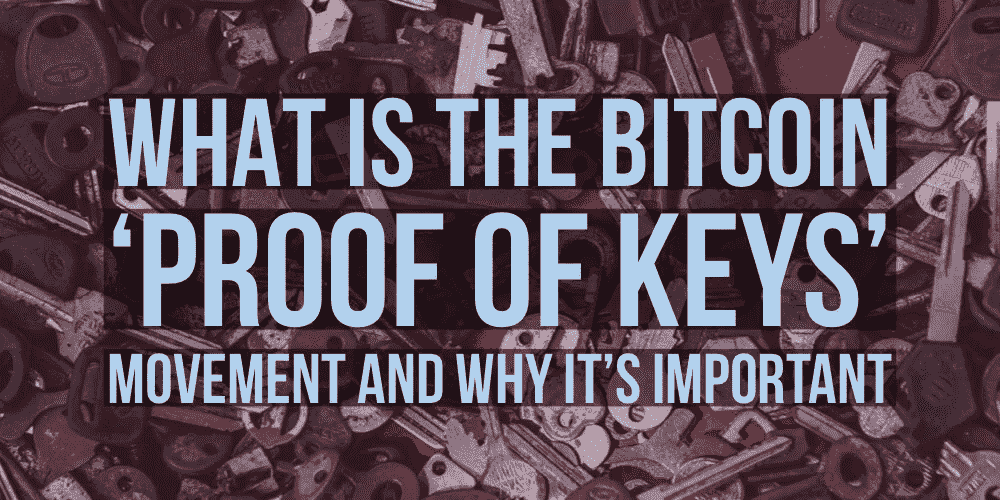

# 什么是比特币“密钥证明”事件，为什么它很重要

> 原文：<https://medium.datadriveninvestor.com/what-is-bitcoin-proof-of-keys-movement-and-why-its-important-crypto-news-c457e6589e8d?source=collection_archive---------3----------------------->

## 2019 年 1 月 3 日，密码交易员将参加*密钥证明*日。感谢 HitBTC 向我们展示了为什么我们应该关心。

## 到底什么是*钥匙*的证明？

*密钥证明*是由知名加密投资人 [Trace Mayer](https://medium.com/u/75e93b5827c9?source=post_page-----c457e6589e8d--------------------------------) 通过 Twitter 发起的运动。2019 年 1 月 3 日星期四，投资者被敦促将他们的加密货币*移出交易所*(比特币基地、币安等)。)和*放入*一个比特币钱包，在那里他们可以控制私钥。

## 为什么是 1 月 3 日？

2019 年 1 月 3 日，是比特币 *'* [*创世纪区块*](https://en.bitcoin.it/wiki/Genesis_block) *'* 被开采十周年。*钥匙的证明*打算成为一年一度的传统，所以选择了一个容易记住的日子，庆祝比特币区块链的诞生。

 [## 比特币生日快乐！10 个事实，每年 1 个，值得庆祝

### 庆祝比特币十周年，刷刷你的比特币历史琐事，从 2008 年到 2018 年每年 1 个事实。

medium.com](https://medium.com/@matthewbardeleben/happy-birthday-bitcoin-10-facts-1-per-year-to-celebrate-a564647d0de0) 

## 那么钥匙的证明有什么意义呢？

正如 Trace Mayer 在他的推文中所说，“不是你的钥匙；不是你的比特币。”大多数加密老手，但很少有新手(呃…新人)明白，从技术上讲，存储在交易所的加密货币属于该交易所。由于交易所对私钥有完全的控制权(用户没有访问权)，他们有能力对钱包和存储在里面的密码做任何他们想做的事情。

这给投资者带来了巨大的风险，而这些风险是试图补救的。通过说服用户移动他们的密码，它完成了几件事；

*   敦促用户学习或重新熟悉如何创建和使用比特币钱包(不管是纸质、硬件还是软件钱包……只要用户控制私钥)
*   教导或提醒加密货币投资者重要的一课:只有当你单独控制私钥时，你才真正拥有资产
*   正如迈耶所说，“宣布并再次宣布我们的货币主权”，这是比特币最初的主要目的之一
*   庆祝比特币区块链的诞生

## 你为什么要在乎？

*密钥证明*思想概括了比特币的实际目的……用机器和数学取代容易出错和易受攻击的“可信第三方”。交易所在加密货币生态系统中发挥着重要作用，但这种有限的作用存在于名称本身… t *o 将一种资产换成另一种资产。*

比特币短暂的历史已经以相当大的代价证明了，为什么交易所永远不应被视为一个存储设施。2014 年对 Mt. Gox 的黑客攻击(据称)让投资者损失了价值 4.73 亿美元的加密货币。虽然这可能是最广为人知的交易所资产损失的例子(无论是通过黑客攻击、退出骗局还是直接消失)，但这远远不是 T2 唯一的例子。如果你需要复习，我推荐你；

 [## 5 个高调的加密货币黑客-(更新)-区块极客

### 在过去几年中，我们已经看到了许多高调的加密货币黑客攻击。在本指南中，我们将讨论…

blockgeeks.com](https://blockgeeks.com/guides/cryptocurrency-hacks/#The_DAO_Hack) 

具有讽刺意味的是，在撰写本文时，第 11 大加密货币交易所(根据 coinmarketcap.com T4 的 24 小时交易量)HitBTC 似乎已经在提供密钥证明之前冻结了取款；

 [## HitBTC 在钥匙证明前冻结客户资金| APAC 新闻专线

### 再次打击 BTC，因为交易所在年度证明之前冻结了许多客户的提款…

apacnewswire.com](https://apacnewswire.com/2019/01/02/hitbtc-freezes-clients-funds-before-proof-of-keys/) 

这并不是说取款功能不会被解冻，或者 HitBTCs 的客户只是失去了他们所有的密码，但它肯定证明了 Trace Mayer 和 *Proof of Keys* 试图提出的观点。如果昨天你在 HitBTC 交易所有 1 个比特币，今天你看到无法提现，明天 HitBTC 就消失了……你会如何存取那 1 个比特币？正确…你不会。

## 我应该参加钥匙证明吗？

是的。这是一个简短的回答。除了小额取款费，你什么也不用花。你在控制你的比特币的知识或实践中所获得的，更不用说你的货币主权的声明，远不止这些。

Thanks so much for reading! Please remember to hold ‘clap’ to 50, follow and share!!!

## [连接&与 Matty Bv3 合作！](https://mattbardeleben.wordpress.com/contact/social-media/)

**商业:**[LinkedIn](https://www.linkedin.com/in/m-bardel/)|[Upwork](https://www.upwork.com/o/profiles/users/_~01578e4e301ac41eb1/)|[AngelList](https://angel.co/matthew-bardeleben)|[认证](https://mattbardeleben.wordpress.com/certifications-all-matthew-bardeleben/)|**社交:** [Twitter](https://twitter.com/@mattybv3) | [脸书](https://www.facebook.com/LearnDisruptProfitRepeat/)|[Reddit](https://www.reddit.com/user/MattyBv3)|[insta gram](https://www.instagram.com/mattybv3/)
技术: [堆栈溢出](https://stackoverflow.com/users/9948932/matty-b) | [GitHub 【T27](https://github.com/MattyBv3)

[**LearnDisruptProfitRepeat.com**](https://learndisruptprofitrepeat.com)
***免费*** *技术培训，合法认证&转行指导由 Matthew 'Matty Bv3' Bardeleben 策划。*

 [## 学习。扰乱。利润。重复一遍。|全民创新技术教育

### 面向未来的自我、技能和职业。关于区块链、人工智能的免费在线课程、指南和教程…

learndisruptprofitrepeat.com](https://learndisruptprofitrepeat.com) 

[**MatthewBardeleben.com**](https://matthewbardeleben.com)
*马修·巴德莱本的个人作品集*

 [## 我的数字化转型

### 数字达尔文主义不仅限于消费者或企业…它适用于每个人。为了茁壮成长，更别说…

mattbardeleben.wordpress.com](https://mattbardeleben.wordpress.com/) 

(*我没有收到上述任何补偿，所有观点仅代表我个人。我个人使用并相信的产品或服务的推荐链接可能包括在内*