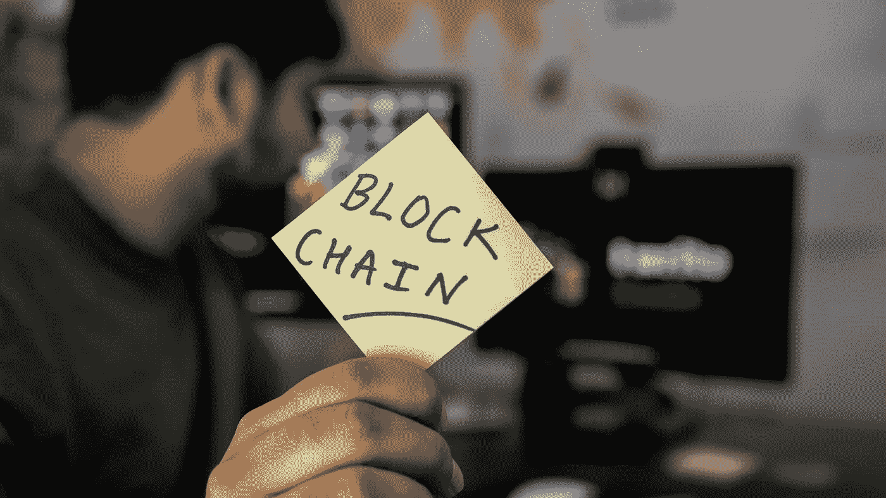

# 什么是区块链？

> 原文：<https://medium.datadriveninvestor.com/what-is-blockchain-90a511be6c41?source=collection_archive---------27----------------------->

首先，区块链经常与比特币混淆，然而实际上区块链是比特币的技术基础。顾名思义，区块链是包含各种不同数据的数据块链。这些块中的数据取决于区块链的类型。区块链是一个分布式账本，对公众开放。它不使用中央管理机制来促进和授权交易，而是使用分布式对等网络。由此网络上的所有节点都需要验证交易以使其被批准。一旦交易被批准，它就被添加到链中，并且其数据存储在链中。这就是为什么它不可能操纵区块链分布式账本技术。

***当今世界使用区块链的机会是无穷的。***

然而，让我们快速看一下它是如何改进业务流程的。供应链管理就是一个很好的例子。区块链使你能够跟踪产品，从生产的早期阶段和原材料，直到产品在世界任何地方的商店货架上被买走。因此，区块链提供了一个非常透明的业务流程概览，减少了重复，这样做可以防止盗窃和侵犯版权。

让我们来看看基于区块链技术构建的另外两个应用程序。首先是区块链的金融应用。现在你不再需要通过银行汇款，相反，你可以通过区块链直接汇款给个人。使跨境支付更加有效，并排除了阻碍性的国际法规。第二，还有建立在区块链基础上的智能合同，其中规定了一套预定的条款，一旦合同签署，就必须遵守，不能更改。只有在预定目标实现后才释放资金。

***Sovtech 对区块链科技并不陌生。***

事实上，我们建立了非洲第一个加密货币，UBU 项目。这一通用基本单位由四个主要部分组成，首先是 UBU，这是一种自由发行的数字交换令牌，其价值来自未充分利用的资产。第二个是财政部，UBU 的一个通过算法编程的区块链发行者。第三个是 UBX，这是一个加密令牌，通过奖励某些类别的参与者在生态系统中投资的风险来充当自举机制。最后，免费提供强大的全球营销平台，允许某些参与者利用网络效应获得指数回报。

*对区块链感兴趣？* [*联系*](https://sov.tech/contact-us/) *了解有关这项创新技术的更多信息，以及如何最好地将其应用到您的业务流程中。*