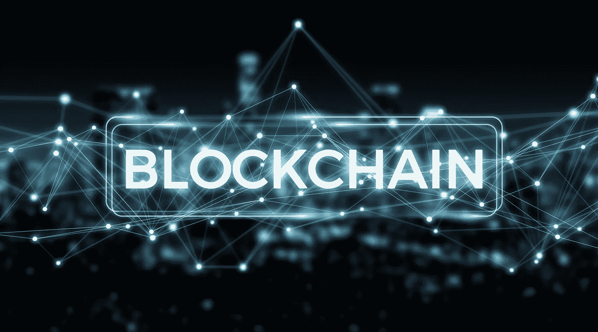

# 区块链到底是什么…

> 原文：<https://medium.datadriveninvestor.com/what-is-blockchain-anyway-521bdfe4e163?source=collection_archive---------3----------------------->

并不是每个人都清楚区块链是什么，为什么它有潜力像区块链爱好者声称的那样扰乱许多市场。为了让那些不熟悉的人更清楚地了解情况，我将继续简要介绍区块链、智能合约、加密货币和该技术的简单用法。

分布式账本技术，区块链，有可能消除大量的记录保存，通过消除中介第三方节省资金，并打破我们今天所知道的信息技术。区块链最早出现在 2008 年，当时中本聪向世界展示了比特币，这是一种加密货币，旨在作为电子现金的点对点版本，允许支付从一方发送到另一方，而无需通过金融机构。如今，区块链技术不仅仅被用作支付网关。

区块链就像一个数据库，可以在用户之间公开共享，并为他们的交易创建一个不可更改、带时间戳和链接的记录。每笔交易被称为一个区块，每个区块都与一个特定的人相关联，每次完成一个区块，它都会创建一个唯一的安全代码，将它与下一个区块联系起来，从而创建一个区块链。数据一旦进入区块链，就永远不会被擦除。每次产生交易时，网络必须同意交易是有效的，一旦交易被验证并且来源被批准，就不可能修改。区块链技术用于在用户之间安全地自主交换信息，无需管理员或第三方。

有许多公司和组织利用区块链技术，例如，马士基最近宣布，它将通过在供应链中实施区块链来管理和跟踪所有海运集装箱的文件记录。在这种情况下，运输供应链中的所有参与者都可以通过区块链总账监控货物的进度，他们可以实时查看海关文件的状态或查看提单，因为没有人可以修改或删除这些记录，所以他们是可信的。

**智能合约**

区块链技术带来了智能合同的真正使用，也称为自动执行合同或数字合同。与传统合同一样，智能合同定义了协议的规则和惩罚，但是，与传统合同不同，它自动强制执行所述义务，而不依赖于第三方。双方达成一项协议，并将其作为写入区块链的代码粘贴在智能合同中。在这个过程中，个人可以选择保持匿名。但是，该合同在公共分类账中(只有意向方可以访问)。写入合同的是一个触发事件，如到期日期或值在此合同中被阻止，它根据预先建立的条款执行合同。智能合同允许**自治**(双方不依赖经纪人或律师)**信任**(文件在区块链中加密、共享、存储和保护)**备份**(文件被多次复制)**安全**(文件被加密)**速度**(自动化任务范围)**节省**(无中介费用)和**准确性**(避免任何人为错误)。

智能合同的一个例子是房东和房客之间的关系。房东把一个特定的位置租给房客，作为交换，房客支付商定的费用。为了使智能合同生效，交易中的一切都必须数字化，在这种情况下，对财产的访问是数字化的，支付也是数字化的。一旦房东和房客都同意对方的条件，并将其输入智能合同，它就会被放入区块链，这意味着该协议不能被更改。当租户支付租金时，智能合同会发布一个数字代码，供他们访问该物业。如果代码不正确或者没有及时到达，则资金被重新提供给承租人。同样，如果房客拖欠租金，合同也不会公布该月的房源密码。

**加密货币**

加密货币，顾名思义，就是加密的货币。它是一种货币，就像我们口袋里的任何其他货币一样，它代表着某种有价值的东西，一种行为，我们用它来交换商品和服务。加密货币只是上述的一个版本，但经过更新后可以使用互联网。加密货币被编码以代表有价值的东西，并且因区块链而异。它们用于与区块链互动，每个项目都以不同的方式使用加密货币，例如，比特币可用于记录交易和支付，而以太坊网络的加密货币以太可用于激活智能合同。

**区块链的用途**

今天，使用区块链技术的主要行业是金融科技、航运、大数据、医疗保健和能源。为了利用这项技术，大多数公司将他们的项目建立在更大的现有区块链上，这些现有的为这些公司创建自己的应用程序提供了开发平台。公司或者人群也可以建立一个去中心化的自治组织，一个完全自治的去中心化的组织，没有单一的领导者。这些组织通过编程代码和一系列智能合同来运行，旨在取代传统组织的规则和结构，消除在完全透明的网络中进行治理和控制的需要。一个分散的自治组织由每个持有其代币的人所有，给予他们投票权。这些组织将留在网络上，只要他们支付其生存成本，并对其客户有用，即，他们服务于一个目的。

以这种方式，允许应用程序和分散的自治组织蓬勃发展的平台是颠覆性的、新的、智能经济的支柱。

欲了解更多有关我们和我们愿景的信息，请访问 https://www . block chain nordic . dk