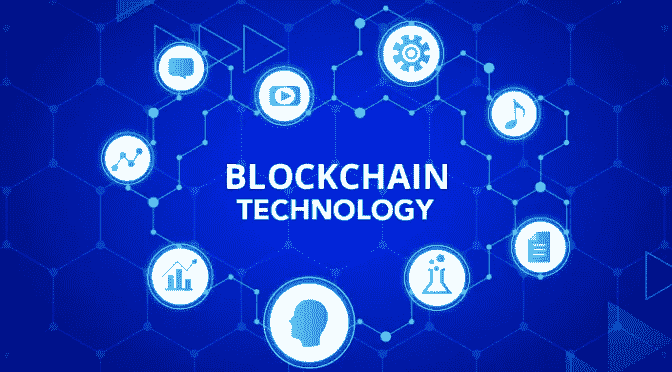

# 什么是区块链技术？初学者终极指南

> 原文：<https://medium.datadriveninvestor.com/what-is-blockchain-technology-an-ultimate-guide-for-beginners-21a44862831d?source=collection_archive---------27----------------------->

> 根据 2017 年 Statista 报告，到 2021 年，全球区块链技术市场的规模将达到 23 亿美元，假设 CAGR 为 61.5%。
> 区块链被证明是 21 世纪最有前途的技术之一。

基于 Stuart Haber、W. Scott Stornetta 和 Bayer 在 1991 年至 1992 年对加密保护区块链所做的工作，中本聪在 2008 年建造了第一个区块链。中本聪可能是一个人或一群人使用这个假名；迄今为止，没有人能够确定他们的离线身份。

# 什么是区块链技术？

区块链基本上是一个数字账本，通过对等网络上计算机节点的批准，可以输入、验证数据，然后进一步处理数据。无论您想要输入新数据、验证现有数据还是删除数据，P2P 网络上预先定义数量的节点都必须验证每笔交易。
数字数据存储在块中，然后链接在一起形成区块链。要创建一个新的数据块，任何一个节点首先需要创建一个新的数据块，然后将所有新的事务放入该数据块中。这个新的块被附加到现有的区块链，然后被广播到网络上的其他节点。在新事务被接受并成为区块链的一部分之前，其他节点必须验证新事务的有效性。

# 区块链的特点

拥有一个 P2P 网络意味着所有用户都是平等的——没有比它的客户端更优越的服务器，就像互联网一样。这导致对包含在整个区块链中的数据的分散控制。所有事务的所有节点的参与确保了没有单点控制和故障。分布式数据确保黑客无法从任何单点侵入区块链。同样，如果任何一个节点出现故障，整个区块链都不会中断，一切照常。

所有区块都在公共领域，因此完全透明。区块链的这一特性已被广泛应用，我们将在后面讨论。

# 比特币和区块链

区块链最初是以比特币的形式实现的，这是一种由中本聪设计的数字货币。或者更确切地说，情况正好相反。区块链的发明是为了让数字货币成为现实。这就是为什么许多人认为区块链是比特币，并且很难相信区块链是一个可以超越加密货币的概念。然而，区块链对普及数字货币的贡献不容忽视。

区块链是第一个消除数字交易中重复支出问题的技术。

你也可以把区块链作为一个数字分类账，只有在所有有权访问分类账的人批准后，才能进行分录。一旦分类账的财务数据被任何其他数据或文件所取代，你就有了一个对其他非财务领域有用的区块链。

# 区块链是如何工作的？

区块链最棒的地方在于，你不需要理解它背后的技术就能使用它。然而，如果我们理解了技术的基础，肯定有助于更好地欣赏任何技术。尽管区块链听起来很有技术含量，但它是基于一个非常简单的实现概念。如果你知道互联网是如何工作的，你就很容易理解区块链是如何工作的。任何区块链的主干都是由具有巨大计算能力的节点组成的 P2P 网络。需要巨大的计算能力，因为需要节点来解决复杂的难题，以找到新的块或验证事务。一旦他们加入网络，区块链就会自动下载到他们的系统中。没有区块链的副本，节点只是与其他节点共享区块链。

当必须创建新的块或者必须向现有块添加数据时，必须由节点来完成。一旦这个新节点被放到网络上，它就被所有节点验证。这称为协调交易。网络每 10 分钟自我检查一次，以查看是否有任何新的交易发生，这需要进行协调。您是否想知道为什么会有用户进行协调并将区块链转发给其他节点或用户？

嗯，所有成功创建新块或协调交易的节点都以比特币支付。这就是比特币最初被发明的原因——一种激励加入区块链网络并在其上工作的手段。这种验证交易并获得比特币回报的过程被称为“挖掘”

用户还挖掘可以添加新事务的块。一旦具有新的未验证事务的新块被添加到链中，它就被广播到所有其他节点。当所有节点都能够验证交易时，它就成为数字总账的一部分。

请记住，不能将新事务添加到旧块中，因为它们已经过验证。这使得区块链防篡改。为了改变任何旧块的数据，欺诈节点需要向网络发出完整的新区块链，由于时间和资源的限制，这实际上是不可能的。

# 区块链技术对行业的影响

尽管区块链旨在推出加密货币比特币，但它已被娱乐、体育、零售、金融、物流、医疗保健等所有主要行业接受。以下是一些有可能改变许多行业面貌的使用案例:

*   区块链可以在[供应链](https://www.techaheadcorp.com/blog/blockchain-revolutionize-supply-chain-management/)中用于验证交付产品的真实性。
*   智能合约可用于执行交易，无需中间人。
*   区块链可以用于众筹，捐款的人可以很容易地跟踪他们的捐款是否得到了正确的使用。
*   保护在线个人身份是当前在线系统的最大缺点之一。区块链可以用来分发这些数据，使其变得安全，并且没有黑客攻击的中心点。
*   人们可以在区块链上存储与他们的学术和专业成就相关的记录，并与未来的雇主或贷款经理等其他人分享。由于是在区块链，对方很容易就能核实信息的真实性。
*   应该公开的数据，如地契、股票市值等。可以安全地放在区块链上，这样任何人都可以访问和查看它们。
*   患者数据可以在医疗机构之间共享，以确保更好、更高效的护理。

# 政府如何使用区块链

世界上大多数政府都在努力解决其各种项目的透明度、可靠性和安全性问题。所有这些问题都可以通过使用区块链维护信息来解决。因此，政府正在采用区块链技术来解决透明度和数据安全问题。由于关于区块链的所有信息都是公开的，可以核实，所有政府措施自动变得透明。

智能合同也被用来确保政府做出的所有承诺都被相关方执行。数据丢失或泄漏也减少了，因为现在不需要物理地维护数据。

# 区块链技术的未来

当您阅读这些数字时，区块链技术的未来将变得不言而喻:

*   在 AngelList 上简单搜索一下，就能看到 7500 多家区块链初创企业
*   2017 年至 2018 年，LinkedIn 上发布的区块链相关工作岗位增加了两倍
*   2018 年，全球在区块链解决方案上的支出为 21 亿美元

然而，区块链技术也面临着一些挑战，这是两方面的。一方面，他们需要克服他们的技术局限，另一方面，他们需要改善普通人的普遍看法。他们面临的技术挑战包括可扩展性、安全性和去中心化等问题。SegWit 升级在一定程度上改进了区块链协议，但块大小需要进一步改进。
尽管区块链技术在过去几年里受到了业内专家的青睐，但由于比特币和其他加密货币引发的争议，它在公众眼中的形象正在遭受打击。

# 常见问题—区块链技术

# 比特币和区块链有什么区别？

比特币是一种数字货币，保存在公共验证的数字账本上。包含由独立用户验证的数据的区块链中的区块链。比特币分类账也是使用区块链技术实现的。

# 区块链能做什么？

由于对等网络上每个数据的分散协调，区块链可以帮助其用户:

*   建立数字身份
*   保持不变的记录，即它们在一段时间内不会改变
*   维护和提供数字审计跟踪
*   通过加密货币和智能合约等平台提供区块链即服务(BaaS)

# 什么是 Hyperledger？

Hyperledger 是跨行业开源区块链技术的伞式组织。它由 Linux 基金会推广。它于 2016 年 12 月推出，并得到了 IBM、SAP 和英特尔等公司的支持。参与者来自一些主要行业，如金融、银行、物联网、制造和零售。从只有四个商业区块链代码库开始，它现在拥有许多私人区块链代码库

# 什么是智能合约？

智能合同是转换成代码行并使用区块链网络实现的合法合同。这些合同可以用来执行允许的合法交易，而不需要集中的权力机构，这就是为什么这些合同也被称为自动执行合同。由于区块链系统用于维护和验证交易，所有交易都是可追踪、透明和不可逆转的。通过使用智能合同，您可以节省时间和金钱。

# SegWit 是什么？

SegWit 是隔离证人的缩写。是 2017 年 8 月比特币和 2017 年 5 月莱特币申请的协议升级。它解决了最初的区块链协议的两个问题——可伸缩性和事务延展性。

## 交易延展性

–最初的区块链协议有一个缺陷，使用户能够修改交易 ID，特别是见证签名，而不修改内容。这对于区块链本身来说不是问题，但是在基本的区块链上开发复杂的应用程序却是个问题。

## 可量测性

–最初的区块链协议将块大小限制为 1MB。这意味着任何区块链每秒只能处理 7 个新事务，这是一个巨大的限制，因为区块链越来越受欢迎，越来越多的事务使用它来执行。SegWit 升级支持在每个块中存储更多的事务。因此，区块链的吞吐量增加了。

# 什么是区块链问题和限制？

每个硬币都有两面。区块链被认为是 21 世纪最有前途的技术之一。但是，它有自己的局限性:

## 资源猪

–数据挖掘需要大量电力和高计算能力。根据一项研究，区块链比瑞士和捷克共和国等国家用的电还要多。需要判断区块链的利益是否远远超过维持其运转所需的资源。

## 51%的人身攻击

每个区块链都有 51%的攻击倾向。这实质上意味着，如果 51%的节点被流氓分子接管，他们可以根据自己的意愿添加新的事务。只有越来越多的人加入区块链网络，才能解决这个问题。

## 复杂语言

–区块链技术使用大量术语和复杂概念。人们需要在这些术语方面受到教育，这样他们才能舒服地加入区块链网络，并使其更加有用。只有当加入网络的节点来自不同的背景时，才能充分利用区块链技术的优势。

## 离线界面

–区块链没有解决在线信息和线下实体之间的最后一英里鸿沟。它必须手动完成，因此容易出现人为错误。

# 结论

区块链本质上是一个不可变的、去中心化的、防篡改的账本。正如我们所看到的，通过提供安全、快速、透明和无中间人的交易方式，它有可能使生活变得更容易。随着越来越多的人意识到区块链技术可以彻底改变我们进行金融和非金融交易的方式，它有可能成为 21 世纪最有价值的技术。作为区块链发展公司的顶级公司之一，我们可以帮助您完美地实现您的想法。

*最初发表于***。**