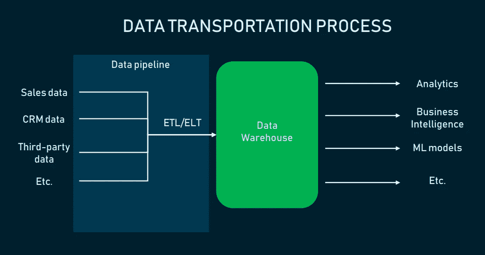
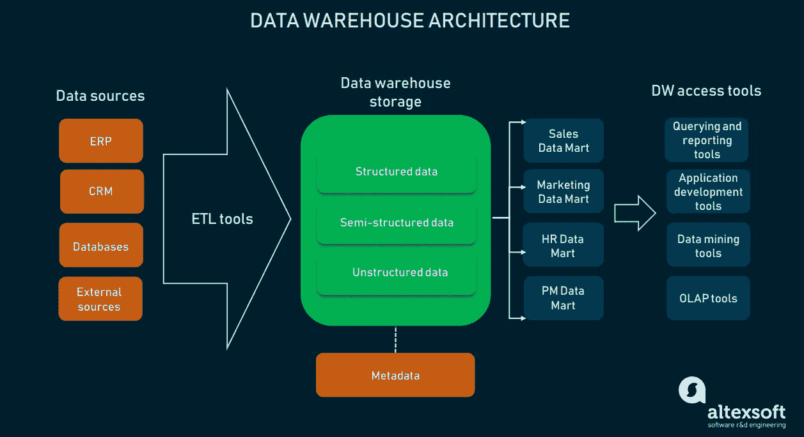
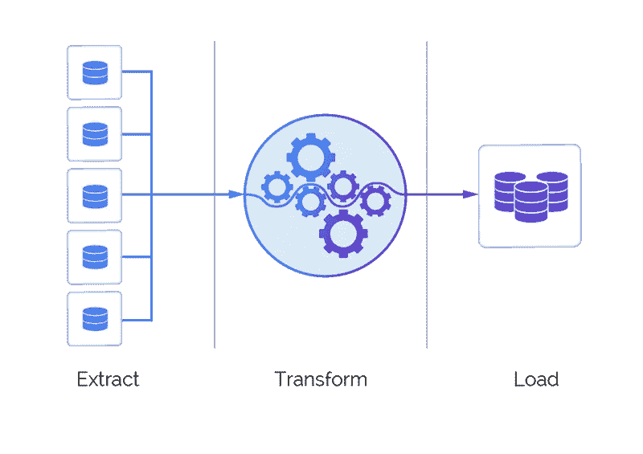
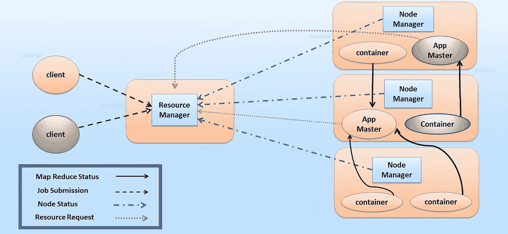
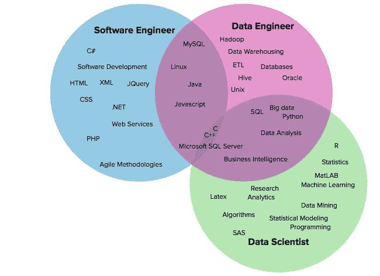

# 什么是数据工程:解释数据管道、数据仓库和数据工程师角色

> 原文：<https://medium.datadriveninvestor.com/what-is-data-engineering-explaining-the-data-pipeline-data-warehouse-and-data-engineer-role-1a4b182e0d16?source=collection_archive---------4----------------------->

分享数据科学能力列表中的最高账单，[机器学习](https://www.altexsoft.com/whitepapers/machine-learning-bridging-between-business-and-data-science/?utm_source=MediumCom&utm_medium=referral)和人工智能不仅仅是流行语——许多组织都渴望采用它们。然而，必须在构建智能数据产品之前完成经常被遗忘的基础工作，即数据扫盲、收集和基础设施。

如果我们看看数据科学实施中的需求层次，我们会发现收集数据进行分析后的下一步是数据工程。这个规程不可低估，因为它在控制基础设施的同时，支持有效的数据存储和可靠的数据流。

*Data science layers towards AI, Source:* [*Monica Rogati*](https://hackernoon.com/the-ai-hierarchy-of-needs-18f111fcc007)

**数据工程**是一组旨在为信息的流动和访问创建接口和机制的操作。这需要专门的专家——数据工程师*——来维护数据，以便其他人可以获得和使用这些数据。简而言之，数据工程师建立并操作组织的数据基础架构，为数据分析师和科学家的进一步分析做准备。*

* [## 大科技很抱歉！数据驱动的投资者

### 大科技很抱歉。在几十年来很少为任何事情道歉之后，硅谷似乎突然开始道歉了…

www.datadriveninvestor.com](https://www.datadriveninvestor.com/2018/06/17/big-tech-is-sorry/) 

# 解释数据工程和数据仓库

为了用简单的术语理解数据工程，让我们转向数据库——一致的和可访问的信息的集合。在一个大型组织中，通常有许多不同类型的运营管理软件:ERP、CRM、生产系统等等。所以也有许多不同的数据库。随着数据源数量的增加，分散在各处的各种格式的数据使组织无法全面清晰地了解其业务状态。例如，有必要弄清楚如何从它的专用数据库中获取销售数据，比如保存在 [SQL 服务器](https://www.altexsoft.com/blog/business/comparing-database-management-systems-mysql-postgresql-mssql-server-mongodb-elasticsearch-and-others/?utm_source=MediumCom&utm_medium=referral)中的库存记录。这就需要将数据集成到一个统一的存储系统中，在这个系统中，数据被收集、重新格式化并随时可以使用——数据仓库。现在，数据科学家和[商业智能](https://www.altexsoft.com/blog/business/complete-guide-to-business-intelligence-and-analytics-strategy-steps-processes-and-tools/?utm_source=MediumCom&utm_medium=referral) (BI)工程师可以连接到仓库，以所需的格式访问所需的数据，并开始从中获得有价值的见解。

将数据从一个系统转移到另一个系统(无论是 SaaS 应用程序、数据仓库(DW)还是另一个数据库)的过程由数据工程师维护。然而，数据架构师负责构建数据仓库——设计其结构、定义数据源并选择统一的数据格式。

*The process of transporting data from sources into a warehouse*

我们将详细阐述数据流过程的细节，解释构建数据仓库的细微差别，并描述数据工程师的角色。

# 数据仓库

一个**数据仓库**是一个中央存储库，原始数据在这里被转换并以可查询的形式存储。如果没有数据仓库，数据科学家必须直接从生产数据库中提取数据，最终可能会对同一个问题报告不同的结果，或者导致延迟甚至中断。作为企业的单一事实来源，数据仓库简化了组织的报告和分析、决策和指标预测。

从技术上来说，数据仓库是一种关系数据库，针对读取、聚集和查询大量数据进行了优化。令人惊讶的是，DW 不是一个常规的数据库。为什么

1.  首先，它们在数据结构上有所不同。常规数据库将数据标准化，排除任何数据冗余，并将相关数据分离到表中。这将占用大量计算资源，因为单个查询会组合来自许多表的数据。相反，数据仓库使用简单的查询和少量的表来提高性能和分析能力。
2.  其次，针对日常交易，数据库通常不存储历史数据，而对于仓库，这是它们的主要目的，因为它们收集多个时期的数据。DW 简化了数据分析师的工作，允许从单一界面操作所有数据，并导出分析、可视化和统计数据。
3.  值得注意的是，数据仓库不像数据库那样支持很多并发用户，它是为一小部分分析师和业务用户设计的。

*Data warehouse architecture*

要构建数据仓库，需要结合四个基本组件。

**数据仓库存储。**数据仓库架构的基础是存储所有企业数据的数据库，允许业务用户访问这些数据以获得有价值的见解。数据架构师通常会在本地数据库和云托管数据库之间做出决定，并注意业务如何从这个或那个解决方案中受益。虽然云环境更具成本效益，更容易扩展或缩小，并且不局限于规定的结构，但在查询速度和安全性方面，它可能会输给本地解决方案。

数据架构师还可以为您的数据仓库设计集体存储—并行运行的多个数据库。这将提高仓库的可伸缩性。

**元数据。**向数据添加业务上下文，元数据有助于将数据转化为可理解的知识。元数据定义了如何更改和处理数据。它包含将源数据加载到数据仓库时应用于源数据的任何转换或操作的信息。

**数据仓库访问工具。**为了方便业务用户与数据仓库数据库的交互，访问工具需要与数据仓库集成。它们有不同的功能，例如*查询和报表工具*用于生成业务分析报表。另一种类型的访问工具— *数据挖掘工具* —基于高级统计建模技术，自动执行在大量数据中发现模式和相关性的过程。

**数据仓库管理工具。**在整个企业中，数据仓库处理许多管理和行政操作。这就是为什么管理数据仓库需要一个能够促进所有这些操作的解决方案。有专门的数据仓库管理工具来完成这一任务。

# 构建数据仓库:理解数据管道

数据仓库关注数据的存储，而数据管道则保证数据的消费和处理。**数据管道**是用于执行数据集成的工具和过程的总和。

它从多个来源捕获数据集，并将它们插入某种形式的数据库、另一种工具或应用程序，为数据科学家、BI 工程师、数据分析师等[团队提供对这些组合数据的快速可靠的访问。](https://www.altexsoft.com/blog/datascience/how-to-structure-data-science-team-key-models-and-roles/?utm_source=MediumCom&utm_medium=referral)

构建数据管道是数据工程的核心职责。为连续和自动的数据交换设计一个程序需要高级编程技能。由于这一过程相当复杂，对于产品已经找到市场的组织来说，追求进一步的增长是可行的。也就是说，数据管道通常用于:

*   将数据移动到云或数据仓库
*   在[机器学习项目](https://www.altexsoft.com/blog/datascience/machine-learning-project-structure-stages-roles-and-tools/?utm_source=MediumCom&utm_medium=referral)中，为了方便起见，将数据放在一个位置
*   整合物联网中各种互联设备和系统的数据
*   将数据库复制到云数据仓库中
*   将数据集中到 BI 中的一个位置，以便做出明智的业务决策

然而，低流量的年轻公司和初创公司将更好地利用 SQL 脚本，这些脚本将作为 cron 作业针对生产数据运行。

# 逐步创建数据管道

管道基础设施因使用案例和规模而异。然而，它总是实现一组 **ETL** 操作:

1.从源数据库中提取数据

2.转换数据以符合特定业务目的的统一格式

3.将重新格式化的数据加载到数据仓库

*ETL operations, Source:* [*Alooma*](https://www.alooma.com/blog/what-is-etl)

**1。正在检索传入数据。**在管道的起点，我们要处理来自众多不同来源的原始数据。数据工程师编写代码片段——作业——按照时间表运行，提取在特定时期收集的所有数据。

**2。标准化数据。来自不同来源的数据通常不一致。因此，为了高效的查询和分析，必须对其进行修改。提取数据后，工程师执行另一组作业，将数据转换为符合格式要求的格式(例如，测量单位、日期、颜色或大小等属性)。)数据转换是一项关键功能，因为它显著提高了数据的可发现性和可用性。**

**3。将数据保存到新的目的地。**将数据置于可用状态后，工程师可以将数据加载到目的地，通常是关系数据库管理系统(RDBMS)、数据仓库或 Hadoop。每个目的地都有其特定的做法，以提高性能和可靠性。

**4。维护变更。**尽管是自动化的，但数据管道必须由数据工程师不断维护:他们修复故障，通过添加/删除字段来更新系统，或者调整模式以适应不断变化的业务需求。

# 数据管道挑战

建立安全可靠的数据流是一项具有挑战性的任务。在数据传输过程中，有很多事情可能出错:数据可能被破坏，遇到瓶颈导致延迟，或者数据源可能发生冲突，生成重复或不正确的数据。将数据放入一个位置需要仔细规划和测试，以过滤掉垃圾数据，消除重复和不兼容的数据类型，混淆敏感信息，同时不遗漏关键数据。

[胡安·德·迪奥斯·桑多斯](https://www.linkedin.com/in/jddios/)，一位经验丰富的数据行业从业者，概述了构建数据管道的两大陷阱:

*   缺乏相关指标
*   低估数据负载

*“一个健康和相关的指标系统的重要性在于，它可以告知我们每个管道阶段的状态和性能，而在低估数据负载的情况下，我指的是以这样一种方式构建系统，即使产品遇到意外的用户激增，它也不会面临任何过载，”【Juan 阐述道。*

# 超越数据仓库:大数据工程

说到数据工程，我们不能忽视大数据概念。基于三个 v——数量、速度和多样性——大数据通常充斥着 YouTube、亚马逊或 Instagram 等大型科技公司。[大数据工程](https://www.altexsoft.com/big-data-consulting/?utm_source=MediumCom&utm_medium=referral)是关于构建大规模水库和高度可扩展且容错的分布式系统，能够固有地存储和处理数据。

大数据架构不同于传统的数据处理，因为我们在这里谈论的是数据仓库无法容纳的如此海量的快速变化的信息流。能够处理如此大量数据的架构是数据湖。

# 数据湖架构

**数据湖**是一个巨大的池，用于以原始的、未经处理的形式保存数据。数据湖因其高灵活性而脱颖而出，因为它不局限于仓库的固定配置。

数据湖使用标准 ETL 操作序列中的 **ELT** 方法交换*转换*和*加载*操作。数据湖支持大型存储和可扩展计算，在提取数据后会立即开始加载数据。这使得需要处理的数据量不断增加。例如，当数据的用途还没有确定时，数据湖是非常方便的——因为数据湖存储数据并在以后按需处理它。

# Hadoop 平台—数据湖的实践示例

数据湖平台的一个流行的开源例子是 Hadoop。这是一个基于 Java 的大规模数据处理框架。该软件项目能够构建各种大数据类型以供进一步分析。该平台允许在各种计算机上拆分数据分析作业，并并行处理它们。

Hadoop 生态系统由以下一组工具组成。

**Hadoop 分布式文件系统(HDFS)。**基于 Java 的大数据存储系统，HDFS 包括两个组件:NameNode 存储元数据，DataNode 负责实际数据并根据 NameNode 执行操作。

**MapReduce。**这是一个用于编写处理存储在 HDFS 的数据的应用程序的框架。MapReduce 程序本质上是并行的，对于使用集群中的多台机器执行大数据分析非常有效。

**纱线。**作为 Hadoop 的操作系统，YARN 有助于管理和监控工作负载。

*YARN architecture, Source:* [*Data Flair*](https://data-flair.training/blogs/hadoop-ecosystem-components/)

**蜂巢。Hive 是一个用于汇总、查询和分析大型数据集的系统，它使用自己的语言——HQL，类似于 SQL。HiveQL 自动将类似 SQL 的查询翻译成 MapReduce 作业，以便在 Hadoop 上执行。**

**猪。与 Hive 的目标相似，Pig 也有自己的语言——Pig Latin。什么时候用猪，什么时候用蜂箱是问题。Pig 是用于编程目的的更好选择，而 Hive 主要由数据分析师用于创建报告。**

**HBase。**建立在 HDFS 之上的 NoSQL 数据库，提供实时的数据读写访问。

还有许多其他组件增强了 Hadoop 的功能:HCatalog、Avro、Thrift、Apache Drill、Mahout、Sqoop、Flume、Ambari、Zookeeper、Oozie。你可以在 [Hadoop 文档](http://hadoop.apache.org/docs/current/)中读到他们的规范。

# 升级到企业数据中心(EDH)

除了大数据功能，数据湖还为治理和安全性带来了新的挑战，并带来了变成数据沼泽的风险，即各种数据的集合既不可治理也不可用。为了解决这些问题，出现了一种新的数据集成方法——**数据中心**——数据被物理移动并重新索引到一个新系统中。

在数据中心架构中，来自许多运营和分析源的数据是通过复制和/或发布-订阅接口获取的。当数据发生更改时，复制使用更改数据捕获(CDC)不断填充中心，而发布-订阅允许中心订阅数据源发布的消息。EDH 以数据为中心的存储架构支持在数据所在的位置执行应用程序。

那么，EDH 相对于传统的数据整合有什么优势呢？让我们仔细看看。

**轻松连接新的数据源。**与缺乏灵活性的数据仓库相反，现代 EDH 可以动态连接多个系统，集成不同的数据类型。

**最新数据。**过时的数据可能是数据仓库的一个问题，但 EDH 克服了这个问题，在捕获数据后立即呈现新数据以供分析。

**工具。EDH 为处理和分析数据提供了强大的工具。**

**快速部署。**虽然 DW 系统部署可能持续数月甚至数年，但 EDH 部署只需几天或几周。

EDH 可以与 DW 或数据湖集成，以简化数据处理并应对这些架构面临的常见挑战。

# 数据工程师的角色

现在我们知道了数据工程所关注的内容，让我们深入研究专门围绕大数据创建软件解决方案的角色—数据工程师。

Juan De Dios Santos 本人就是一名数据工程师，他这样定义这个角色:“*在一个包括数据科学家、BI 工程师和数据工程师的多学科团队中，数据工程师的角色主要是确保数据的质量和可用性。”*他还补充说，数据工程师可能会在实施或设计数据相关功能(或产品)时与其他人合作，如 A/B 测试、机器学习模型的部署和现有数据源的细化。

# 技能和资格

*Overlapping skills of the software engineer, data engineer, and data scientist, Source:* [*Ryan Swanstrom*](https://101.datascience.community/2016/11/28/data-scientists-data-engineers-software-engineers-the-difference-according-to-linkedin/)

**软件工程背景。**数据工程师使用编程语言来实现对数据和数据库的干净、可靠和性能化的访问。Juan 指出他们能够处理软件开发的整个周期，包括构思、架构设计、部署和[开发、原型制作、测试、定义指标、警报和监控系统。数据工程师是至少在 Python 或 Scala/Java 方面经验丰富的程序员。](https://www.altexsoft.com/blog/engineering/devops-principles-practices-and-devops-engineer-role/?utm_source=MediumCom&utm_medium=referral)

**数据相关技能。***Juan 强调说:“一名数据工程师应该了解多种数据库(SQL 和 NoSQL)、数据平台、MapReduce、批处理和流处理等概念，甚至数据本身的一些基础理论，例如数据类型和描述性统计，”*强调说。

**系统创建技巧。**数据工程师需要具备各种数据存储技术和框架的经验，他们可以结合这些技术和框架来构建数据管道。

# 工具包

数据工程过程包括一起使用不同的数据存储和操作工具。因此，数据工程师应该对许多数据技术有深刻的理解，以便能够为某项工作选择正确的技术。

用于编写 ETL 管道的工具:

[**气流**](https://airflow.apache.org/) **。**这个基于 Python 的工作流管理系统最初是由 Airbnb 开发的，用于重新构建他们的数据管道。通过迁移到气流，该公司将其实验报告框架(ERF)的运行时间从 24 小时以上减少到大约 45 分钟。Airflow 的关键特性是自动化脚本来执行任务。在 Airflow 的优点中，Juan 强调了它的[操作符](https://airflow.apache.org/_api/airflow/operators/index.html) : *“它们允许我们执行 bash 命令，运行 SQL 查询，甚至发送电子邮件。”Juan 还强调了 Airflow 发送延期通知的能力，完整而丰富的 UI，以及项目的整体成熟度。*相反，胡安不喜欢气流只允许用 Python 写作业。

[**云数据流**](https://cloud.google.com/dataflow/) **。**data flow 是一项基于云的数据处理服务，旨在通过快速并行执行分析管道，实现大规模数据接收和低延迟处理。数据流比气流有优势，因为它支持多种语言，如 Java、Python、SQL，以及 Flink 和 Spark 等引擎。也是谷歌云维护的很好。然而，胡安警告说，Dataflow 的高成本可能对一些人不利。

[**卡夫卡**](https://kafka.apache.org/intro.html) **。**从消息队列到成熟的事件流平台，Apache Kafka

跨多个节点分发数据，以实现单个数据中心内或跨多个可用性区域的高可用性部署。作为分布式提交日志的抽象，它提供持久的存储。

其他流行的 ETL 和数据解决方案是用于快速移动数据的 [Stitch](https://www.stitchdata.com/) 平台和用于将各种来源的数据同步到数据仓库的工具 [Blendo](https://www.blendo.co/) 。

**仓库解决方案。**广泛使用的本地数据仓库工具包括 [Teradata 数据仓库](http://www.teradata.com/products-and-services/data-warehouse-overview/)、 [SAP 数据仓库](https://www.sap.com/products/bw4hana-data-warehousing.html)、 [IBM db2](https://www.ibm.com/analytics/data-warehouse) 和 [Oracle 数据库云服务器](https://www.oracle.com/engineered-systems/exadata/)。最流行的基于云的数据仓库解决方案是[亚马逊红移](https://aws.amazon.com/redshift/)和[谷歌大查询](https://cloud.google.com/bigquery/)。

**大数据工具。**数据工程师应该能够利用(或至少知道)的大数据技术有 Hadoop、分布式文件系统如 HDFS、搜索引擎如 [Elasticsearch](https://www.elastic.co/) 、ETL 和数据平台: [Apache Spark](https://spark.apache.org/) 用于大规模数据处理的分析引擎、 [Apache Drill](https://drill.apache.org/) 具有大数据执行能力的 SQL 查询引擎、 [Apache Beam](https://beam.apache.org/) 模型和用于在分布式处理后端并行构建和运行管道的软件开发包。

# 最后:数据工程师 vs 数据科学家

数据工程师和数据科学家被混淆的情况并不少见。我们请 AltexSoft 拥有 10 多年经验的数据科学家 Alexander Konduforov 评论这两种角色之间的区别:

"*数据科学家和数据工程师都与数据打交道，但解决的任务大相径庭，拥有不同的技能，使用不同的工具*。*数据工程师构建和维护海量数据存储，并应用工程技能:编程语言、ETL 技术、不同数据仓库的知识和数据库语言。然而，数据科学家清理和分析这些数据，从中获得有价值的见解，实施预测和预测分析模型，并主要应用他们的数学和算法技能、机器学习算法和工具。”*

Alexander 强调，对于数据科学家来说，访问数据可能是一项艰巨的任务，原因有几个:

*   巨大的数据量需要额外的工作和特定的工程解决方案来在合理的时间内访问和处理它
*   数据通常以多种不同的存储方式和格式存储。在这种情况下，首先采取[数据集准备措施](https://www.altexsoft.com/blog/datascience/preparing-your-dataset-for-machine-learning-8-basic-techniques-that-make-your-data-better/?utm_source=MediumCom&utm_medium=referral)对其进行清理、转换、合并并移动到更结构化的存储，如数据仓库，是有意义的。这通常是数据架构师和工程师的任务。
*   数据存储器有不同的[API](https://www.altexsoft.com/blog/engineering/what-is-api-definition-types-specifications-documentation/?utm_source=MediumCom&utm_medium=referral)来访问它们。在这种情况下，数据科学家需要数据工程师来实现最有效和最可靠的获取数据的渠道。

正如我们所见，与数据工程师构建的数据存储一起工作，数据科学家成为他们的“*内部客户。”*这是他们合作的地方。* 

**最初发表于“* [*什么是数据工程:解释数据管道、数据仓库和数据工程师角色*](https://www.altexsoft.com/blog/datascience/what-is-data-engineering-explaining-data-pipeline-data-warehouse-and-data-engineer-role/?utm_source=MediumCom&utm_medium=referral)*”**