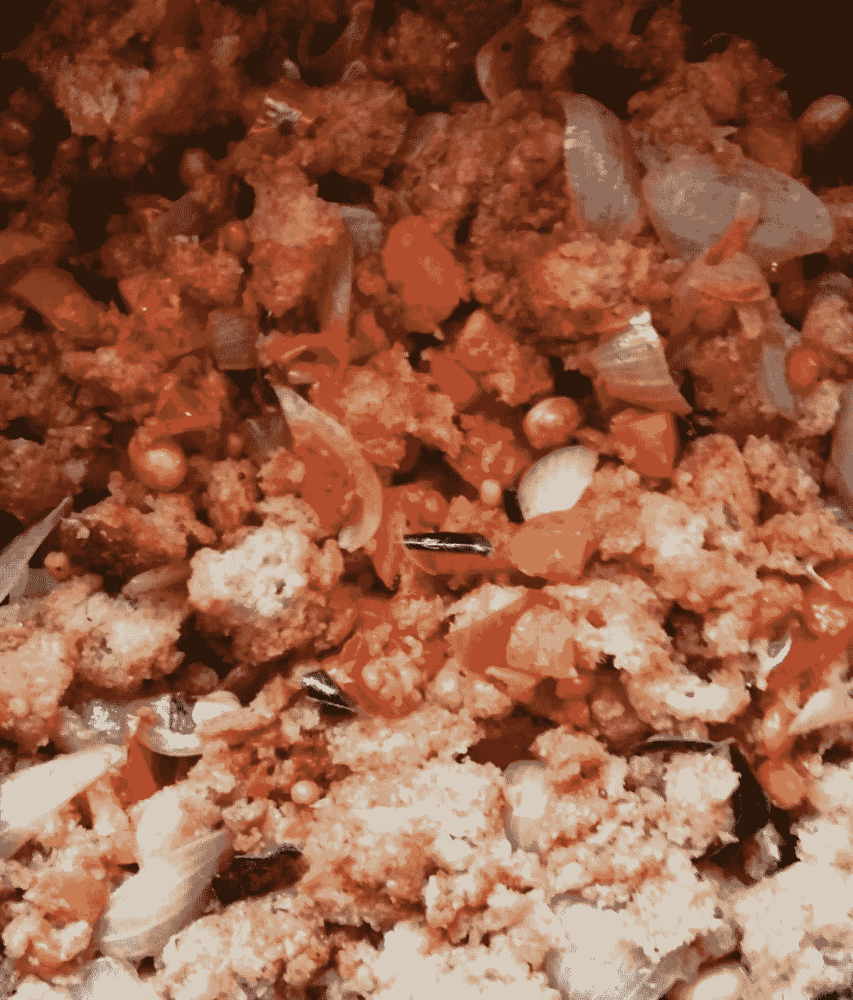

# 什么是数据科学——一种理解方式的范例

> 原文：<https://medium.datadriveninvestor.com/what-is-data-science-a-recipe-example-way-of-understanding-2f1705d07ce6?source=collection_archive---------9----------------------->

我如何用最简单的例子来解释数据科学，我知道很多专家已经给出了精彩的例子，但是我该怎么做呢？？？

**我的早餐:**

我想到了一个食谱，实际上是一个用杂粮面包制作的新食谱，我做了一个杂粮 POHA(扁平米饭)，为什么不把我的食谱和一个主题联系起来呢

**POHA(扁平米饭)**是印度流行的早餐食谱之一，它有足够的蛋白质含量，非常健康。它有洋葱/花生/番茄/盐，但在食谱的最后主要部分是扁平的米饭，准备有一套过程。现在..这与数据科学有什么联系，谁是数据科学家

**什么是数据科学，谁是数据科学家:**数据科学是一个跨学科的领域，它使用科学的方法、流程、算法和系统从各种形式的数据中提取知识和见解，包括结构化和非结构化的，类似于数据挖掘和**数据科学家**是处理海量数据(非结构化和结构化)并使用数学、统计和编程技能来清理、管理和组织这些数据的人。

上面的段落是通用的，我会解释得更简单

现在——作为一名厨师，你的想法是拿出普通的 poha，做一个不同的 poha，然后你就有了面包。

作为一名厨师，你必须收集
1)想象
2)检查制作食谱的可能性
3)知道你有什么
4)计算时间
5)只使用所需数量的蔬菜，这些蔬菜最适合少数人食用
6)期望以更低的失败概率获得更好的产出
7)最后——味道应该是你可以接受的，其他人也可以接受的
当我今天制作上述项目时……我已经遵循了以上所有 6 个步骤，并且完全被接受..事实上，他们喜欢它。所以第 7 步证明了

现在，当我想到数据科学时，数据科学也是一系列必须遵循的步骤，最终目标是决策制定。在这里，理解数据扮演着重要的角色..接下来的挑战是过滤数据，最后是主要结果之前的一系列编程技术，这也是最重要的

如果满足以下条件，你就是一名数据科学家:
1)理解
2)形象化
3)过滤需求
4)最终执行

主厨或数据科学家不一定是核心主厨/程序员，但他们应该指导团队实现预期的产出。事实上，编程在商业模式中排在最后，但它是最重要的部分，需要在正确的时间放置。

在上图中:面包是最重要的因素，但在进入面包区之前——有大量的工作要做，这些工作会影响面包的到达。想象一下，如果洋葱/西红柿等没有煮好，尽管我们添加了面包，但预期的产量都会因为可预测的坏味道而失败

***了解数据不仅是一项任务，也是一项挑战，因为我们花费的每一分钟都有成本和业务影响***

**有两种厨师**
*1)知道做什么，他/她会独自做，因为每天的食物供应带宽较少，但利润不错
2)知道如何做/做什么，让高效的团队来做工作，因为他/她不能做任何事情，除了这些厨师指导的团队*

**也有两种数据科学家** *1)作为所有任务的单点联系人
2)指导团队完成任务，但负责交付*

在这两种情况下，角色取决于他/她拥有的数据或任务或职责的带宽。

**数据科学家算不算核心程序员？
*是的，不必总是核心程序员
对语言有想法/理解语言/执行程序是技术人员的三个重要阶段*** 仅仅对任何语言有想法都不会有帮助，但理解语言对两种类型的数据科学家来说更重要…理解语言将让领导推动团队获得期望的结果
这就像导演做所有的剧本/对话，导演只指导但向其他人交付任务，这将产生好的电影一样简单

因此，不要混淆术语，因为角色取决于您的现场/非现场体验

最后，感谢大家阅读这篇文章，感谢你们的支持

***mad Hu Vadlamani***