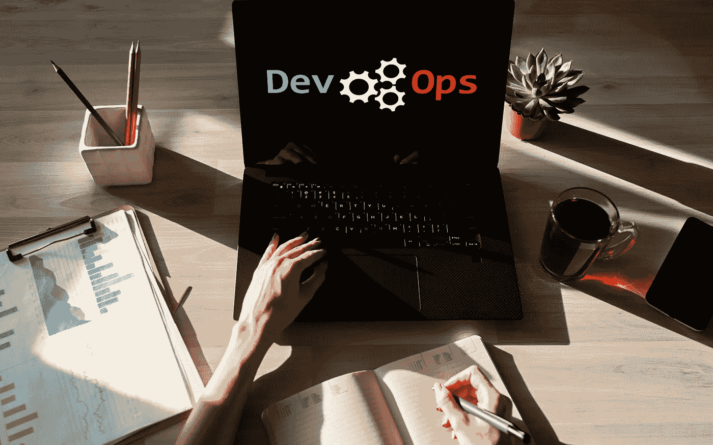

# 什么是 DevOps，我们为什么需要它？

> 原文：<https://medium.datadriveninvestor.com/what-is-devops-and-why-do-we-need-it-82c2ef0a9d3d?source=collection_archive---------1----------------------->

DevOps 方法被许多专家认为是促进开发和运营团队之间合作的最佳方式。然而，DevOps 不仅仅是一种方法论。它更像是一种文化，使软件开发的技术和商业方面更加有效，从而减少上市时间，提高产品的整体质量。在深入了解 DevOps 为什么重要之前，让我们先了解一下它的定义。

# DevOps 定义

DevOps 是敏捷方法的产物，它打破了开发和运营团队之间的壁垒，从而增加了他们之间的合作。然而，如果你没有合适的文化，DevOps 只是一个时髦的词。以下是一些 DevOps 文化:

 [## 数据科学和软件工程哪个更有前途？-数据驱动型投资者

### 大约一个月前，当我坐在咖啡馆里为一个客户开发网站时，我发现了这个女人…

www.datadriveninvestor.com](https://www.datadriveninvestor.com/2019/01/23/which-is-more-promising-data-science-or-software-engineering/) 

*   分担责任——在许多公司，开发团队只专注于创建产品，如果操作和管理系统是其他人的工作，他们会变得不感兴趣甚至疏远。如果在系统存在的过程中监控系统也是开发团队责任的一部分，他们可能会感受到运营团队正在处理的同样的痛苦。这将通过自动化部署和更好的日志记录，找到简化部署和维护的新方法。
*   自治团队——只有当开发和运营团队能够在没有复杂决策过程的情况下独立做出决策和变更时，有效的协作才是可能的。这包括信任你的团队，调整风险管理方式，以及摆脱员工害怕冒险或失败的环境。
*   消除所有的孤岛——一些公司记录流程，并将此文档移交给另一个团队，并将此视为常规合作。这种安排从一开始就注定要失败，因为它助长了一种相互指责的文化。您必须调整资源结构，让运营团队尽早开始与其他团队合作。DevOps 的目标之一是模糊开发和运营团队之间的界限，以至于他们之间可能根本没有区别。

# DevOps 生命周期

DevOps 生命周期由许多阶段组成，但流程如下所示:

*   计划——这个阶段包括关于你如何设想发展过程的最初计划
*   代码—根据客户的要求编写应用程序代码
*   构建——集成您编写的所有不同的代码
*   发布——如果测试阶段成功，应用程序就可以投入使用
*   部署—代码被部署到云环境中以供额外使用
*   操作—对代码进行操作
*   监控——密切关注应用程序的执行情况，并做出任何必要的更改以满足客户的需求。

# 我们为什么需要 DevOps？

DevOps 为[软件编程公司](https://skywell.software/)提供了很多好处，比如提高创新速度，让你更好地为客户服务。您也将更加灵活地适应不断变化的市场条件，并推动更高的业务成果。由于发布的速度和节奏会很频繁，您将能够更快地改进您的产品。通过这种方式，您可以更快地发布新功能，更快地发现并修复错误，也许最重要的是，更好地响应客户需求，从而为您的企业带来竞争优势。持续集成和交付(CI/CD)是自动化软件发布过程的实践，从构建开始，一直到部署。

尽管生产的速度会加快，但必须可靠地进行。您将能够使用 CI/CD 来测试所有的更改，更好的监控和日志记录将有助于您持续地实时掌握应用程序的运行情况。安全流程不会受到影响，因为合规性策略将通过使用细粒度控制和配置管理技术实现自动化。

# 结论

如果您刚刚踏上 DevOps 实施之旅，设定现实的目标和期望是至关重要的。虽然您可能渴望获得 DevOps 项目管理的所有好处，但您的团队可能会经历文化冲击，因为他们习惯于旧的孤岛结构。改变既定的流程并不容易，在人员、流程和信息层面的实施需要一些时间。这种文化冲击通常会以新目标的形式出现。你不能告诉你的团队，他们习惯于一个月发布一个版本，从现在开始他们需要每天发布五个版本。这根本行不通。

您需要有一个更加结构化的方法，并理解随着您的团队逐渐熟悉 DevOps 文化和方法，发布时间表可能会在一开始变慢。这将需要大量的教育、培训和一些时间来适应所有的变化。随着过渡的进行，设置和监控业务关键指标(如总收入和客户满意度)非常重要。仅仅为了发布不同的版本而发布多个版本是没有意义的。它必须对底线产生影响。

鉴于 DevOps 提供的所有好处，可以肯定地说，未能实施 DevOps 流程的公司有落后的风险。一个最常见的误解是 DevOps 只适用于大公司，而事实上中小型企业可以利用 DevOps 提供的一切。事实上，脸书、网飞和其他企业集团能够实现如此快速增长的原因之一是，它们是开发运维的早期采用者，能够比竞争对手更快地向用户提供新功能。因此，如果您还没有开始实施 DevOps，您就落后于您的竞争对手了。

*最初发表于*[*sky well . software*](https://skywell.software/blog/what-is-devops-and-why-do-we-need-it/)*。*