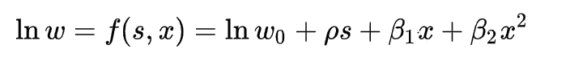

# 什么是计量经济学？

> 原文：<https://medium.datadriveninvestor.com/what-is-econometrics-a24fd634ee6?source=collection_archive---------13----------------------->

当机器学习工程师晚上失眠试图找出如何提高他们的 AUC 分数时，计量经济学家却因为完全不同的原因而失眠。

Photo by [National Cancer Institute](https://unsplash.com/@nci?utm_source=medium&utm_medium=referral) on [Unsplash](https://unsplash.com?utm_source=medium&utm_medium=referral)

广义地说，计量经济学是应用统计建模来检验经济理论。它主要处理观察数据，而不是实验数据，需要一种不同的方法来量化“治疗效果”和梳理因果关系。为研究设立实验的统计学家以统计学上“有效”的方式设计实验和数据——这就是实验数据。另一方面，经济学家经常在他们的研究中使用像人口普查这样的调查数据，他们没有为他们的研究创建治疗组和对照组——这是观察数据。

为了更好地说明，考虑一个例子。考虑一个正在测试药物疗效的临床试验。两个实验组设计了一种非常特殊的方法来确定药物对患者的因果效应(也称为治疗效应)。每组、治疗组和对照组的组成方式使得它们在不同的统计变量上接近相同——这通常通过将个体随机分配到每组来实现。除了给药以外，每组都是相同的，因果关系可以从测量结果的差异中推断出来。统计学家可以控制小组的设计和实验的进行。

 [## 为什么包容性财富指数比 GDP 更能衡量社会进步？|数据驱动…

### 你不需要成为一个经济奇才或金融大师就能知道 GDP 的定义。即使你从未拿过 ECON 奖…

www.datadriveninvestor.com](https://www.datadriveninvestor.com/2019/03/08/why-inclusive-wealth-index-is-a-better-measure-of-societal-progress-than-gdp/) 

因为计量经济学家处理观察数据，一套独特的建模技术已经在过去几十年中发展起来，通过“准实验”来捕捉因果关系。比方说，你想测试大学教育程度的工人和高中教育程度的工人之间是否存在工资差异。这里有一个你可以运行的回归:

这只是说工资是教育(s)和劳动力经验(x)的函数。这被称为明瑟方程，在经济学家中非常有名。然而，如果你只是用 OLS 来估计，那么你从结果中解释因果关系就大错特错了。为什么？

在这种情况下，对照组是受过高中教育的工人，而治疗组是受过大学教育的工人。但是每组中的个体并不是随机分配的——很可能选择上大学的个体样本之间的相互关系并不适用于那些选择不上大学的个体。这可以是很多东西，如雄心和风险承受能力，它通常被捆绑成一个变量，经济学家称之为“未观察到的异质性”。

因为这两组在组成上不是随机的，所以对这个模型的估计不会产生正确的解释。它将产生的回报似乎可以被解释为能力而非教育的回归。为了产生更好的结果，必须进行模型校正。

上面的例子只是计量经济学家面临的一种统计问题，即“不可观察对象的选择”。基于不可观察变量的治疗组非随机选择。

还有许多建模方法可用于创建准实验设计和校正偏差。一些受欢迎的型号包括:

*   差异中的差异
*   回归不连续性
*   间断时间序列
*   倾向得分匹配

许多流行的经济学文章已经使用这些类型的模型发表。例如，David Card 和 Alan Krueger 在 1994 年发表了一篇非常著名的论文，使用差异中的差异模型来说明提高最低工资对就业的影响。

这个例子强调了生成模型结果的因果解释的工作的重要性。如果经济学家发现提高最低工资会对就业产生破坏性影响，这将产生明显的政策影响。这篇论文实际上发现几乎没有效果(但已经被广泛而激烈地争论了几十年)。

政策制定者通常依赖经济学家提供这类信息来验证他们的提议或指导未来的提议。

虽然它看起来仍然像统计数据，但建立计量经济学模型的实际机制与机器学习的机制非常不同，后者主要关注预测准确性，并已成为更多的计算和资源问题，而不是统计问题。