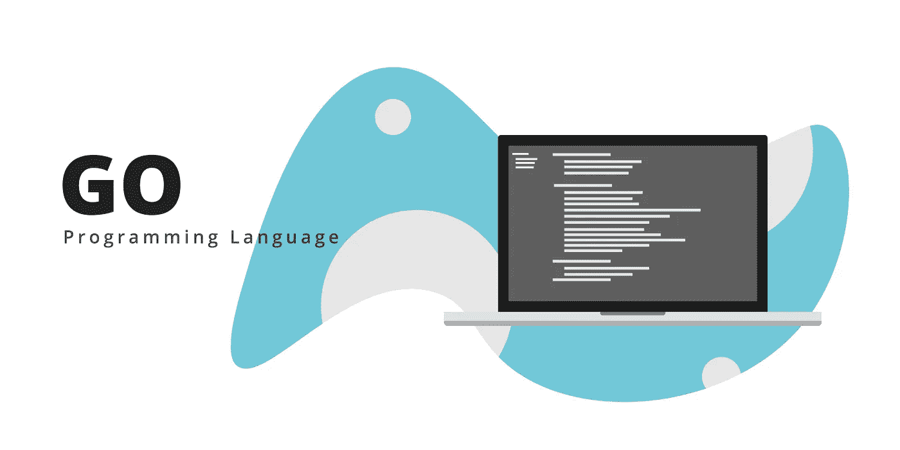

# 什么是 Go 编程语言，何时使用

> 原文：<https://medium.datadriveninvestor.com/what-is-go-programming-language-and-when-to-use-it-f6bb4f4fed7f?source=collection_archive---------7----------------------->

在过去的几年里，我们已经看到了一种新的编程语言 Golang 的兴起。让我们仔细看看围棋，这样我们就能发现所有的好处，以及什么时候应该使用它。

# Google Go 语言

Go 是 Google 在大约十年前创建的，当时他们正经历着 C++编译的漫长等待时间。由于这造成了一个瓶颈，他们决定寻找一种全新的编程语言来解决这个问题。基本上，他们吸收了所有让 C++如此伟大的东西，最显著的是性能和安全特性，并将其与 Python 的速度相结合。

 [## 创建折衷书架的程序员指南——数据驱动的投资者

### 每个开发者都应该有一个书架。他的内阁中可能的文本集合是无数的，但不是每一个集合…

www.datadriveninvestor.com](https://www.datadriveninvestor.com/2019/03/25/a-programmers-guide-to-creating-an-eclectic-bookshelf/) 

这允许 Go 快速使用多个内核，同时能够实现并发。如果你想知道什么是并发，就把它想象成多任务。例如，当你在网上浏览一个网站时，许多事情同时在浏览器中发生。如果您正在创建的产品必须同时做许多事情，那么软件开发也必须实现同样的事情。这使得它对开发者非常有吸引力，并且可以在分布式计算环境中使用。

# 为什么要用 Golang？

由于这种编程语言相对较新，很多人都想知道 Golang 适合做什么？好吧，让我们来看看它的一些好处:

*   非常适合 web 开发
*   非常适合命令行脚本
*   可用于网络服务器应用程序
*   可用于前端开发

开发人员喜欢使用 Go，因为它有一个完整的开发环境，即使对于没有太多经验的开发人员来说，学习 Go 也相当简单。其中一个原因是因为它有一个庞大的工具生态系统，因此对于大型协作项目非常有用。这使得它成为[编写定制软件](https://skywell.software/)的绝佳选择。如果你正在寻找更多的好处，Go 是由谷歌创建的，目前由谷歌提供支持，谷歌拥有世界上最重要的云基础设施之一，可以大规模扩展。

# 围棋的缺点

虽然 Go development 肯定有它的优势，但是您可能会因为它太新而在使用它时遇到一些问题。具体来说，您可能很难利用它的库。例如，如果你陷入困境，需要帮助，没有多少资源可以帮助你。然而，随着技术变得越来越先进，开发者社区发展到相当大的规模，你可以期待谷歌开始创建他们的库。

最大的问题之一是泛型。尽管 Go 提供了许多功能，如“映射”或“过滤”,但您将无法对其他类型的集合重用这些相同的功能。

# 戈朗未来

许多专家认为 Golang 前景光明的原因之一是因为谷歌。虽然还有其他因素，但谷歌在创造用户喜爱的产品方面有着悠久的历史，这些产品提供了很多价值，并且易于使用。事实上，它结合了 C++和 Python 等传统语言的精华，同时仍然易于使用，这将使它在未来非常有吸引力。

此外，根据 Golang 网站上的信息，它能够在去年最受欢迎的编程语言堆栈溢出调查中保留前五名的位置。该数据还表明，用户满意度和计划在未来学习围棋的开发人员数量都在增加。从给出的所有数字中，我们可以看到已经在使用 Go 的人喜欢它，没有使用的人渴望学习。事实上，如果我们看看过去五年的统计数据，Golang 的受欢迎程度一直在稳步上升，在此期间没有任何下降。这是足够大的样本，可以推断未来几年甚至更长时间的数据。我们可以有把握地说，Golang 在接下来的几年里将继续获得更多的认可和采用。

在过去的五年里，我们也开始看到越来越多的 Go 聚会和会议。这可能有助于减少一些人面临的知识差距，因为没有很多 Golang 图书馆可用。

# 结论

我们提到了 Golang 的优势，但是您应该始终记住，编程语言的选择在很大程度上取决于您的项目和您当前团队所拥有的技能。例如，如果项目需要 Python 知识，但您当前的团队缺乏这种专业知识，那么您可以使用 Golang 作为替代品。同样的事情也可以用在 Perl 上。但是，你需要小心，因为如果你决定使用 Go 并遇到一些问题，解决起来可能很有挑战性。

虽然您会听到很多关于 Golang 的简单性的事情，但是不要因此而阻止您使用它进行高级编程。Golang 因其简单而受到批评和赞扬，一些专家甚至说它已经变得肤浅。但是，你应该记住，它确实包含了一些特性，比如指针语义，这将允许你编写低级和高级代码，你必须知道所有的细节。因此，没有必要怀疑 Go 的用途，因为你可以用它来创建各种各样的应用程序。

*最初发布于*[*https://sky well . software*](https://skywell.software/blog/what-is-go-programming-language/)*。*