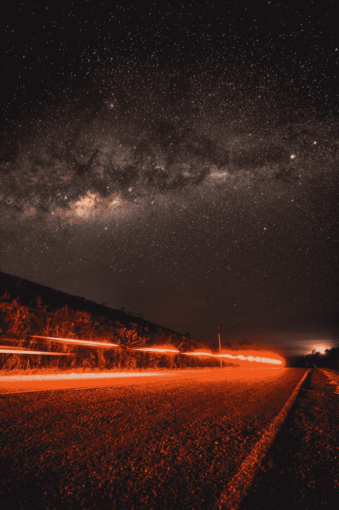
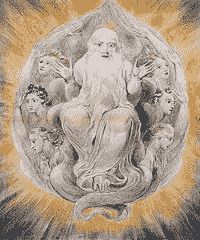

# 科学世界中的上帝是什么？

> 原文：<https://medium.datadriveninvestor.com/what-is-god-in-a-scientific-world-c8fc7ec36055?source=collection_archive---------13----------------------->

Photo by [Sebastián León Prado](https://unsplash.com/@elmundoderabbit?utm_source=medium&utm_medium=referral) on [Unsplash](https://unsplash.com?utm_source=medium&utm_medium=referral)

*The first picture to show up when I googled God, picturing God blessing the seventh day, a watercolor painting by William Blake (1725–1827)*

1995 年，哈勃望远镜对准了北斗七星附近的夜空区域。这个地方显然是空的，整个尝试是一场赌博——他们会发现什么，如果有的话？传回的东西让研究人员大吃一惊:在宇宙的一个小点上有超过 1500 个星系的照片。如果你拿着一支笔，一臂之遥地指向天空，并聚焦在笔的顶部——这个小点就是哈勃望远镜捕捉到的区域。仅在这一点上，你就能发现超过 1500 个星系。我们的星系——银河系，直径约 10 万光年，厚约 1.2 万光年。一光年距离大约是 95 亿公里。据估计，银河系中有 2000-4000 亿颗恒星，其中一颗就是我们的太阳。星系中恒星的巨大距离意味着当我们仰望夜空时，我们正在穿越时间(因此霍金称之为“时空”)。一些发光的星星在地球存在之前就已经存在了。望远镜是时间机器。然而，我们似乎对自身的自然有所了解。我们起源于细菌和单细胞生物，猴子是我们的近亲，我们的思想和感情并不完全受我们控制。从这个角度来看，我们的存在很快变得毫无意义。在星系或宇宙的尺度上，我们比我们想象的要小，但我们有能力去好奇、质疑、探索、研究和反思我们自己和我们在这个巨大的宇宙中的位置。这种观点经常让我感到敬畏，让我对上帝产生怀疑。

在我的一生中，我一直在思考很多关于上帝的问题，当然，我对上帝的印象很大程度上是由基督教教义形成的，因为我是在一个具有基督教价值观的基督教国家中长大的，也是在一个基督教家庭中长大的。

另一方面，我认为所有的宗教都有真理。基督教宣称“上帝无处不在”，“上帝就是爱。”当我小的时候，我认为这是一个公然的声明——上帝怎么可能无处不在？没有人可以无处不在，那是不可能的。当然，我了解到上帝是一个仁慈的实体/人，他创造了人类，因此也有能力控制我们，决定什么是好的/不好的行为。但我认为这种对上帝的看法是扭曲的。上帝不是我们之外的一个实体，上帝在我们所有人之内(正如大多数宗教也教导的那样)。上帝在花中，上帝在你中，上帝在我中。你是上帝，上帝是你。这听起来像是狂妄自大，但我的观点是，我认为我们的自我是一种暂时的幻觉，只要我们过着人类的生活，我们就会把自己包裹在这种幻觉中。我们相信我们是一部关于我们的宇宙戏剧中的主角，因为我们只限于我们自己的意识，但事实是这样吗？在更深的层面上，我认为自然、其他人和我们观察的世界不是我们之外的东西，我们是自然，正如自然是我们一样。这就是我认为的上帝。上帝是一切，是渗透生命和万物本身的能量。没有实体，上帝就是一切，上帝就是我们。

如果上帝是爱，那么爱是什么？对我来说，爱就是与某些东西联系在一起。可能是一个人，可能是对上帝，甚至可能是曼联，但本质的东西是感受到深层的联系。如果上帝是爱，上帝也要与所有人接触，感受与某些东西的联系，我认为你能感受到的最深形式的爱是与所有人、与树木、与火车上你旁边的人、与水、与动物的深刻联系。一是一切，一切是一。认识到这一点就是属于超越自己的东西，属于上帝。

在一次无聊的讲座中，我偶然在谷歌上看到了残忍的连环杀手，并开始阅读关于泰德·邦迪的内容。当你读到像泰德·邦迪这样的人时，很难不相信爱情的对立面——一个纯粹的邪恶，魔鬼。如果我们谈论上帝，我们也必须谈论它的对应物。20 世纪 70 年代，泰德·邦迪在美国暗杀并强奸了至少 30 名妇女。他描述说，他的动机之一是他认为自己拥有受害者——换句话说，他认为自己凌驾于一切之上，因此拥有对他人和事物的所有权。泰德·邦迪感到与外界脱节，缺乏理解。这与我所描述的上帝和爱的存在相反。考虑他人的所有权就是将自己提升到万物之上，从而将自己从不存在所有权的上帝那里分散开来——这是撒旦的真实本性。如果我们考虑基督教的死亡罪——贪婪、欲望、贪吃——许多都是这种自私和所有权的本质。通过贪婪，你考虑拥有人或事物的权利，这意味着你已经与他人脱离，被自己所吸收。灵性的反面不是物质主义，而是利己主义。不幸的是，我们社会的一部分人今天鼓励了许多这些行为，并在经济上奖励了他们。我们今天的经济是注意力经济，谁得到最多的关注，谁也赚最多的钱。因此，在互联网、电视或手机上，我们看到最令人毛骨悚然的人在争夺注意力，他们都想要点击、喜欢和关注，这样我们就可以赚钱。这是通过经济手段直接鼓励自私自利，这从上帝和所有人的角度看不起我们。我认为，许多人感觉到了这一点，因此对我们所生活的社会产生了更深的厌恶。

我认识到自己对所有这些行为的倾向，如贪婪、欲望和自私，这就是为什么我希望我们的文化不鼓励这些行为。当我们看电视时，我们的大脑无法区分真实的人和电视上的人所产生的情感，所以如果我们不断消费天堂酒店、爱情岛或卡戴珊等媒体，无论我们是否愿意，它们都会成为我们的参考点。我们的思想是我们的现实，我们的思想是由我们消费的东西塑造的。是我们的文化偏见，我们的文化背景，鼓励了这些想法。但文化只不过是一种大众催眠，我们都不可避免地需要成为其中的一部分，今天在许多方面都聚焦于灵性的反面——自我主义。但是我们从来没有学会为自己定义上帝。上帝这个词被滥用了，与恋童癖的天主教神父、伊斯兰教和恐怖主义、战争、死亡和洗脑联系在一起。但我不相信上帝是这样的。

我相信我们今天需要上帝和灵性。我们已经失去了与超越人类条件的某些东西的关系，减少了客观世界中的一切，将我们自己减少到生物机制，但是在精神空间中有如此多的东西。我们需要为自己定义上帝，自己去探索，而不是被别人告诉上帝是谁。因此，我还想强调，这只是我基于创造我的现实的思想对上帝是什么的看法。

你和上帝是什么关系？