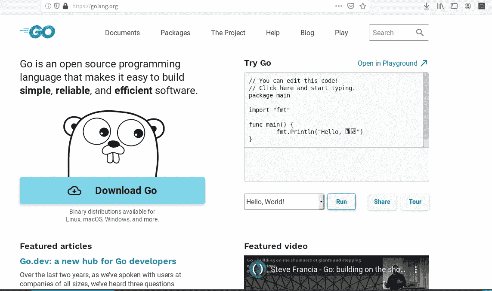
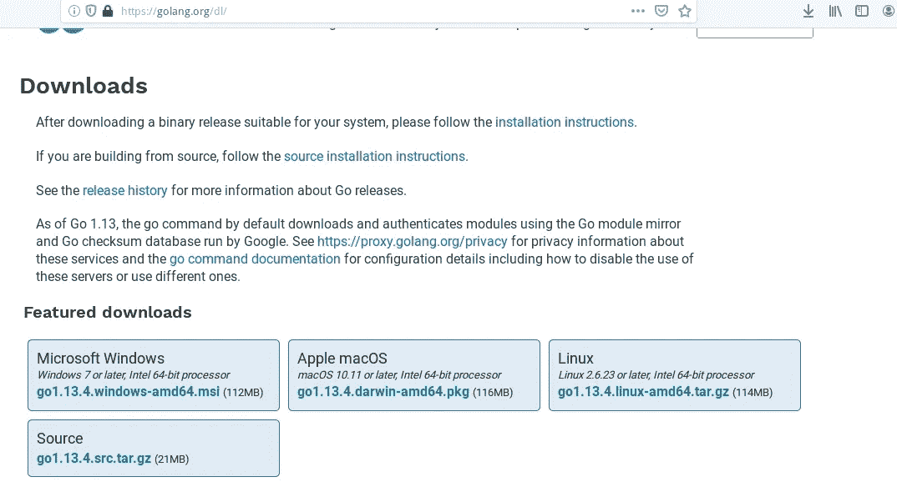
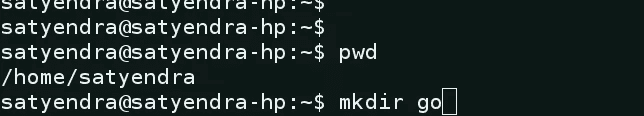
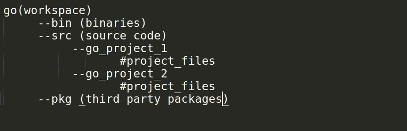
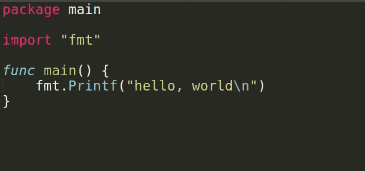
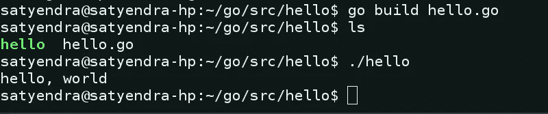

# Golang 是什么，如何安装

> 原文：<https://medium.datadriveninvestor.com/what-is-golang-and-how-to-install-it-34312c93c72?source=collection_archive---------0----------------------->


Golang logo

Golang 是一种通用编译编程语言，由 google developer 创建。

Golang 来源于 C++/Java 这样的编程语言。所以它继承了这些语言的一些属性，比如静态类型、面向对象等等。它非常易于编码，并且在代码编译和执行方面非常高效。

Golang 现在如此受欢迎是因为它有一些无与伦比的特点

## 强大的静态语言——

强类型意味着变量的类型不能随时间而改变。例如，如果一个变量是整数类型的，我们不能随时间给它赋值布尔值。

[](https://www.datadriveninvestor.com/2019/01/23/which-is-more-promising-data-science-or-software-engineering/) [## 数据科学和软件工程哪个更有前途？数据驱动的投资者

### 大约一个月前，当我坐在咖啡馆里为一个客户开发网站时，我发现了这个女人…

www.datadriveninvestor.com](https://www.datadriveninvestor.com/2019/01/23/which-is-more-promising-data-science-or-software-engineering/) 

静态类型意味着所有的变量都必须在编译时定义。

## 简单—

围棋的语言很简单，例如

有多少个循环关键字—只有一个

多少个关键字— 25 个(java 中 50 个，c++中 48 个)

同样的，还有很多特性使得 go 语言变得非常简单。

## 并发性—

当软件上的负载增加时，需要通过增加线程的数量来扩展软件。大多数编程语言在处理并发和多线程时会变得很慢。这成为支持多线程和并发性的最相关的选项。

## 垃圾收集—

Go 语言自己管理内存，不用自己管理内存。

## 内置测试框架—

在使用像 java/javascript 这样的编程语言时，我们看到我们首先选择一个好的测试框架，然后开始测试，而 golang 有一个内置的测试工具，我们可以在其中测试我们的软件。

## 安装 Golang —

要安装 Golang，请访问官方网站-[https://golang.org/](https://golang.org/)。



[https://golang.org/](https://golang.org/)

现在点击下载开始按钮。



Download page

在这一页，你会看到 windows，mac 和 linux 操作系统的安装文件。

对于 windows，有一个可执行文件，下载并安装它，这是非常简单的。

要在 linux 上安装，请一步一步来

## 第一步—

点击给定链接下载. tar.gz 文件。

## 第二步—

使用下面的命令在/usr/local 目录中解压缩它。

```
sudo tar -C /usr/local -xzf go1.13.4.linux-amd64.tar.gz
```

这个命令会提取/usr/local 目录中的所有文件和软件包。

## 第三步—

现在，在您的主目录中为 go 创建一个工作区。



create workspace for go

现在添加 GOPATH。bashprofile 或者。bashrc 文件。

```
export GOPATH=$HOME/go
export PATH=$PATH:/usr/local/go/bin:$GOPATH/bin
```

现在执行。bashprofile 或者。bashrc 文件立即应用更改。

```
./.bashprofile or ./.bashrc
```

## 第四步—

现在让我们通过编写 hello world 程序来测试 go 是否已安装。

在编写代码之前，先用一种非常简单的方式理解 go 的目录结构——



directry structure of go

在 go workspace 中有一个 bin 目录，其中包含所有可执行文件的 bin，src 文件夹包含项目源代码，pkg 包含我们安装的所有包。

现在让我们编写你的第一个 hello world 程序来检查你的系统上是否安装了 go。

在 go 文件夹中，在创建 hello 文件夹中创建一个文件夹 src，然后将文件名命名为 hello.go

```
cd go
mkdir src
cd src
midir hello
cd hello
touch hello.go
```



simple program in go.

现在将上述代码写入 hello.go 文件并保存。

要执行该文件，我们需要两步——

首先使用“转到构建”命令创建可执行文件，然后运行它。



running hello world code.

您已经在系统上成功安装了 Golang。