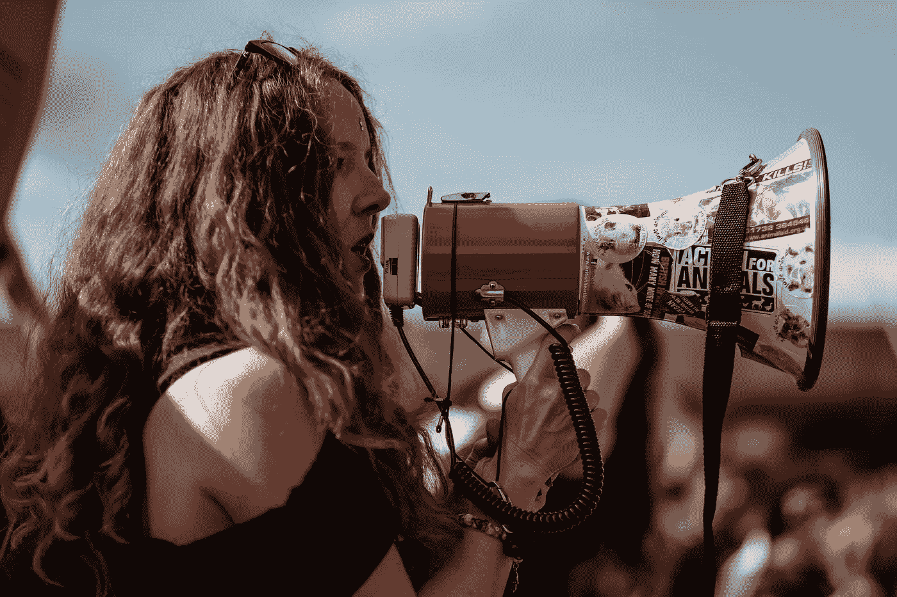

# 什么是好的沟通？

> 原文：<https://medium.datadriveninvestor.com/what-is-good-communication-a9d3994b7a57?source=collection_archive---------8----------------------->

## 这都是关于环境的

Photo by [Clem Onojeghuo](https://unsplash.com/photos/DoA2duXyzRM?utm_source=unsplash&utm_medium=referral&utm_content=creditCopyText) on [Unsplash](https://unsplash.com/?utm_source=unsplash&utm_medium=referral&utm_content=creditCopyText)

问题“什么是好的沟通？”没有上下文就毫无意义。

谁在说话，对谁说，他们想说什么？沟通基本上是信息的传递(在你和观众之间)。良好的沟通是你所传达的信息被理解的地方。

 [## 从语音到对话的飞跃:人机交流的挑战-数据…

### 机器人无处不在，几乎无所不在。我们甚至已经开始与他们交谈，在这种情况下…

www.datadriveninvestor.com](https://www.datadriveninvestor.com/2018/08/02/making-the-leap-from-speech-to-dialogue-the-challenge-for-human-to-machine-communication/) 

在商业中，你的一言一行都是你交流的一部分(对客户、顾客和竞争对手)。为了有效地交流，你必须始终如一:说你想说的，说话算数。

不要假装你不是的东西。讲述关于你自己的最吸引人、最真实的故事——基于你所做的和你已经做过的。在你的所有沟通中尽可能清晰、开放和直接(包括营销和客户服务)。某人与你的公司打交道的经历就是你的公司。要诚实。保持一致。做你自己。

良好的沟通也是双向的。这是关于与你的听众接触，倾听他们所说的，并对反馈做出反应。良好的沟通不仅仅是传播信息，而是对话。(例如推特)

注意你的听众对你的谈话，但不要打断。当你的听众与你互动时，要注意并愿意回应。信守承诺。

倾听并同情你收到的任何反馈——试着理解你的听众或从他们的角度看问题。这种意识、接受能力和责任感使得良好的沟通成为可能。

最好的沟通是与你的听众在一起，让他们可以接触到你。

有什么问题吗？

 [## 用我的推荐链接加入媒体

### 作为一个媒体会员，你的会员费的一部分会给你阅读的作家，你可以完全接触到每一个故事…

medium.com](https://medium.com/@jamesgarside_/membership) 

**詹姆斯·加赛德是一名独立记者和作家。你可以在** [**中**](https://medium.com/@jamesgarside_) **上关注他，在**[**Patreon**](https://www.patreon.com/jamesgarside)**上加入他，在**[**Twitter**](https://twitter.com/jamesgarside_)**上和他聊天。**