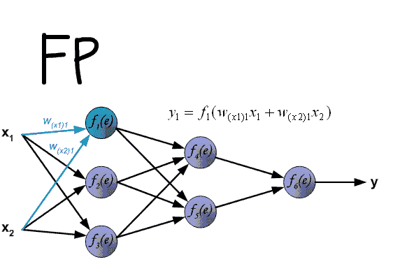

# 什么是梯度下降(直观上)？

> 原文：<https://medium.datadriveninvestor.com/what-is-gradient-descent-intuitively-42f10dfb293f?source=collection_archive---------14----------------------->

当谈到模型解释时，人们通常指的是获得对机器学习模型的特定输出的某种解释。这种解释通常以输入要素为框架:人们希望在输入要素中看到一些证明模型预测合理的证据。

神经网络传统上被机器学习社区视为不可解释的黑盒。然而，为了试图理解这些模型处理的信息，已经开发了许多新技术。

渐变技术将是这篇文章的重点。该技术使用在反向传播算法的反向传递期间产生的梯度中包含的信息作为特征重要性的代理。[尽管它并不总是能给出最合理的解释](https://arxiv.org/abs/1810.03292)，但与其他方法相比，它易于实施且计算成本低廉。

我想澄清一下，我们不是在讨论梯度下降技术中使用的数学，而是在讨论它们是如何工作的。

用于训练现代神经网络的反向传播算法有两个阶段:正向和反向。在前向阶段，输入信号通过网络的各层传播，直到到达输出层。然后使用损失函数来计算网络输出和地面真实值(标签)之间的误差。

在监督学习中，该损失函数是可微分的，因此可以产生一个[梯度](https://www.khanacademy.org/math/multivariable-calculus/multivariable-derivatives/partial-derivative-and-gradient-articles/a/the-gradient)，该梯度可以用于校正神经网络最后一层的权重，以便使输出更接近地面真实情况。由于在正向传递期间由神经网络执行的每个信号变换也是可微分的，所以输出相对于误差的梯度可以用于计算最后一层的梯度，然后是倒数第二层的梯度，然后是前一层的梯度，等等，直到达到输入信号。这些梯度然后被用于对神经网络的每个权重进行小的更新。

误差相对于输入的梯度通常被忽略，因为反向传播算法不会更新输入。然而，这些梯度仍然提供了一些非常有用的信息:**它们描述了输入中的每个信号分量需要如何改变，以使网络输出更接近标签**。

反向传播在训练期间形成神经网络的方式使得输入信号中不感兴趣的部分比感兴趣的部分获得更少的梯度信号。因此，测量在关于特定输出的反向传递期间由每个输入特征接收的梯度的幅度可以被用作该特征对于所考虑的标签的识别有多重要的代理。

让我们举个例子:

"我喜欢这部电影，但主要演员很烂。"

我们从模型中得到如下预测:0.877。

不错:该模型给出了 88%的概率，这是一个电影评论中的正面短语，即使该短语本身既包含正面元素(与电影有关)，也包含负面元素(与电影中的主要演员有关)。

为什么模型认为这是一个积极的短语？为了回答这个问题，我们需要得到一个解释。使用梯度法，我们将尝试如下解释这个短语:

1.  使用此短语作为输入，在神经网络上运行 forward()传递
2.  计算损失(我们预计输出为 100%，因此这里仍有改进的空间)
3.  运行一个反向()过程，并收集损耗相对于输入的梯度
4.  对于输入中的每个单词向量，计算相应梯度向量的范数。这测量每个输入单词接收的梯度量。
5.  因为我们想比较一个词和另一个词，我们用最大梯度范数来归一化每个词的梯度范数。

如果我们这样做，我们会得到以下结果:

我(0.525)爱(1.000)这部(0.580)电影(0.588)，(0.155)但是(0.000)主(0.032)主(0.114)演员(0.196)烂(0.400)。(0.136)

每个单词右边的数字是相应单词向量接收的(相对)梯度范数。如果我们将这个数字解释为神经网络对每个单词给予多少“关注”的衡量标准，我们可以看到，它在“我喜欢这部电影”部分比“但主要演员很糟糕”部分更加关注，这证明了 88%的正概率得分。

我们还可以注意到，与句子后半部分的其他词相比,“sucks”这个词得到了相对较多的关注。