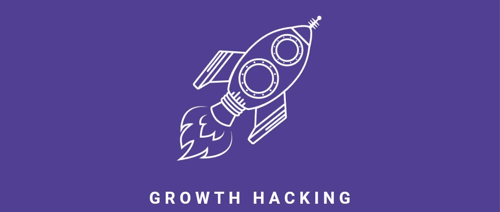
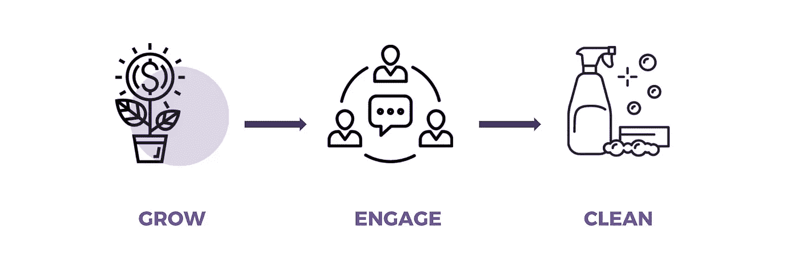
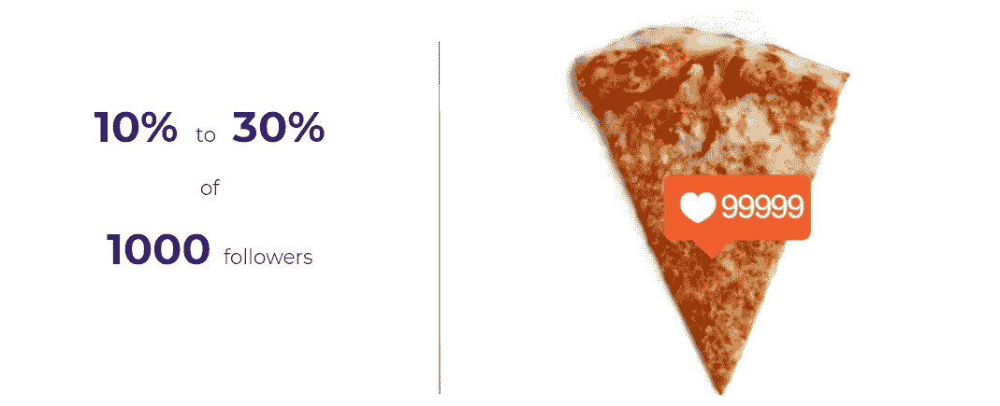
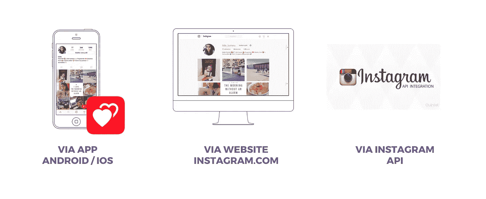
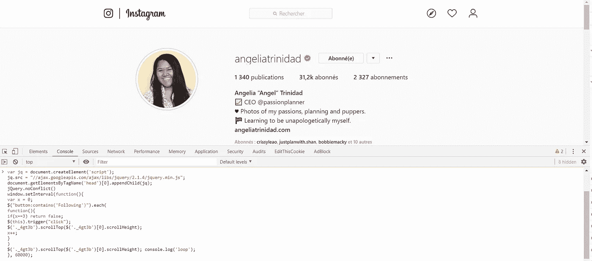
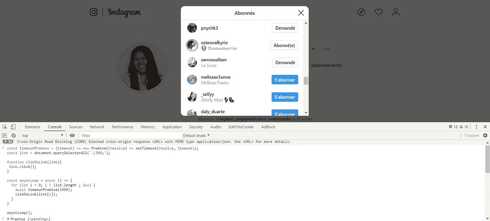
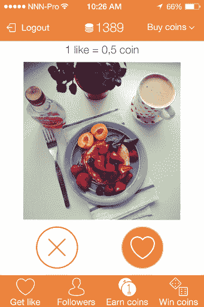
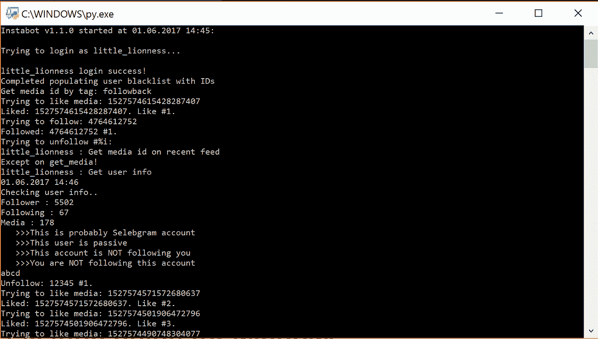

# 2020 年增长黑客是什么？

> 原文：<https://medium.datadriveninvestor.com/what-is-growth-hacking-8d847dcb665a?source=collection_archive---------3----------------------->

> *我如何在 Instagram 上实现社交媒体互动自动化*

G rowth hacking 是一个直接来自硅谷的术语。Dropbox 的前雇员、GrowthHackers 的现任 CEO 肖恩·埃利斯在 2010 年引入了这个术语，他将 growth hackers 定义为“一个人，他的唯一真正目标是**增长**，同时尽可能少花钱。”

**增长黑客是一套使用最少资源的非一致性策略**，其目的是能够快速增长用户群，产生营业额。例如，资源主要是由用户在社交网络上收集的数据。

对想象的场景进行不同的测试，只保留最相关的策略。一旦这些策略变得众所周知，因此成为常规，剩下的就是想象新的其他方式。

> 增长黑客就是在短期内用更少的钱来增加受众。

增长黑客意味着将独创性、自动化和数据分析结合起来，以最小的预算获得最大的结果。GH 并不意味着越界和使用非法或不道德的工具和方法(例如，批量创建虚假的 Twitter 账户，在脸书上使用未经授权的自我发布，使用工具向论坛和博客发送垃圾邮件……)

## 增长黑客的不同技术

这里的主要思想是发展和吸引你的观众，产生更多的线索和清理你的社交账户。只保留优质受众，去掉所有假账号。在本文中，我将只关注**增长**部分。

增长黑客是一种主要由初创公司使用的技术，这些公司资源很少，希望以最小的预算获得最大的成果。

如何不经过付费广告或其他付费技术，不花一分钱，获取新用户？

我将介绍一套有助于快速发展社区和业务的技术，而无需花费任何成本！我就以 Instagram 为例。

## 在社交网络上关注合适的人

真的很简单。你所要做的就是订阅正确的人(我自愿瞄准的人)，希望他们会跟着我回来——这是一个双赢的局面。
至少有 10%到 30%的人会重新认购您的账户。你每订阅 1000 个人，就会有 100 到 300 个新的关注者来敲你的门。
你要做的就是关注所有与你的关系网相关的人(Twitter 建议算法，LinkedIn 或 Instagram 也是这么做的)。找到你的竞争对手并关注他们的用户。
每天在 Instagram 或 Twitter 上订阅 200 到 400 人需要时间。作为一个懒人，我永远不会做那件事，除非有机器人替我做。这就是我们所说的“自动化脚本”这里有三种技术可以做到这一点:

## 1.经由 INSTAGRAM.COM

你必须选择一个订阅人数多于关注人数的 Instagram 账户。打开开发工具。您可以通过右键单击页面上的任意位置并单击“检查元素”来完成此操作然后点击控制台选项卡或者你可以按 SHIFT + CTRL + J *(Windows)* 或者 CMD + OPT + I *(Mac)* 。在控制台打开的情况下，粘贴以下代码并输入:

一旦你按下回车键，你会看到跟踪按钮会慢慢地自己点击。这个脚本被编码成每次跟踪一个人需要一个随机的时间(2 到 4 秒)。这降低了 Instagram 检测到脚本的几率。

在某些情况下，互联网连接不良的用户可能会发现脚本无法立即工作，从而导致错误。这是因为脚本必须在运行之前加载 jquery。试着再运行一次。

## 2.通过 ANDROID / IOS 应用程序

下面是安卓和 iOS 的两个 app。第一个是 LikeDike。它允许你用喜欢图片来赚取点数(每张 0.5 点)，然后花在你的一张照片上(1 点)或者一个新的追随者身上(10 点)。老实说，这不是我最喜欢的解决方案，但对于那些不会或不想编码的人来说，这是一个很好的替代方案。

## 3.通过 INSTAGRAM API

你可以创建你的 Instagram API。要访问 API，请前往 [*Instagram 开发者*](https://www.instagram.com/developer) *。*如果你已经知道如何用 Python 编程，你可以依靠这个 [*Github 脚本。*](https://github.com/Instagram/python-instagram) 但是为什么要多此一举呢？有相当多的完整的机器人来实现喜欢、评论和订阅的自动化。例如，用 Python 开发的脚本 [*InstaPy*](https://github.com/timgrossmann/InstaPy) ，允许根据不同的标准自动关注或喜欢 Instagram 用户的内容。你可以在 timer post 上了解更多，同样的功能对于[*insta bot*](https://github.com/instabot-py/instabot.py)*。*

## API INSTAGRAM 限制

事先检查 Instagram API 的官方限制。你必须遵守限制，否则你将被禁止:

**新账户:**

*   帐户创建后的前 12 到 20 天的操作间隔是 36 到 48 秒。
*   总限制是每天 500 个动作(关注，取消关注，喜欢)。

**可信账户:**

*   **喜欢**:28 到 36 秒一个喜欢(一次 1000 个，间隔 24 小时)。
*   **跟在**后面:28 到 38 秒一个，一小时 200 以下(一天 1000，休息 24 小时)。
*   **跟随+喜欢**:每天 2000(1000+1000)以下，以每 28 到 38 秒一次的速度。
*   **点评**:12 到 14 个小时以下，休息 350 到 400 秒。