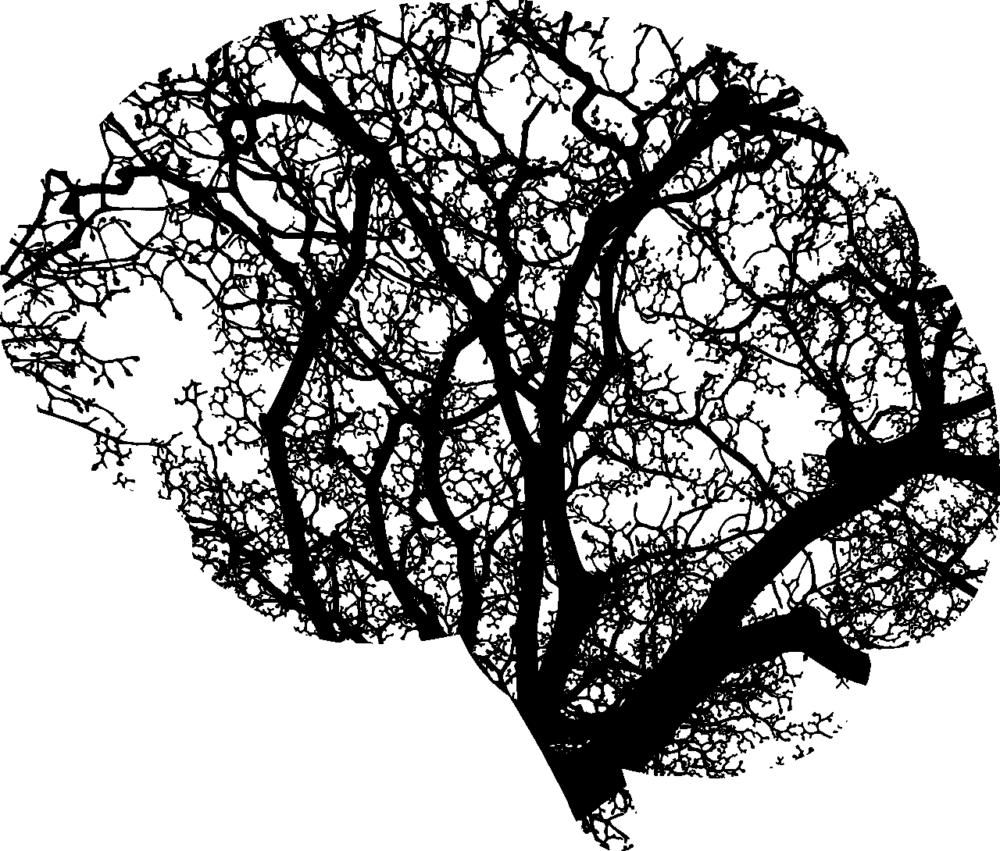
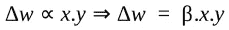
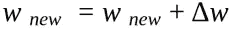
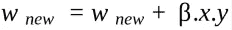
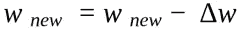
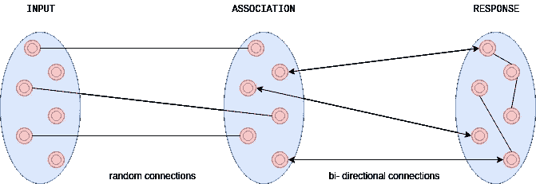

# Hebbian 学的是什么？

> 原文：<https://medium.datadriveninvestor.com/what-is-hebbian-learning-3a027e8e4bbb?source=collection_archive---------0----------------------->

最简单的神经网络([阈值神经元](https://becominghuman.ai/introduction-to-neural-networks-bd042ebf2653))缺乏学习能力，这是它的主要缺点。在《*行为的组织》一书中，* [Donald O. Hebb](https://en.wikipedia.org/wiki/Donald_O._Hebb) 提出了一种更新神经网络中神经元之间权重的机制。这种权重更新的方法使神经元能够学习，并被命名为 Hebbian 学习。

作为这一学习机制的一部分，提出了三个要点:

*   信息以权重的形式存储在神经网络中神经元之间的连接中。
*   神经元之间的权重变化与神经元的激活值的乘积成比例。

*   随着学习的进行，弱连接神经元的同时或重复激活会逐渐改变权重的强度和模式，从而导致更强的连接。

 [## DDI 编辑推荐:5 本机器学习书籍，让你从新手变成数据驱动专家…

### 机器学习行业的蓬勃发展重新引起了人们对人工智能的兴趣

www.datadriveninvestor.com](https://www.datadriveninvestor.com/2019/03/03/editors-pick-5-machine-learning-books/) 

# 神经元集合理论

神经元之间的弱连接的重复刺激导致它们的递增强化。

新的权重通过以下公式计算:

# 抑制性连接

这是另一种联系，对刺激有相反的反应。这里，连接强度随着重复或同时的刺激而降低。

关于这种神经网络的详细信息，应该考虑阅读[这个](https://www.csail.mit.edu/news/model-sheds-light-purpose-inhibitory-neurons)。

# 在感知器中实现 Hebbian 学习

Frank Rosenblatt 于 1950 年推断，阈值神经元不能用于认知建模，因为它不能从环境中学习或采用，也不能发展分类、识别或类似的能力。

感知器从生物视觉神经模型中获得灵感，该模型具有如下所示的三层:

*   输入层与视网膜中的感觉细胞同义，与后续层的神经元随机连接。
*   关联层具有与响应层双向连接的阈值神经元。
*   反应层具有阈值神经元，这些神经元相互连接，用于竞争性抑制信号。

响应层神经元通过发送抑制信号来产生输出，从而相互竞争。阈值函数设置在关联层和响应层的原点。这形成了这些层之间学习的基础。感知的目标是为每个输入模式激活正确的响应神经元。

# 结论

Hebbian 学习受生物神经权重调整机制的启发。它描述了将无学习能力的神经元转化为对外部刺激有反应的认知能力的方法。这些概念至今仍是神经学习的基础。