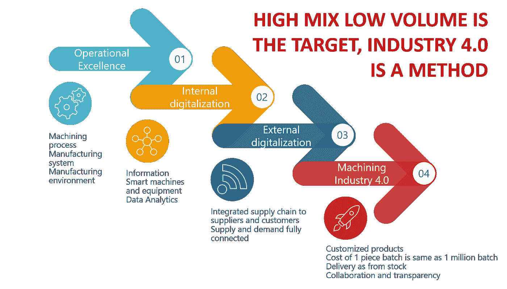

# 什么是工业 4.0 或者“钢铁侠为什么打败绿巨人”？

> 原文：<https://medium.datadriveninvestor.com/what-is-industry-4-0-or-why-ironman-beats-the-hulk-45c82264ffea?source=collection_archive---------31----------------------->

由于机器、流程和网络的持续数字化，我们正处于整个行业产品制造方式变革的中心。

1.  第一次工业革命是通过水力和蒸汽动力实现机械化。
2.  然后是第二次，大规模生产和装配线使用电力
3.  我们已经生活在第三个时代有一段时间了，这是由于计算机的使用和专用机器和机器人的自动化。
4.  第四次工业革命将建立在第三次的基础上，并连接计算机控制的机器和机器人。这些连接至少有三个不同的级别，对生产有不同的影响:

I)单一连接。一个车间里的机器将不再在只有人工监督的情况下孤立工作。它们相互连接，或者配备了传感器，将信息发送到工厂内的中央枢纽。

*II)工厂到在线服务:*当机器连接到互联网时，可能性就出现了*。工厂可以使用在线服务来监控、预测甚至控制机器的某些方面。工厂中生成的数据不断被分析，模式被专门的系统识别。这些信息随后被发送回计算机、机器和在工厂工作的员工，以优化运营。*

第三个层次意味着工厂不仅连接到在线服务，还连接到由其他行业参与者组成的系统。可以是客户、供应商和第三方服务。经过一段时间的控制和校准，越来越多的日常决策可以留给系统。工厂变得更加自主和有效。自我补充系统就是一个例子。系统检测到某些项目接近设定的最低阈值，并自动从预定义的供应商和预定义的价格订购新项目(或去在线拍卖网站获得最佳价格，但那是另一个项目)。

**工业 4.0 路线图——这不是购买新系统的问题**

即使有一个智能的自主工厂设置听起来不错，但对大多数玩家来说还有很长的路要走。传感器、在线服务和联网机器都很好，但这并不能解决该行业面临的挑战。随着需求的批量变小，完美设置的压力越来越大。

一级方程式赛车可能是一辆非常快的车，但是它没有拖拉机那么好。反之亦然，你不会开着拖拉机出现在摩纳哥大奖赛上。同样考虑一下，如果你在拖拉机上安装一个 f1 引擎，会发生什么？实际上我不确定，但是我很确定这不是什么好东西。比赛开始前，你需要准备好所有的东西，你需要从正确的方向出发。

我想说的是，你需要知道转型的目的，然后按照正确的顺序采取必要的步骤。

*The nice picture above comes from* [*Seco Consultancy Services*](https://afasterhorse.net/topics/6252/home)*.*

1.  从核心业务开始，您的机器。在采取下一步行动之前，确保他们的表现真的很好。质量和产量应该最大化，而浪费部分应该最小化。
2.  对机器满意后，看看机器最近的周围。这些流程是如何运作的？停机时间？原因是什么？缺少零件等？
3.  然后从更广泛的角度来看运营和生产。支持流程是如何工作的？员工流动率？销售和营销？你有新顾客吗？你能应付新顾客吗？

Picture source: [https://www.dailymotion.com/video/x494jb9](https://www.dailymotion.com/video/x494jb9)

我们不会在这个问题上纠缠太多细节，但我的观点是，在增加超级力量之前，你需要让你的工厂井然有序。

你更喜欢精于算计的铁人，还是不那么值得信赖的绿巨人？两者都很强，但我至少更喜欢根据数据做出决策的精明而有效的铁人。

也就是说，高级别路线图可以(应该？)长这样:

1.  实现卓越运营
2.  内部数字化(连接机器)
3.  外部数字化(连接服务和外部网络)
4.  工业 4.0 涅槃，高混——低量天堂。

那么，你打算从哪里开始？我认为可以肯定地说，面对前面所有的问题和不同的挑战，以及 laser 对日常运营的关注，将需要大量聪明的工作以及与外部合作伙伴和供应商的协作才能实现这一目标。

快马是一个从各个角度(制造商、供应商、服务提供商、主题专家、技术合作伙伴等)连接行业参与者的平台。参与进来！在这里阅读更多****！****

***作者:Johan Wallquist(数字业务经理，一匹跑得更快的马)***