# 参加自己创作的游戏的比赛是什么感觉？

> 原文：<https://medium.datadriveninvestor.com/what-is-it-like-to-attend-tournaments-for-a-game-that-you-created-8a5ef263e6ad?source=collection_archive---------5----------------------->

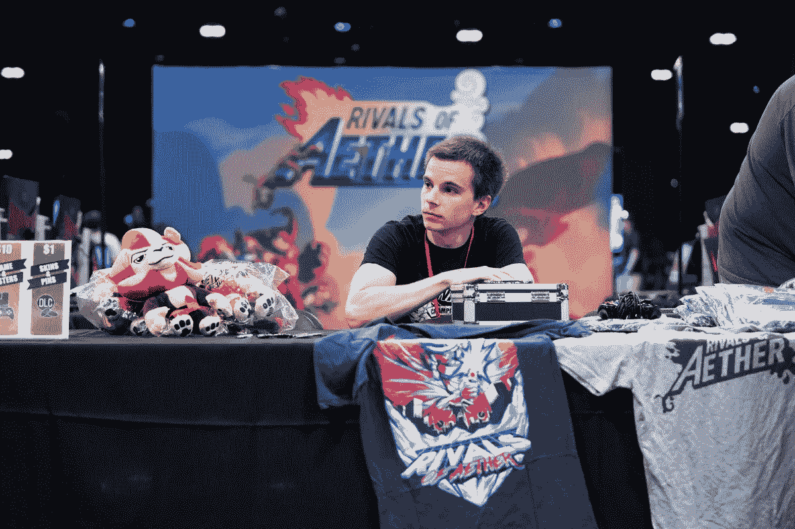

Heat Wave 2 took place at a gaming lounge in Tempe, Arizona in October 2018.

我刚从亚利桑那州的草根视频游戏锦标赛回来。这一事件被称为“热浪 2”，他们都在玩的电子游戏是“以太的对手”[。与我过去参加的其他比赛不同，我不是在那里工作的。我参加了热浪 2 比赛，尽管我根本没有赢得比赛或做得好的意图。](http://www.rivalsofaether.com)

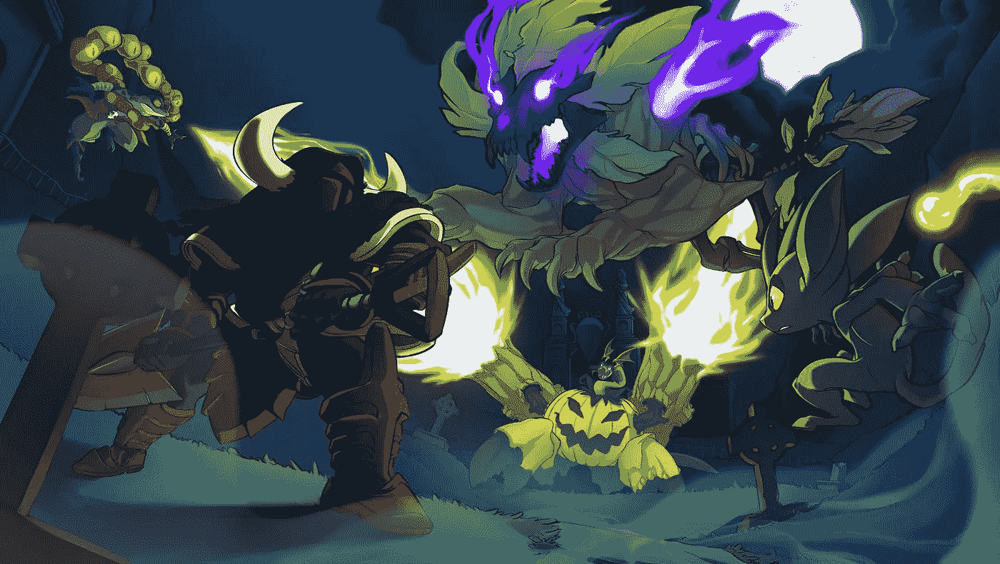

Halloween 2018 Art by Marc Knelsen

你知道，几年前，我用一个想法、一些计算机程序和我的搭档兼作曲家 [flashygoodness](https://www.flashygoodness.com/) 创立了《以太的竞争对手》。现在我们是一个大约 10 人的团队，我们都影响着发展，但游戏的根本仍然是我的孩子。

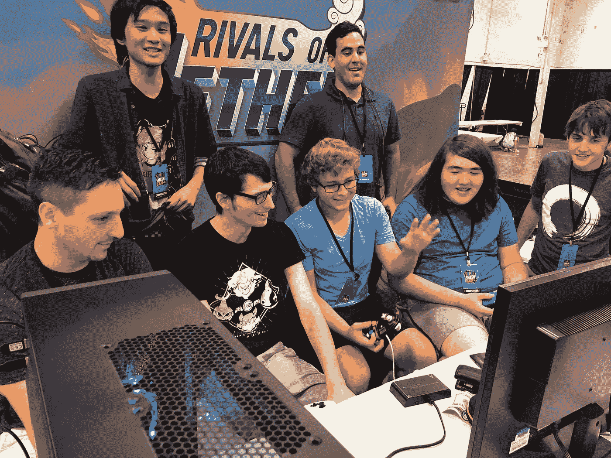

Top players doing some friendly doubles at Super Smash Con 2018.

自 2015 年推出 Early Access 以来，我们一直在支持竞争场景，并尽最大努力使其发展壮大。作为一个小型独立工作室，我们不会为了举办我们游戏的锦标赛而雇佣活动人员或向活动投入大量资金。相反，你可以发现我和我们的社区经理，乔治罗杰斯，在几乎每一个事件有对手的以太。

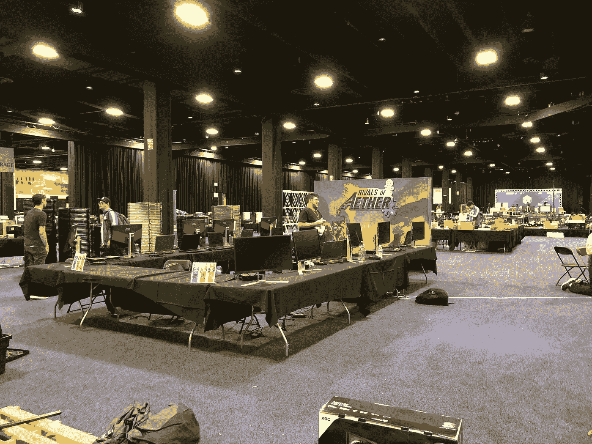

Setting up at Shine 2018

我们经常跑括号。我们在手提箱里装了许多小型电脑。我们带了指示牌。我们提供奖品。我们制作兽皮来庆祝事件。我们有时甚至自己参加比赛。我要说乔治做得比我好得多。

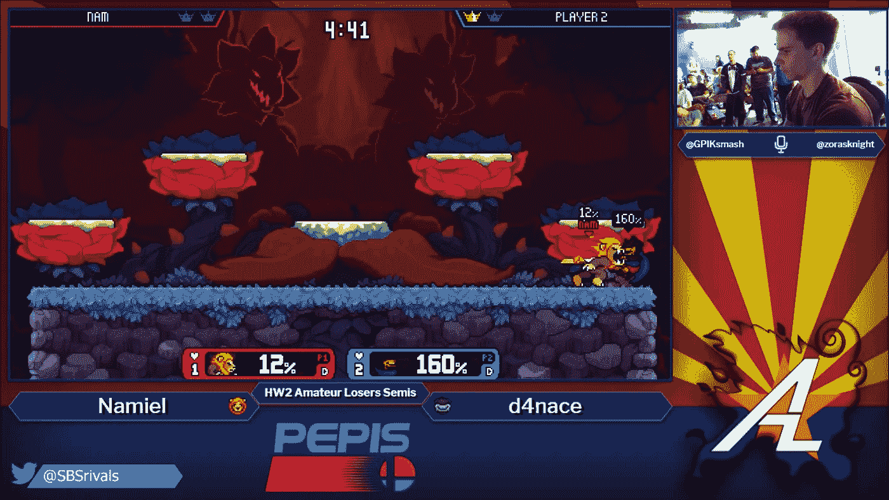

Me actually winning a set on stream at Heat Wave 2\. Source: AZ Rivals of Aether

但是热浪 2 是不同的。锦标赛不是由乔治和我管理的。我们不是确保事件发生或成功的主要力量。相反，由 Stephen“SBS”Sobansky 领导的亚利桑那州当地团队多年来一直在发展壮大，并推出了他们的第二个本土专业。他们处理一切从流到奖品到设置等等。我去那里是为了参与社区活动，并作为参与者享受这一次活动。

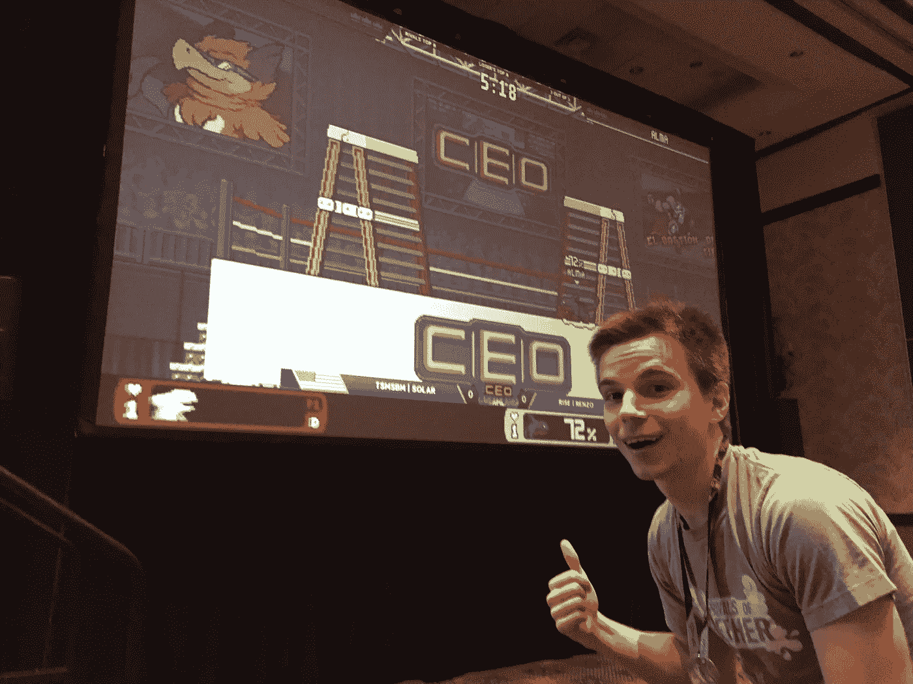

Showing off the CEO themed stage skin at CEO Dreamland in April 2017.

这些年来参加这个比赛和其他比赛，我有时会被问到“知道你创造了我们都在玩的游戏是什么感觉？”或者“你想过竞争对手会走到这一步吗？”由于这似乎是一个受欢迎的问题，并且不是一个大量开发人员可以分享的经验，我想我会分享一些关于 Aether 的竞争对手和成为其锦标赛场景的一部分的想法。

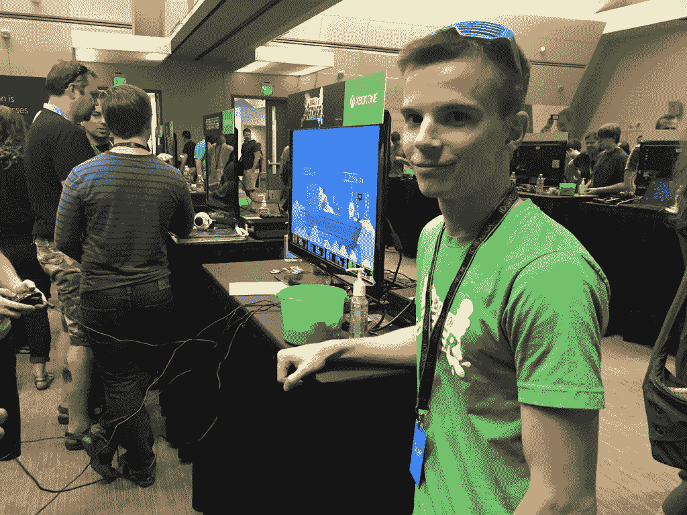

Me at the ID@Xbox Pre-PAX event in 2015

参加锦标赛的第一个方面是它们不同于常规。他们有不同的人，不同的互动，不同的目标。在与 Aether 的竞争对手合作时，我们参加了从 PAX 到 GDC 到 E3 等许多会议。我们做过展台、信息亭、一对一会议以及其他各种活动。但是锦标赛并不完全一样。虽然活动是为了解释游戏并试图获得新的粉丝，但锦标赛是为了我们现有的粉丝。参加锦标赛的人已经知道比赛的内容。我们在那里给他们一个有趣的体验和肾上腺素激增，只有当你在一场势均力敌的比赛中才能得到。我们优先考虑为在家的观众提供一个好的视频流，为玩家在场地做有趣的事情。

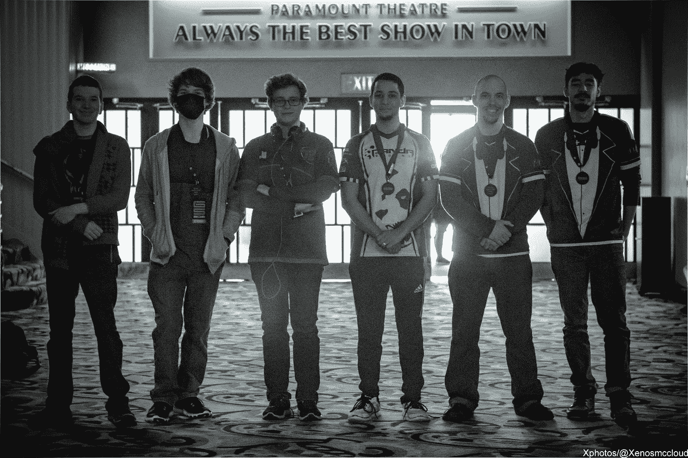

The Top 6 competitors at Genesis 5 in January 2018\. Source: Xenos McCloud

参加锦标赛的第二个方面是结识所有的球员，并与他们建立多年的友谊。Aether 的竞争对手是幸运的，因为我们的顶级球员非常有激情。我们有像企鹅和 MSB 这样的球员，他们参加了今年全国各地几乎所有 Aether 赛事的当地对手，轻松超过了我自己的出席率。我们有像 FullStream 和 cake 突击这样的顶级球员，他们长期统治着单打和双打，并经常提供尽可能好的总决赛。但是除了玩家之外，社区已经扩展到支持更多的角色。我们有评论员，围绕竞争对手如 Tuxedo 电子竞技开始的电子竞技团队，以及像 youtubers、定制控制器制造商等内容创作者。在大会上，你可能会在这里或那里记住一张脸，但很难建立联系。在锦标赛中，我看到许多相同的面孔，并在现场交了许多朋友。

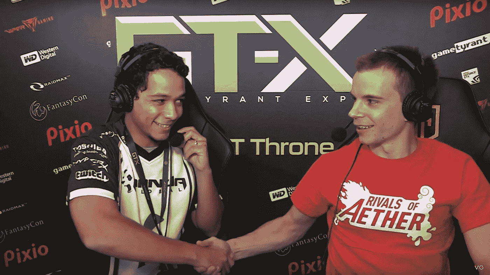

Me congratulating FullStream on his win at GT-X 2017\. Source: VGBootcamp

去看锦标赛的第三个方面是粉丝互动是独一无二的。作为“游戏的创造者”,第一次与人见面通常是一种体验——一种不同的体验。在《热浪 2》中，我让五个不同的人做了自我介绍，告诉我从《以太》的竞争对手中删除一个他们不喜欢的角色。讽刺的是，没有一个角色被提到两次。取决于你问的是谁，总有一个不同的角色会给他们带来麻烦。我也会收到很多人在比赛中报告的 bug。你可能会认为这很烦人，但老实说，我在活动中发现了一些问题，回家后就解决了。我们的在线论坛，如 discord 和 subreddit，有太多的活动，无法一直在上面，所以有时直接进入源代码工作。虽然我不能说这是一个成功的报告错误的方法，因为通常当我回到家的时候，我已经忘记了关于事件的所有细节。玩家们经常让我签一些东西，在超级粉碎兄弟的活动中，我已经成了一个有点二流的名人。当然，有人可能会要求我签一些东西，但前提是像芒果或无敌舰队这样的顶级玩家不在附近。

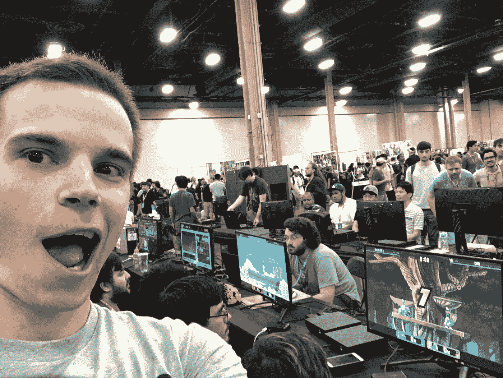

I got destroyed in the Rivals of Aether Bracket at Evo 2018

参加锦标赛的另一个方面是，作为一个人，我自己也成了一个迷因。因为顶级玩家在我自己的游戏中摧毁了我，网上的粉丝们认为我在自己的游戏中表现很糟糕。以至于如果你在一个活动上输给我，你将永远听不到我们不和的结局。曾经有一段时间，我是游戏中最好的玩家之一。我肯定是世界前五名。这一点是 2015 年 9 月在 Early Access 上推出的游戏的前 10 分钟。球员们一拿到它，我的技术就在一夜之间黯然失色，球员们也因此变得更好。当我做一些并不可怕的事情时，有时给人们惊喜是很有趣的。我确实玩游戏和练习，但当我玩游戏的大部分时间都在开发新功能或处理 bug 时，很难跟上进度。很多时候，如果我想放松，我会玩别的或者看网飞，因为我整天都在工作的时候盯着对手。

Playing on stream against Nikioni at Shine 2017\. Source: Big Blue Esports

参加锦标赛的下一个方面是做评论。自从我们开始参加与 Super Smash Brothers 相关的活动以来，我们已经享受到了参加大型锦标赛的好处，例如参加我们总决赛的 [VGBootCamp](https://www.twitch.tv/vgbootcamp) 和 [Beyond the Summit](https://beyondthesummit.tv/) 。我经常和乔治或 Smash Bros 或其他格斗游戏的资深评论员一起在大型赛事上做解说。作为一名评论开发者有它的优点和缺点。我可以说我的比赛解说可能是我最弱的一面，但是我能够给出别人无法分享的对比赛的见解。问题是当我开始做那些中场比赛的时候。我得到了负面的反馈，我需要停止东拉西扯，关注比赛。不过，在我看来，有时候一个玩家正在摧毁另一个玩家，这甚至都不接近。在我看来，这是谈论你那些没有进入最终游戏的滑稽角色想法的最佳时机。做评论确实有助于你了解你以前可能没有见过的球员，并让我在平衡时贴近地面。观看顶级球员的表演，同时大声讨论一个人在失败的情况下可以做什么，这是一件很棒的事情。

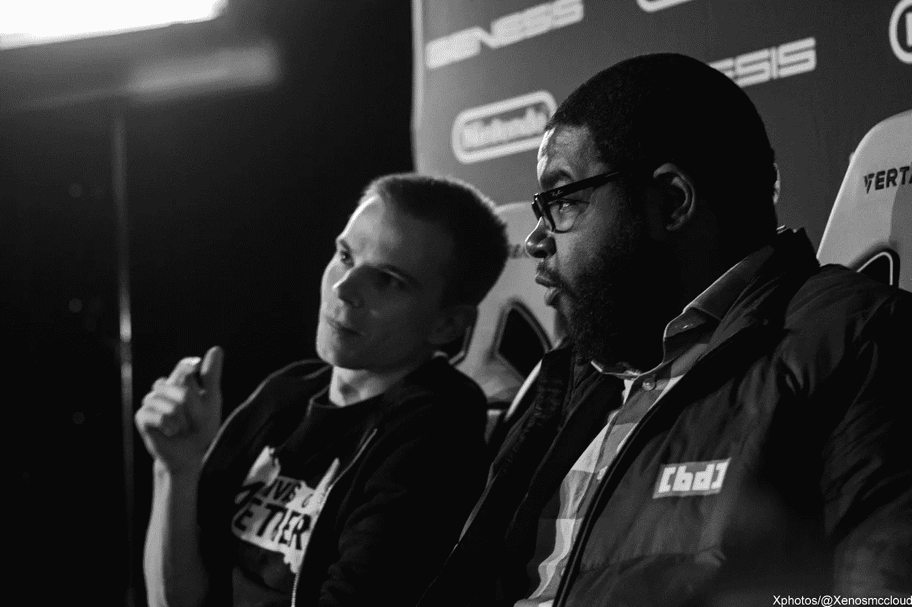

Doing commentary with ThePhenomenalEE at Genesis 5 in January 2018\. Credit: Xenos McCloud

最后，参加锦标赛让我能够接近游戏竞争场景中的最重要时刻。我们目前有两个顶级玩家 FullStream 和 have 突击之间的巨大竞争，他们每个人都在以太赛季决赛的最后两个对手中获得第一名。第三季决赛将于 2019 年 2 月举行，故事情节只会越来越多。我可以看到元是如何展开的，但也可以近距离观察玩家。创世纪对我们的游戏来说是一个惊人的事件。舞台很大，人群非常喧闹和激动。溪流每年都是我们观看次数最多的活动，超过了前一年。去年在《创世纪 5》中，我们看到了游戏有史以来最伟大的[总决赛之一](https://www.youtube.com/watch?v=a7TSxipTGY8)。

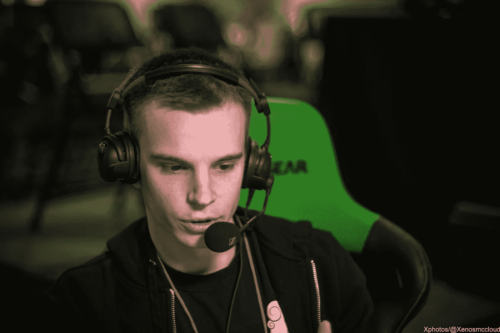

Commentating at Genesis 5 in January 2018\. Credit: Xenos McCloud

《以太的竞争对手》是一款非常棒的游戏。我只能感谢社区为我们今天仍然能够工作的原因。老实说，这个游戏从来没打算这么大。我从 2014 年开始着手，计划到 2015 年彻底完成。但是像大多数游戏一样，事情花费的时间比预期的要长。除此之外，我们也有一群热情的玩家围绕着游戏，所以我们决定增加更多的内容。我们把名单从 8 个增加到了 14 个。我们增加了更多的阶段。我们推出了 Xbox One。我们正在努力改进在线功能，并在 2019 年推出更多平台。现在对手有一个惊人的场景，我们知道开发最终会结束，但我们想设置它，所以社区永远不会。