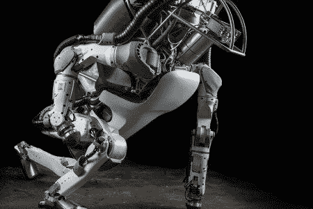
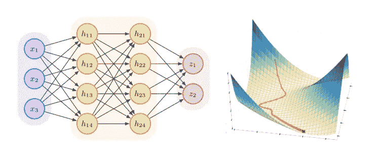

# 什么是机器学习？

> 原文：<https://medium.datadriveninvestor.com/what-is-machine-learning-55028d8bdd53?source=collection_archive---------0----------------------->

Atlas Robot, Boston Dynamics

# **机器学习**

机器学习(ML)被定义为使用算法和计算统计学从数据中学习，而无需显式编程。它是计算机科学中人工智能领域的一个分支。虽然机器学习领域直到最近才出现爆炸性发展，但该术语最早是在 1959 年创造的，最基础的研究是在整个 70 年代和 80 年代完成的。今天机器学习的崛起是由于大量的数据、更高效的数据存储和更快的计算机。

根据你想要完成的任务，有许多不同的方法让计算机从数据中学习。这些不同的方法可以分为机器学习的三个主要部分:监督学习、非监督学习和强化学习。

## **监督学习**

监督学习算法采用标记数据并创建一个模型，该模型可以在给定新数据的情况下进行预测。

这些既可以是一个**分类**问题，也可以是一个**回归**问题。在分类问题中，可能会有由动物照片组成的测试数据，每张照片都标有相应的名称。该模型将在该测试数据上被训练，然后该模型将被用于对具有正确名称的未标记动物照片进行分类。在回归问题中，有一种关系试图在许多不同的变量中被确定。通常，这是以用于预测未来数量的历史数据的形式发生的。这方面的一个例子是根据过去的价格变动预测股票的未来价格。

## **无监督学习**

无监督学习是指我们在处理没有被标记或分类的数据。目标是在数据中发现模式并创建结构，以便获得意义。

无监督学习的两种形式是**聚类**和**维度缩减**。聚类是将相似的数据分组。一个组中的数据应该具有彼此相似的属性或特征。然而，当与另一组数据比较时，它们应该具有非常不同的性质。降维是通过移除随机变量并保留主要变量来压缩数据，而不丢失数据集的结构和意义。降维的用处在于使数据更容易存储，更快运行计算，更容易在数据可视化中查看。这也有助于从模型中去除错误信号或噪声，从而有助于提高模型的性能。

## **强化学习**

强化学习使用奖励系统和试错法来最大化长期回报。

以吃豆人游戏为例。

Pac 会在迷宫中吃掉小点。每得一个点，它就获得一分/奖励。当它在环境中导航时，它会评估每个状态中奖励的概率。Pac 将学会不在先前绘制的迷宫部分折回，因为这些点已经被消耗掉了，不会有立即的回报。太好了！但是如果一个值 25 分的水果出现在之前特许的版块里呢？它不再是最大化潜在回报。如你所见，这里有一个**勘探和开采的权衡**。为了处理这种情况，强化学习算法整合了一种叫做**ε贪婪**策略的随机水平。Epsilon 是代理商 Pac 随机选择路线并故意错过奖励的州的百分比。一般来说，强化学习算法将开始更具探索性，随着游戏的奖励系统被更好地理解，算法将倾向于剥削。

在上面的强化问题中，重新评估每个状态中的概率的行为被称为**马尔可夫决策过程(MDP)** 。几乎所有的加固问题都是这样分类的。

# **深度学习**

令人惊讶的是，机器学习领域已经通过模仿人脑取得了最显著的成果。深度学习利用神经网络，就像人脑一样，包含可以激活或停用的相互连接的神经元。深度学习可以分为 ML 的监督和非监督学习子部分。

**工作原理:**

输入或多个输入被传递到神经网络，然后神经网络将它们处理成一个或多个输出。神经网络本身是一个由分层神经元组成的网络。深度学习因其深度或层数而得名。对数据逐层进行矩阵运算。将输入乘以权重，添加偏差，然后对结果应用激活函数。将它传递给下一个神经元，并重复直到它结束。对于整个网络的每次后续传递，成本函数调整加权连接，以便减少误差并改进模型。这种连续的误差减小也被称为梯度下降。

A simple neural network and gradient descent

神经网络在图像识别、语音识别、自然语言处理等有着无穷商业应用的领域取得了显著的成果。

# **一些有趣的研究**

*   使用 Instagram 照片，机器学习研究人员能够比全科医生的亲自诊断更准确地确定用户是否患有抑郁症。你可以在这里阅读更多信息[。](https://arxiv.org/pdf/1608.03282.pdf)
*   OpenAI 一直在教一个机器人如何像人类一样灵巧地操纵物理对象。查看一下→ [这里](https://blog.openai.com/learning-dexterity/)。
*   在另一项 OpenAI 研究中，研究人员给了两个人工智能代理一个小的词语选择以及一些通信目标。代理人然后开始发展他们自己的语言。查看一下→ [这里](https://blog.openai.com/learning-to-communicate/)

# **机器学习的应用**

机器学习的应用是无穷无尽的。没有一种职业或行业会保持不变。普通消费者会接触到的最常见的机器学习是推荐系统。无论是亚马逊推荐产品，网飞推荐你的下一个狂欢系列，还是脸书向你展示另一个狗狗视频。这些建议都是根据您的个人数据为您量身定制的。

在医疗保健领域，机器学习已经在医学成像和诊断甚至药物发现方面有了大量应用。算法可以学习识别 x 射线、大脑扫描和皮肤照片中最复杂的细节，即使是最有经验的医生也可能会错过。药物研发的效率低得惊人。据估计，一种主要药物从最初发现到上市平均需要 10 年时间和 26 亿美元。机器学习可以通过生物活性预测、分子设计和合成预测来帮助减少这些可怕的数字。

在金融领域，机器学习将增加获得贷款的机会，并将投资组合管理服务带给所有人，而不仅仅是高净值个人。

仅在美国，车祸每年就造成超过 5000 亿美元的经济损失和无数的生命损失。依靠机器学习的自动驾驶汽车将有助于解决这些问题。此外，自动驾驶汽车将降低许多人的生活成本。不仅交通成本会降低，而且许多人会选择住在市中心以外的郊区，那里的房地产价格更便宜。

# 机器学习的未来

机器学习是不可预测的，但它将对所有人的职业和个人生活的方方面面产生巨大影响。从金融家、医生到客户服务代表和销售人员，每个人都可以期待得到更新，比以往任何时候都更有效率。如果你是技术专业人士，你可以期待机器学习被集成到软件工程栈的每一层。

最终，机器学习是实现真正人工智能的一种手段。今天，所有的人工智能程序都被认为是**人工狭义智能(ANI)** 。这些都是有限的范围，单一的应用程序。**人工通用智能(AGI)** 是可以应用于各种问题集的程序，就像人类能够用有限的知识解决各种问题一样。理想情况下，AGI 能够自我重新编程。当人工智能超越人类水平的智能时，就到了最后一个阶段**人工超智能(ASI)。《超级智能》的作者 Nick Bostrom 将人工智能定义为在几乎所有感兴趣的领域大大超过人类认知能力的任何智能。**

最后，引用非营利研究机构未来生命研究所主席马克斯·泰格马克的话，该机构旨在减轻人类面临的生存威胁。

> “我们热爱的文明的一切都是智慧的产物，所以用人工智能增强我们人类的智慧有可能帮助文明以前所未有的方式繁荣发展——只要我们设法让技术受益。”

**结束。**

*参考文献*

[https://medium . freecodecamp . org/the-hitching liers-guide-to-machine-learning-algorithms-in-python-bfad 66 ADB 378](https://medium.freecodecamp.org/the-hitchhikers-guide-to-machine-learning-algorithms-in-python-bfad66adb378)

[https://futureoflife.org/](https://futureoflife.org/)

[https://blog.openai.com/learning-to-communicate/](https://blog.openai.com/learning-to-communicate/)

[https://blog.openai.com/learning-dexterity/](https://blog.openai.com/learning-dexterity/)

[https://arxiv.org/pdf/1608.03282.pdf](https://arxiv.org/pdf/1608.03282.pdf)