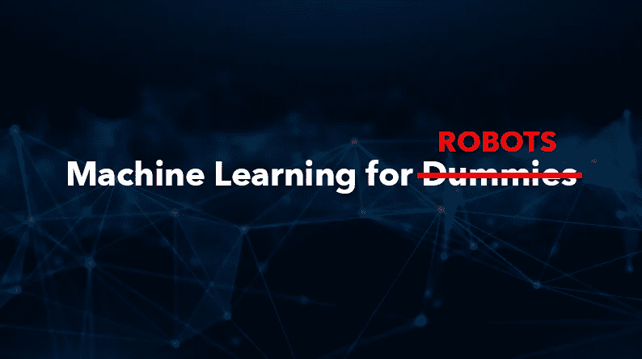
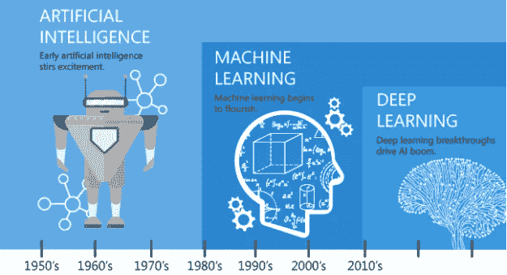
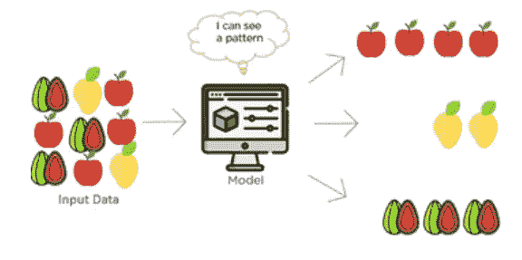

# 什么是机器学习，它是如何工作的？

> 原文：<https://medium.datadriveninvestor.com/what-is-machine-learning-and-how-does-it-work-6af591f48db?source=collection_archive---------22----------------------->

**什么是机器学习？**

人工智能不仅仅是具有类似人类品质的机器人。然而，我们现在有了因为某些技能而被认为是类人的技术。作为人类，我们生来就能通过经验更好地完成任务。机器可以使用叫做**的机器学习** (ML)来做完全相同的事情。

机器学习将统计学和计算机科学结合起来，让计算机掌握给定的任务。

假设你想让一台电脑来区分一张花栗鼠的照片和一张松鼠的照片。你可以从给它看图片开始，告诉它哪个是花栗鼠，哪个是松鼠。被编程为学习的计算机将识别特定的模式(如动物的大小或特征)，这有助于计算机在未来区分花栗鼠和松鼠。

**机器学习是如何工作的？**

嗯，我们知道人类能够内化信息是因为他们的大脑。我们甚至知道大脑的每个部分是做什么的，因为我们在学校学过。我们不了解的是计算机是如何思考的，机器学习是如何工作的。这有什么关系？因为如果我们能先了解计算机及其工作方式，我们就能帮助技术进步。

机器学习使用两种技术:**监督学习**和**非监督学习**。

**监督学习:**开始理解这个概念的一个简单方法是分解单词本身。

被监督的意思是- **观察和指导任务、项目或活动的执行。这正是所发生的事情。为了做到这一点，监督学习需要分类和回归技术。**

***分类*** 是根据共有的品质或特征对某物进行分类的动作或过程。在机器学习中，这没有什么不同。我们将数据分成给定数量的类。

***回归*** 是一个变量(如产量)的平均值与其他变量(如时间、成本)的对应值之间关系的度量。

**无监督学习:**

无监督学习正是它听起来的样子。机器不受监督，而是自行发现人类可能看不到的信息。

这是机器学习的一部分，有助于在某些数据中找到模式。无监督学习的特别之处在于算法没有被标记。这意味着只给出了输入变量(x ),没有相关的输出变量。为了做到这一点，无监督学习需要一种叫做聚类和关联技术的东西。

***聚类*** 是一种仅使用输入来发现其输入数据中的模式、不一致性或相似性的技术。

***关联*** 是一种在大型数据库中发现变量间有趣关系的过程中，帮助机器学习的技术。

监督和非监督学习一起帮助机器学习实际工作。这还不是全部。还有一种叫做深度学习的东西，但那会在我的下一篇文章里。

在 LinkedIn 上关注我，了解我的人工智能之旅，并阅读我未来的文章。

我之前文章的链接:[https://www . LinkedIn . com/pulse/existence-ai-our-daily-lives-devan Shi-upadhyay/](https://www.linkedin.com/pulse/existence-ai-our-daily-lives-devanshi-upadhyay/)