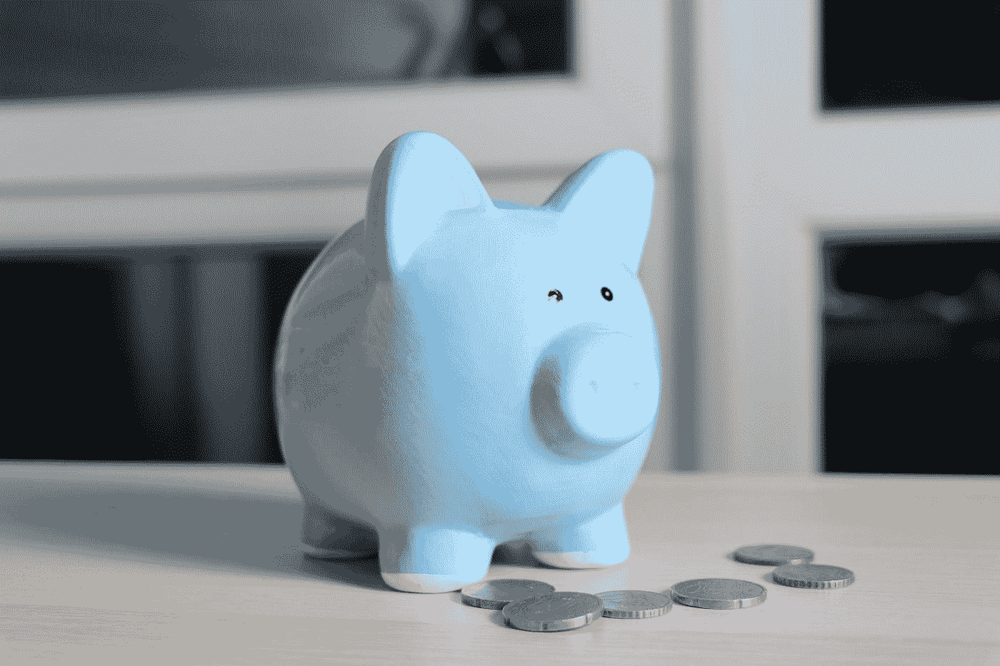

# 什么是心算？

> 原文：<https://medium.datadriveninvestor.com/what-is-mental-accounting-26d515a77ac1?source=collection_archive---------7----------------------->

它会对你的个人财务有帮助还是有害呢？

Photo by [Sabine Peters](https://unsplash.com/@kredit?utm_source=medium&utm_medium=referral) on [Unsplash](https://unsplash.com?utm_source=medium&utm_medium=referral)

我之前已经写了一些关于心理账户的文章，但那些文章主要是解释它是如何工作的，以及它是如何成为行为经济学中的一个流行概念的。在这篇文章中，我将快速回顾它的定义和一些已完成的研究，但我将主要关注我最近去阿姆斯特丹的一次经历，在那里我的英国银行账户被单独留下，但我的荷兰银行账户却到处花钱。

## *收入酒坛*

让我们回忆一下。心理会计是一种分类，在我们的头脑中，我们把钱分配到不同的罐子里。这个系统非常类似于上个世纪，家庭主妇将家庭收入分成不同的罐子。一个装房租或抵押贷款的罐子，一个装食物，一个装衣服，一个装存款，等等。鉴于目前我们的大部分金钱不再是实物而是网络，这种现实生活中的分裂已经变成了网络和精神上的分裂。这看起来非常有序，但研究指出，这种制度可能适得其反。我们先来看看这个。

 [## 外汇投资如何帮助偿还债务|数据驱动的投资者

### 外汇是对外汇市场的投资，不同国家的货币在外汇市场上进行兑换

www.datadriveninvestor.com](https://www.datadriveninvestor.com/2019/02/13/how-forex-investment-helps-to-repay-your-debts/) 

## *不动的钱*

泰勒是非常详细地解释了心理账户及其可能后果的人之一。他主要关注两个陷阱:[共同持有](https://www.moneyonthemind.org/blog/balancing-savings-and-debt)和不动资金。前者我写过多篇文章，你可以在这里阅读。因此，我将深入研究后者。心理账户的一个缺点是系统的僵化。一旦人们做好了他们的“罐子”，他们就不会在罐子之间转移钱了。例如，有些人有一个罐子以备不时之需。这并不是真正的长期储蓄，而是为了在财务上出问题时使用:比如说，洗衣机坏了，或者其他相当昂贵的东西需要更换。现在，想象一个人度过了非常昂贵的一个月。许多外出就餐、晚宴、昂贵的购物旅行，一些人可能会说这是一个典型的 12 月。结果，“食物罐”在这个月到来之前就用完了。

现在出现了一种令人震惊的行为，这种行为向许多(行为)经济学家提出了问题:这个人不是从一个不同的罐子(或多个罐子)中取出确实还有钱的钱，然后在下个月放回这笔钱，而不会产生太大的后果，而是取出信用卡或另一种贷款。似乎一旦钱被放进一个罐子里，它就只能被用于一个目的，而且只能用于一个目的。这太疯狂了，因为归根结底，我们谈论的是钱。我们拥有的交换价值可以变成任何东西。但不是用心算！

所以心理账户的一个缺点是人们会负债，而不是花掉他们实际拥有的钱。这种行为是有代价的。债务并不便宜。但是我最近发现了心算的一个后果，我以前并不知道它的存在，而且它已经花了我很多钱！

## *不收钱时*

现在我自己的经历和共同持有关系不大。我很高兴地说，我确实有存款，但我没有负债来平衡它们(谢谢爸爸妈妈！).然而，我有两个截然不同的银行账户:荷兰和英国。前者是我住在家里的时候拍的，所以这是我第一次拍。这个帐号只在我回家的时候使用。后者经常被使用，因为我在英国生活和工作，因此我的大部分时间(和金钱)都在那里度过。

这有什么关系呢？因为它改变了你的视角。在花钱和记录我的钱的时候，我很小心。我经常检查我的每日(英国)帐户，以说明我所有的进出。这是我赖以生存的账户。但这也是我在欧元区国家(如荷兰)时无法使用的账户。然后我的荷兰帐户被使用。我没有每天跟踪那个账户。那不是活钱。所以不知何故，在我脑海的某个地方，这个账户变成了“游戏币”。当你不考虑钱的真正价值时，它就会从你的钱包里飞出去了。

这里要考虑到一些关联。当我在欧元区时，我经常休假。我回家看望家人，或者去布达佩斯这样的好地方放松一下(具有讽刺意味的是，布达佩斯仍然有匈牙利货币 Florint (HUF)，但我仍然会遇到使用欧元时的类似问题)。所以分手对我来说只是意味着从一个吝啬鬼变成一个挥霍者。但是如果你想在预算上做文章，这肯定会适得其反。你需要确保这种不同的资金来源不断登记。我对你说的和对我自己说的一样多。因为当我用完欧元时，我就像用完了我的英国账户一样没钱了。所以破产就是破产的意思。这看起来很奇怪，在使用了心理账户之后，这并没有记录下来。所以，出国的时候，或者使用任何不是你日常账户的账户，都要小心。好好跟踪一下，给自己定个预算，或者干脆只用现金。当你用完了实物货币，你就完了！

现在我很想知道，我是否是唯一一个经历这种心算缺点的人，或者你是否也在挣扎。请在下面留言或发微博！

*在这篇文章中使用的参考资料，在许多其他伟大的文章中可以找到关于* [*金钱上的想法*](https://www.moneyonthemind.org/blog)