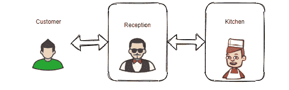
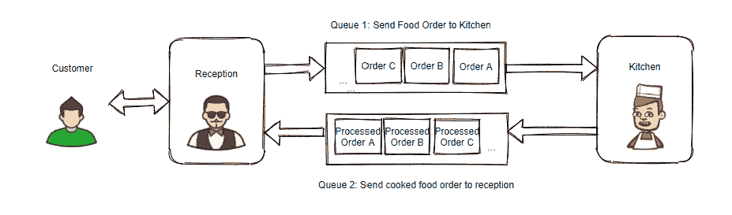
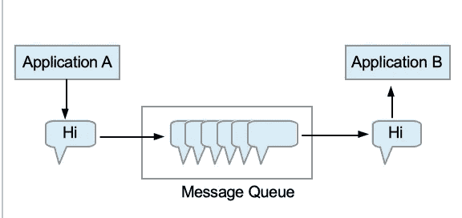

# 异步系统和消息队列

> 原文：<https://medium.datadriveninvestor.com/what-is-message-queue-b5468ff6db50?source=collection_archive---------0----------------------->

在了解消息队列是如何形成的之前，让我们先了解一下什么是异步系统。

考虑这样一个场景，一位顾客走进一家餐馆点他最喜欢的食物。

*   接待处
    *接收/确认来自顾客的订单，[事件已接收]
    *是否开票【行动已执行】
    *向厨房发送食品请求。[事件触发]
*   厨房
    *接收订单，【事件已接收】
    *烹饪食物，【动作执行】
    *将其发送回前台。[事件触发]
*   接待处
    *从厨房接收已处理的订单【接收到的事件】
    *标记订单已完成【执行的操作】

厨房准备食物时，接待处不会等待厨房立即处理订单，而是接待其他顾客。如果厨房很忙，它可以去完成手头的订单，一旦完成，它就可以选择下一个订单并进行处理。

这里有几点需要注意。接待处和厨房

1.  有独立的责任
2.  不要等其他人结束
3.  不受时间或某种时钟的约束

这就是我们所说的 [**异步系统**](https://en.wikipedia.org/wiki/Asynchronous_system) 。它由具有明确定义的事件集的组件组成，整个流程由 E [**事件驱动架构(EDA)**](https://en.wikipedia.org/wiki/Event-driven_architecture) 管理，这意味着组件将基于这些事件的发生执行指定的操作，并进而可以触发其他事件进行通信。

正如我提到的，厨房可能忙于准备手头的订单，可能不会同时处理新订单。因此，新订单请求必须在某个地方存放一段时间。这就是消息队列发挥作用的地方。

[**【MQ】**](https://www.cloudamqp.com/blog/2014-12-03-what-is-message-queuing.html)**用于异步应用程序到应用程序的通信。**

****

> ****“异步应用程序到应用程序通信****

**很拗口吧。通俗地说，异步通信是指当应用程序“A”向另一个应用程序“B”发送消息“M ”,但不要求立即响应继续处理。B 也可能占线或断线。一旦“B”可用，它就可以向“A”发回响应。与此同时,“A”也可以执行一些其他任务。那么，我们在什么地方存储 M 呢？显然我们不希望' M '丢失。当目标程序繁忙或没有连接时，MQ 提供临时存储。**

**电子邮件可能是异步消息传递的最好例子。当一封电子邮件发出后，发件人可以继续处理其他事情，而无需收件人立即回复。**

# ****消息队列:消息+队列****

****队列**包含消息序列，在应用程序之间发送，等待处理。放入队列中的消息将被存储，直到用户检索到它们。**

**发送方应用被称为**生产者**，接收方应用被称为**消费者**。生产者生产消息，消费者消费消息。**

****消息**是从生产者发送给消费者的数据。它可以是请求，也可以是响应。MQ 不处理消息，只是简单地存储它。这种处理消息的方式将生产者和消费者分离开来。消息的生产者和消费者不需要同时与消息队列进行交互。**

# **模型的类型**

1.  ****生产者-消费者模型**:是一个点对点的消息传递模型，生产者事先知道消费者，只有指定的消费者可以使用队列中的消息。**
2.  ****发布-订阅者模型**:是一种广播消息传递模型，其中生产者(也称为发布者)不了解消费者(也称为接收者)，它只是通过指定类或标签来发布队列中的消息。订阅了该类或标签的任何组件(接收器)都将接收到该消息。事实上，所有的订户都收到相同的消息。此外，每封邮件都有一个到期时间，它会在保留期后自动删除。**

# ****消息队列的优势****

**消息队列很重要，因为它们有助于实现“**解耦**”。如果两个或多个应用程序可以在不连接的情况下相互通信，则它们是解耦的。此外，一个应用程序不知道其他应用程序实现。换句话说，它们之间没有依赖关系。**

**对于分离的应用:**

1.  **只要不违反通信合同，对一个应用程序的任何更改都不会影响其他应用程序**
2.  **我们可以将一个整体应用程序分解成更小的应用程序，从而降低整体复杂性。**
3.  **维护和调试应用程序变得更加容易。**
4.  **我们可以有跨平台的应用程序。更小的应用程序可以用任何编程语言独立开发，并进行扩展。**

**有了消息队列，系统的可靠性和性能有了**的提高。生产者不必等待消费者变得可用，并且可以在队列中添加请求。消费者可以在消息可用时对其进行处理。没有等待的开销。MQ 将消息持久化，因此即使不同的应用程序组件停止运行，也不会丢失数据，并且系统将具有更高的容错能力。****

**感谢读者朋友们！！**