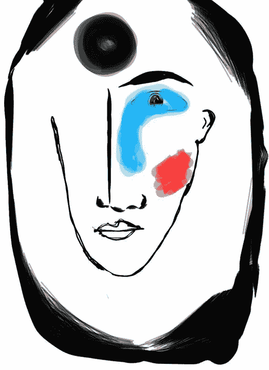
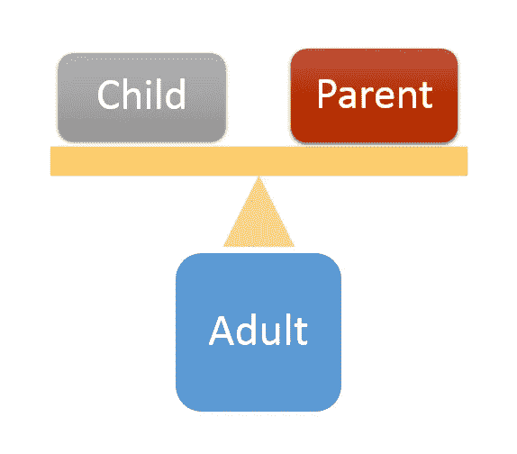

# 什么是现代性？

> 原文：<https://medium.datadriveninvestor.com/what-is-modernity-581fe5a6bc2d?source=collection_archive---------0----------------------->

## **现代人与传统人有何不同**

Digital Painting by H. Z. Qadim

现代性实际上是一个历史时代的出现，贯穿一个不可逆转的过程。现代性的这些历史性和不可逆转的特征，对于研究全球化的影响，尤其是对发展中国家的影响是很重要的。西方的现代性是由西方思想家和知识分子提出来的，但它并没有停留在西方，而是传播到了全世界。然而，就哲学和思想而言，现代性转移较少，但就现代性的产品和更为明显和迅速扩散的表面较不深刻的层面而言，这导致了危机。黑格尔认为，在每个时代，更有能力进行文化生产和再生产的文明(我认为是更符合人类要求和思维模式的文明)将领导世界。

因此，现代性是一个不可避免的历史事件，而不是个人的偏好，这意味着尽管个人对这一过程产生了影响，但他们不一定领导这个历史时代，事实上他们被那个时代所领导。此外，现代性是一个不可逆转的过程，这意味着在现代性之前不可能体验同样的生活方式。想象一下，如果没有现代社会发展的技术，我们是不可能生活的。这意味着坚持现代性是否是一件好事的问题是多么愚蠢，因为现代性是一种不可逆转的历史现象，不管我们的判断如何，它都会流动。因此，对于发展中国家来说，与其否认现代性的革命性影响，或者更糟的是，忽视现代性的优势，不如通过了解现代性并对其进行批判来获得对现代性的控制。

 [## 哲学、象形文字和技术|数据驱动的投资者

### 在发现罗塞塔石碑之前，象形文字已经被视为信息，即使它们的语义…

www.datadriveninvestor.com](https://www.datadriveninvestor.com/2018/10/16/philosophy-hieroglyphics-and-technology/) 

这篇文章有助于不发达国家和发展中国家找到解决现代生活中的矛盾的方法。的确，对于西方思想家来说，技术和技术工具是创造技术的头脑的产物，而在东方，人是技术的使用者。一个有着传统思维的技术使用者，没有能力创造技术来战胜自然。这种矛盾存在于东方人生活的许多时刻，他们以传统的思维为基础，以现代的方式生活，使用现代的工具。这种矛盾产生了对传统生活的主观怀旧的热情，同时又不可能放弃现代生活。如果给现代性的概念下一个定义，这样的危机可能会更好理解。这篇文章旨在提供一个对现代性概念的洞察。

**主体人类和自由的概念**

古代人受自然力的支配。他曾经认为自己处于众神的统治之下，众神从天上看着他，控制着他的身心。事实上，人类被限制所禁锢，导致他无法理解自然。在这里，我不打算拒绝或证明上帝作为这个世界的创造者的存在，这与本文的意图无关。不管是否存在一个至高无上的上帝，被周围的自然击败的被迫的人类，在寻找一个使他的生活有意义的终极目标时，在他的头脑中创造了限制他自由的神话概念。正如黑格尔也声称人类在所有时代都是自由的，但他没有意识到他的自由，直到他在现代性时期意识到这种自由。

现代性中的人从生存的边缘走向生存的语境，从客观存在转向主观存在。事实上，在现代世界中，人类认识到了自己对存在的直接认知，并抛弃了基于古代神话和传统信仰的对存在的认知和理解。人类自己创造的神话和概念被视为不可否认的真理，几代人以来，它们被当作智慧来教导。在笛卡尔或康德的思想中，上帝的存在并没有变成虚无，只是它从概念化的中心移位了。换句话说，传统时代的人类习惯于从上帝或神和女神的眼睛看世界，而在现代时代，他通过自己的眼睛看世界，通过自己的理性解释世界，并通过自己的理解将世界概念化。这样的人类不会认为上帝的愤怒是肺结核或灾难性地震的原因，而是通过科学方法来寻找原因，以学会如何拒绝它们或减轻相应的影响。所以问题是，如果在古代上帝有能力惩罚患有肺结核的人，那么现在随着预防科学技术的发展，上帝是否已经失去了至高无上的权力？

因此，成为“主体”的人，相信心灵自由，抛弃神话，通过自己的心灵和感官建立对周围世界的认知，是现代性的发起者。技术和知识的发展是这种思维方式的产物，确实可以把阿维森纳和海亚姆这样的人看作是罕见的例子，他们的下一代没有重复和复制他们来开创人类历史的新时代。Hoodashtian 在他的《现代性和伊朗的全球化》一书中为现代人定义了六个特征，这是研究现代性时必须注意的:

1.现代人是认知的主体，而不是受支配的 T2 客体。一门识别和探索世界并减少这个世界的神秘的学科。事实上，他用基于知识的认知取代了非科学的因果关系，并以此开始了他对传统的批判。没有更多的精灵会因为癫痫而受到责备，每个现象都有或者将会有一个原因和一个科学的原因。就像尼采宣布上帝死了，他，前客体人，变成了超人。

然而，我认为现代生活并没有提供对所有现象的全面理解。科学推理决定了一个现象是如何发生的，却不能决定为什么会发生！传统人的懒惰思想简单地认为保存圣人的身体是因为精神问题，而现代人确实寻找土壤的特性及其背后的化学/物理原因。诚然，传统观点是不可接受的，但现代人不知道为什么会发生这种情况。唯一合理的答案是，这仅仅是一次事故，但如果这种情况发生得更多，似乎就不合逻辑了。所以我认为应该避免传统的解释方式以及将一切与灵性和形而上学联系起来，这同样适用于所有现象的现代解释方式。

同样值得一提的是艾瑞克·伯恩的交易分析理论，它阐明了现代性的一个精神层面。正如伯尔尼解释的那样，每个人都有三种自我状态，父母、孩子和成人。虽然成年人负责理性义务，而儿童是情感义务的来源，但父母扮演着社会规范的角色，拒绝成年人做出判断并服从父母的判断。父母对孩子的态度要么是支持的，要么是控制的，对成年人的态度要么是咨询的，要么是命令的。审视父母-成人-儿童的自我状态模型，似乎作为统一身份的社会也有这些自我状态，其中之一是社会中最广泛认同的自我状态。在传统社会中，父母或孩子的状态更常见，这就是为什么这些社会通常非常依赖，需要一个可以依赖的权力来源，而像古鲁和宗教领袖这样的父母来源在人们的日常决策中占有很高的份额。在传统社会中，人们大多依靠情感而非理性。因此，有可能得出这样的结论:现代社会是男性自我状态中亲子主导的终结，是成人性格主导的开始。

**Adult plays a vital role ion modern lifestyle and and adjusts the parent and child ego states**

2.现代人正在“分离”,这意味着他把自己从他正在研究的现象中分离出来，并审视它。主体对现象没有偏见，因为他应该能够脱离它。根据笛卡尔的观点，主体应该对所有的数据和先前的发现持怀疑态度，这是从现象中分离出来的第一步，也就是说，怀疑结论并且不对发现有偏见。

3.现代人充实了他们的环境，这意味着他们把环境当成了物质。

4.主体是主导的，这意味着他超越了研究对象，利用它为自己服务。开发资源和利用技术来获得对自然的控制是这一主题的自然特征，这解释了为什么西方多年来一直在开发东方，并为东方国家提供了一种见解，即只有通过从客体到主体的转变和变得现代化，才能从开发中解脱出来。

5.主体是以中心为导向的，这意味着他把自己放在世界的中心。要强调的是，主体不是一个终结者，他只是把自己放在了语境的中心，把曾经在中心的东西，即父母，放在了边缘。主体站在他自己的位置上，而不是把思考和观察的权利交给古鲁，他直接思考和哲学化。

6.这个主题倾向于普遍性，因为他认为自己是一个应该被效仿的普遍模式。对我来说，这个特征就是社会中新父母的出现。事实上，倾向于仅仅依靠理性来做决定，并谴责其他来源，如情绪，成为现代生活中的新宗教。具有讽刺意味的是，父母不再让男人自由，而是强迫他致力于所谓的“理性”。

但是为什么定义“主体”的特质很重要呢？原因，我认为是一个生活在传统社会(不发达)或正在经历转型的社会中的人，应该能够区分现代性和现代主义。前者是主体人的产物，而后者只是应用了现代技术，这并不一定意味着使用技术的人就是现代人。这就是不发达社会和发展中社会矛盾的来源，因为他们只是传统观念不发达的技术的使用者。带有传统信仰的现代生活方式导致了矛盾的主观事物之间的斗争。

自由，思想的自由事实上是新文明或历史时代的基础，称为现代性。人变成了一个主体，把自己从宇宙中分离出来，把自己放在中心，用自己的理性研究宇宙，通过怀疑主要概念，自由地复制新的概念。应该注意的是，正如 Hoodashtian 所声称的，现代性不是不服从的时代，而是无意识的不可避免的服从的结束。然而，一个男人仍然可以自由自觉地跟随和服从。换句话说，成年人修改父母的规则，并从理性的角度对其进行批评，如果他们认为这些规则合理或至少不是不合理的，那么父母的义务应该得到遵守。对社会法规的承诺，只要法规是通过理性过程立法的，规则符合理性，就是现代社会中父母与成人自我状态调和的结果。

因此，我们可以说，自由是现代性的基础。解放思想是现代性的本质，但这并不意味着现代人是一个无法无天的人，对任何信仰都没有道德依附。这只是意味着，这种伦理宪章不是没有深入思考就盲目相信的。现代人不接受非理性的信仰，但仍可能接受既不理性也不非理性的概念。现代性只不过是思想选择的自由。