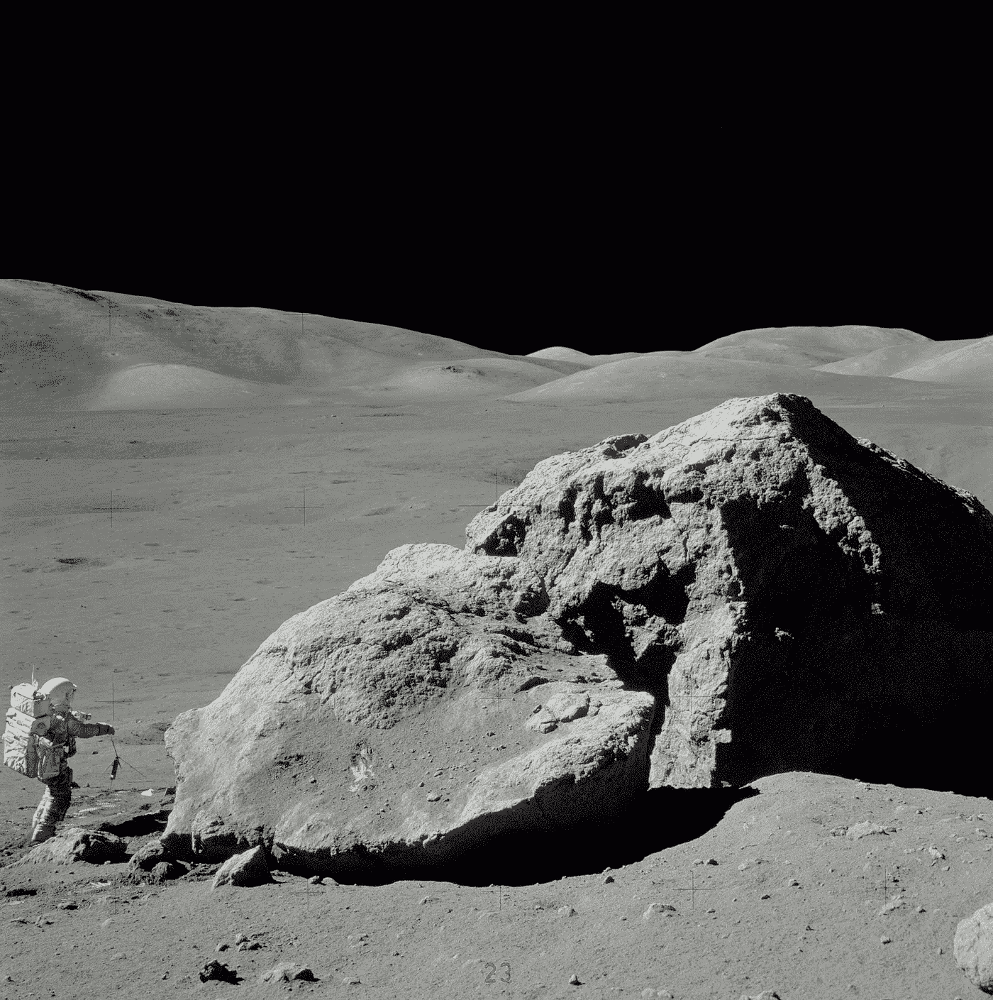
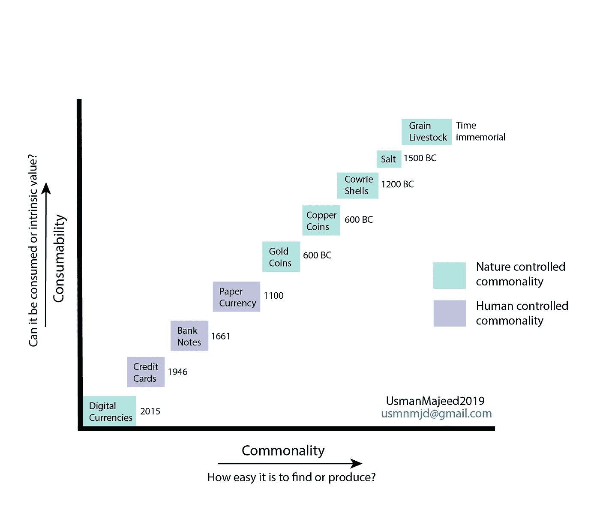

# 钱是什么？

> 原文：<https://medium.datadriveninvestor.com/what-is-money-c8e577748e48?source=collection_archive---------7----------------------->

American geologist and astronaut Harrison Hagan Schmitt takes rock samples from the surface of the moon during Apollo 17 (photo courtesy NASA)

我们人类，从史前时代开始，就一直为了生存而交换商品和服务。这种交易被称为物物交换。随着时间的推移，我们开始生活在像尼罗河和印度河流域这样的河床上的小社区里。这些小社区中的人们彼此高度依赖。无论是为了获取食物的集体狩猎旅行，还是为了种植食物的耕作和牲畜，人类社会都进化得越来越相互依赖，因为它最大化了个人和集体的生存前景。

在这些小社区的公共场所饲养牲畜和储存谷物等农产品，自然会带来唯一识别个人资产的问题。从史前时期开始，人类就已经开始用独特的标识符来识别他们的牲畜，例如特殊种类的石头，或贝壳(沿着次大陆、墨西哥和中东的沿海地区的特殊[海贝](https://en.wikipedia.org/wiki/Cowrie))。这种标识符的第一个先决条件是非常低的**通用性**(唯一性)和罕见的可用性，以避免腐败和通货膨胀。第二个自然前提是它们在自然界中的内在稳定性，也就是说，这些标识符不会随时间而衰减，或者不会被人类或其他人消耗。让我们称这个属性为**可消费性**。通用性和可消费性越低，资产管理的标识符就越好。这是现代货币的最初形式。

 [## 5 行业转型区块链应用|数据驱动投资者

### 除非你一直生活在岩石下，否则我相信你现在已经听说过区块链了。而区块链…

www.datadriveninvestor.com](https://www.datadriveninvestor.com/2019/02/13/5-real-world-blockchain-applications/) 

几千年来，人类已经使用了几种类型的标识符作为货币。我们使用过铜币和金币、纸币，最近还使用过信用卡和借记卡。看看黄金，它是化学性质最无趣的重金属之一。它几乎不与其他元素反应，因此它的可消费性非常低。此外，黄金是一种软金属，它不能用来制造器皿，也不能被锻造来制造其他东西，如建筑材料或剑和矛。如果我们谈论黄金的共性，它接近于稀土金属。

> 如果你把每一只耳环、每一枚金币、每一个电脑芯片里的微量黄金、每一个哥伦布发现美洲大陆前的小雕像、每一枚结婚戒指都收集在一起并熔化掉，估计你只剩下一个 20 米左右的立方体。 [*我们为什么看重黄金？*](https://www.bbc.com/news/magazine-25255957) *(* BBC 世界文章 *)*

基于非常低的通用性和可消费性，**黄金**是货币的最佳候选之一。这就是它作为货币被使用了几千年的原因。用另一个例子来完成我们的思考过程，从 60 年代和 70 年代的多次阿波罗任务中取回的**月球土壤**证明了月球曾经是我们星球的一部分，它的土壤与地球上的土壤没有太大的不同，除了月球表面已经在太阳的直接辐射下被烹饪了数百万年。这种月壤由于其极低的通用性和可消费性而具有极高的价值。其中几克已经卖出了数百万美元。在[的一个案例中](https://www.space.com/11804-nasa-moon-rock-sting-apollo17.html)，一家美国法院估计它的价值为每克 5 万美元。

上图显示了自然界中的各种实体，基于共性和可消费性，是如何被用作货币的。随着纸币和信用卡的出现，一方面，通用性和可消费性进一步降低，但另一方面，通用性已经处于人类的控制之下。现在，像银行和政府这样的个体机构可以通过玩弄共性来操纵货币，造成人为的经济不稳定。

银行和政府对现代经济的操纵只能通过将货币的公共性交还给自然来制止。过去十年中，比特币等数字货币提供了一个这样的承诺。这种数字货币基于区块链技术，这种技术确保了互联网的分布特性和计算机的计算能力带来的通用性和安全性。这些数字货币的共性是由分散在全球不同文化、宗教和社会背景的数百万互联网用户控制的，这些用户是由速度极快、价格低廉的计算机驱动的。然而，仍然需要时间来检验和证明这种数字货币的未来。

*穆罕默德·乌斯曼·马吉德*，*usmnmjd@gmail.com*