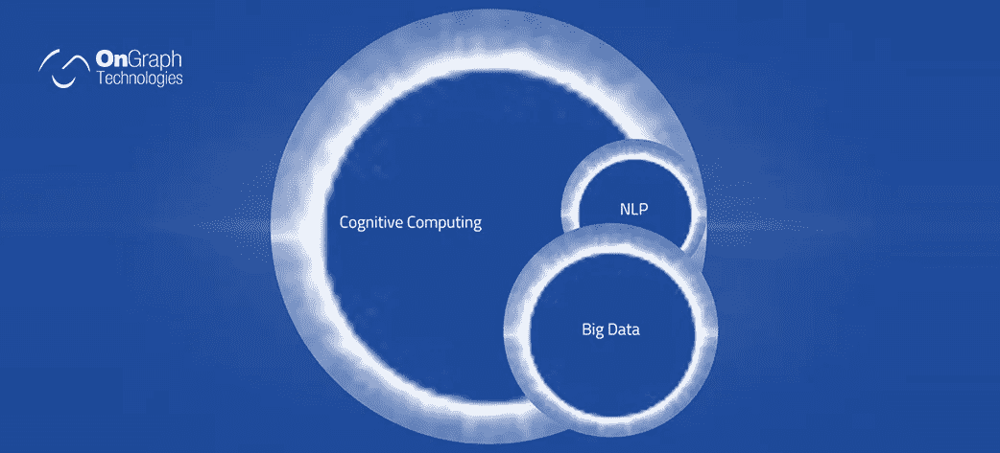
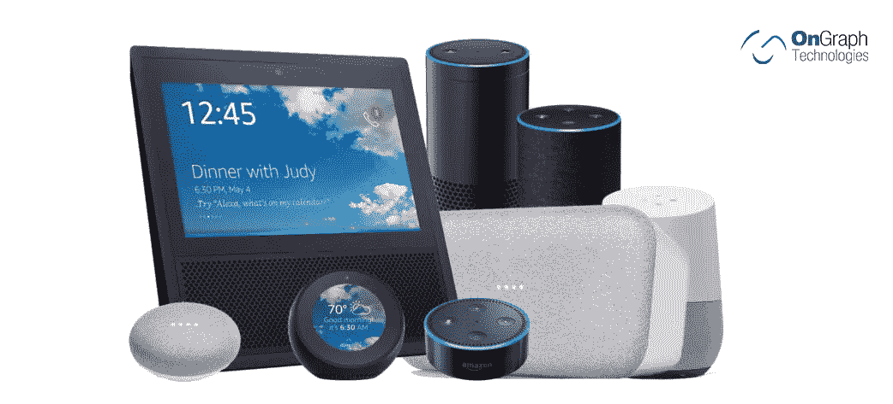

# 什么是 NLP，它如何塑造未来？

> 原文：<https://medium.datadriveninvestor.com/what-is-nlp-and-how-it-is-shaping-future-b6b1397d9a32?source=collection_archive---------9----------------------->

# NLP 有能力让计算机理解人类的讲话和语言，是未来几年网络发展的引领者。尽管它还处于起步阶段，但它为计算设备提供的巨大潜力是可以预见的。像下面这篇文章一样继续阅读；我们揭示了 NLP 以及它如何塑造 it 行业…

继人工智能之后，自然语言处理(NLP)近年来成为另一个热门词汇。尽管硅谷巨头们主要关注自然语言处理，并围绕它重组他们的业务，但世界已经关注并等待一些更大的创新，这些创新只是科幻小说。不是每个人都理解 NLP 是什么，以及它能以多少种方式提高 it 业务流程的效率。

**什么是自然语言处理？**

NLP 代表正常语言处理，是一项帮助智能设备如移动设备、物联网、智能扬声器等的创新。理解人们所说的话。它是[人工智能](https://www.ongraph.com/applications-of-artificial-intelligence-in-day-to-day-life/) (AI)的一部分，属于计算机科学和计算语言学领域，涉及计算机和人类语言之间的交互。

 [## 对话式人工智能的兴起将如何影响世界数据驱动的投资者

### 从不同的专业服务，保险，教育，金融，旅游，电信，到建筑，银行，和…

www.datadriveninvestor.com](https://www.datadriveninvestor.com/2019/02/07/how-the-rise-of-conversational-ai-will-impact-the-world/) 

NLP 是一项创新，通过它计算系统被编程来分析、理解和生成自然语言。 [**定制机器人开发服务**](https://www.ongraph.com/chatbot/) 使用 NLP 使机器人能够发起类似人类的交流。这包括任何或所有语言形式、练习或交流策略的自动化，例如，讨论、阅读材料、翻译、唇读等等。NLP 是机器学习、大数据和人工智能的一部分，有可能彻底改变一切。

为什么要关心？

NLP 正在改变我们与设备交互的方式。随着人工智能领域的不断创新，以及帮助 NLP 在不同行业的大量领域中找到空间的 [**Bot 应用程序开发服务**](https://www.ongraph.com/) ，该技术正在快速发展。

下面是按行业划分的 NLP 在某些方面的应用情况:

1.*药* —汇总医生收费笔记；互操作性(以一种意想不到的方式横向排列供应商的病历)
2。*法律* —针对权威报告的改进和更重要的查询/研究

**当前有哪些自然语言处理的例子？**

个人助理(Apple/Siri，Amazon/Alexa，Google Home)，计算机化的语音/文本识别软件，(微软-Skype Translator，Google Translate，Google Assistant)，地址回复(Google/Search)，内容大纲都是真题项中 NLP 的案例。

**为什么是现在？**

NLP 目前崛起的一个关键驱动力是网络，它可以提供大量不同格式的数据，如文本/语音。当今的计算设备可利用多中心 CPU/GPU。这些功能提高了计算系统的效率，并让它们通过更高级的机器学习策略来使用这些庞大的数据集。

此外，我们今天拥有相当多的基础设施和工具，但它们并不像最近开放。可以把它想象成 web 开发框架工具的爆炸，它可以立刻引发任何规模的项目。

它如何塑造未来？

1.**通过大数据进行精细化分析**

与计算设备的每次交互都会产生数据。不管你是浏览网站、将商品添加到购物车/愿望清单还是购买商品，你在互联网上的每一个动作都在积累数据。今天的数字数据比近代史上任何时候都多。随着 NLP 和 AI 的创新，企业正在通过大数据来充分利用大数据。

有了 NLP，使信息民主化成为可能。NLP 使数据分析师能够接受结构化和非结构化数据，并让它们发挥作用。NLP 揭示了大数据的密集模式和示例，这些模式和示例可指导系统重建和驱动发生。精细的数据分析使品牌能够推进广告以扩大执行力。

2.**UX 和 UI 的巨大转变**

迟早，UX 和 UI 会在他们的大纲和编程中看到戏剧性的变化。NLP 与机器学习、人工智能等其他推进的进步一起，使开发人员能够定制数据控制的个人体验。每个人都有自己喜欢的获取和控制信息的方法，设备和网站会考虑这种定制化的程度。从今以后，我们可以预见，一个网站将会因个人偏好的控制类似信息的 UX/用户界面组件而发生变化。

3.**自然语言处理(即聊天机器人)将重新定义导航**

此时，开发人员关注界面配置，着眼于发现和行动的角度，以提供更好的导航，例如，颜色的利用、复制、数据设计等。我们生活在一个静态的世界里，数据和容量被方便地整理出来；然而，NLP 和聊天机器人之类的东西改变了这一点。NLP 重新定义了 UX 的公开部分，允许专注于其他重要的事情和导航功能。

由于基于人工智能的聊天机器人的出现，客户服务流程彻底改变了。聊天机器人已经存在了。沉迷于我们以前的文章之一[聊天机器人的未来](http://www.ongraph.com/blog/future-of-chatbots/)，并发现它在当前商业场景中的重要性。

4.**语音体验将变得更加普及**

亚马逊和谷歌的语音助手以及支持语音的电视改变了语音界面的开发方式。它正在塑造另一种关于他们自然本能和简单的心态。语音目前正在以一种方式发展，它最终将成为用户体验中无与伦比的一部分，它不会被忽视的是，开发者如何“计划”语音在未来几年遇到更多的问题。

AI、NLP 和其他相关技术已经触及了移动和 web 开发的很大一部分。如果你有机会以任何方式通过你的评论与 NLP 面对面，请让我们知道你的 NLP 体验。

*原载于 2018 年 9 月 14 日*[*https://www.ongraph.com*](https://www.ongraph.com/natural-language-processing/)*。*