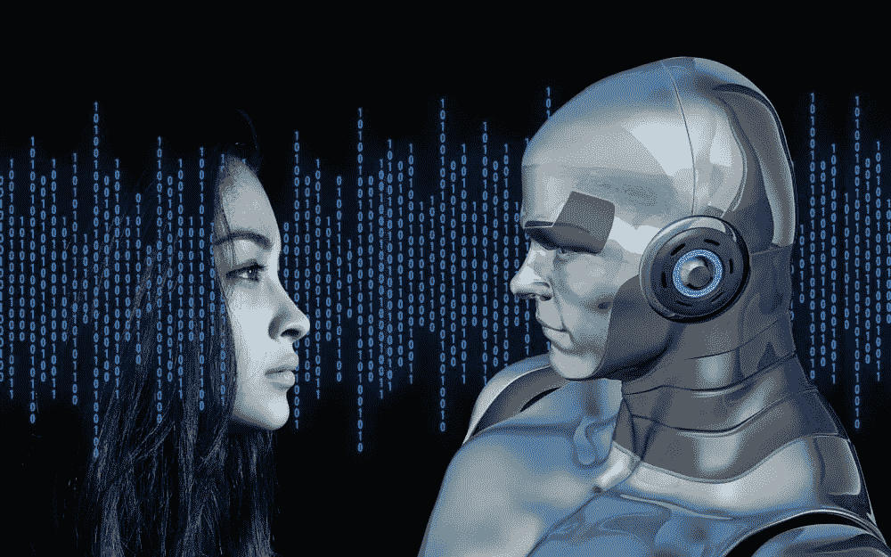

# 什么是自然语言处理(NLP)？

> 原文：<https://medium.datadriveninvestor.com/what-is-nlp-natural-language-processing-8f91313cc57b?source=collection_archive---------10----------------------->

自然语言处理(NLP)是一种使用人类语言的人机交互形式。现在有许多编程语言。开发人员学习它们并与机器一起工作。但是对于一个普通人来说，学习计算机语言是很困难的。所以让机器理解人类语言结果 NLP 就提前了一步。

NLP 现在非常重要，因为它作为家庭/个人助理、机器翻译和推荐广告参与了我们的日常活动。本文涵盖了自然语言处理的历史、技术、应用和现代趋势。所以通读这篇文章，对 NLP 有一个简单的了解。

# 历史

对 NLP 的研究开始于 60 多年前。计算机科学家试图给机器带来自动化系统来理解人类语言。

Photo by [Joel Naren](https://unsplash.com/@joeljnaren?utm_source=medium&utm_medium=referral) on [Unsplash](https://unsplash.com?utm_source=medium&utm_medium=referral)

从 1906 年到 1911 年，瑞士语言学教授弗迪南·德·索绪尔的研究将“作为科学的语言”转变为“作为系统的语言”。他争论单词的上下文和意义，以现代的方法引入语言系统。

1950 年，科学家艾伦·图灵将这个想法作为他的研究论文[计算机械和智能](https://www.csee.umbc.edu/courses/471/papers/turing.pdf)。这篇论文成为了 NLP 研究的一个里程碑。

然后在 1952 年，[霍奇金-赫胥黎模型](https://www.swarthmore.edu/NatSci/echeeve1/Ref/HH/HHmain.htm)介绍了神经元&电脉冲对大脑功能的影响。它使得人工神经网络的实现在自然语言处理中很有帮助。

在这些研究论文的帮助下，NLP 任务变得更加容易。

# 技术

为了理解 NLP，我们必须分解用于从人类语言中挖掘信息的基本技术。它们大多是自然语言学，如句法、语义和语用学。

Photo by [micah boswell](https://unsplash.com/@micahboswell?utm_source=medium&utm_medium=referral) on [Unsplash](https://unsplash.com?utm_source=medium&utm_medium=referral)

*语法*

句法是我们在语言中使用的语法。即有意义句子的成分，如名词、动词、副词等。

我要去上班了。

在上面的句子中，你可以观察到 **ing** 自带 **go** 是根据语法**。**

*语义*

语义是组合时单词之间的关系。这就是单词在反义词、同义词和句法之间的联系等情况下的含义。

英雄——薇莉安。

以上两个词的关系是同义关系。关于它们的研究是语义学

*语用学*

语用学是关于词语应该被使用的语境。

河岸上有许多树。

在上面的句子中，由于河岸旁边的存在赋予了河边的含义。否则，单独使用时，就意味着我们省钱的地方。

人工智能使用这些技术从人类语言的任何来源(如文本、图像或音频)获取信息的方式实际上是 NLP。

# 应用程序

自然语言处理发展的原因是它的应用。NLP 被用来改变人类与机器对话的方式。现在跟人最相关的，机器是手机，技术是互联网。所以它的大部分应用都是基于互联网或者手机的。

1.  *搜索引擎—*NLP 为您在搜索引擎中的日常搜索提供了便利。
2.  *网络广告*——互联网通过你的文字手势来理解你。
3.  语音搜索——NLP 将你的声音转换成机器可以理解的形式。
4.  *机器翻译* —所有的机器翻译都基于自然语言处理
5.  *语音助手/聊天机器人* — Siri、谷歌助手、Alexa 正在使用 NLP 进行交互
6.  *文本摘要* —从文章中提取摘要。

这些只是 NLP 的一些常见应用。还有很多其他的应用。无论如何，我们必须承认我们每天至少使用一次 NLP。

# 现代方法

最初，NLP 被视为使用传统编程语言从语言学实现的一组规则。但问题是语言每天都在进化。因此，在大多数 NLP 情况下，传统的编程变得不合适。(但是，对传统编程的需求仍然存在于 NLP 的几个部分中)

Photo by [Tim Gouw](https://unsplash.com/@punttim?utm_source=medium&utm_medium=referral) on [Unsplash](https://unsplash.com?utm_source=medium&utm_medium=referral)

传统编程的终极选择是人工智能。目前，人工智能的子集主要用于 NLP，如人工神经网络。它们模仿人脑，使 NLP 更加准确。这种现代的方法在更多的计算能力的帮助下在所有的案件中被实践，这只有在这个技术时代才有可能。

# 结论

Photo by [Aaron Burden](https://unsplash.com/@aaronburden?utm_source=medium&utm_medium=referral) on [Unsplash](https://unsplash.com?utm_source=medium&utm_medium=referral)

NLP 是一种使人和机器的交互更容易的现代方法。自然语言处理的研究早就开始了。自然语言处理使用自然语言技术。自然语言处理的应用非常广泛，也融入了我们的日常生活。由于昂贵的计算能力的可用性，人工智能在这些天被使用。

*这篇文章是一个简单的介绍，我将在以后的博客中继续深入研究 NLP。对这篇文章还有什么想法吗？我有空听听你们的评论。*